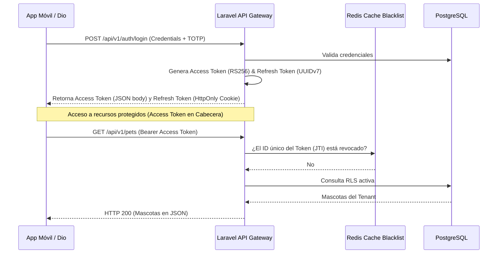

# Contrato de Especificación de APIs REST & OpenAPI 3.1
## Patitas Soft SaaS - Integración Oficial Backend, Web y Mobile (Flutter)

---

### Control de Documento
* **Proyecto:** Patitas Soft
* **Versión:** 1.0.0
* **Fecha:** 11 de Junio de 2026
* **Autores (Consorcio de API Architects):**
  * API Architect
  * Laravel 12 Enterprise Architect
  * REST API Specialist
  * OpenAPI 3.1 Expert
  * Mobile Architect (Flutter Specs)
  * Security Architect
  * OWASP API Security Specialist

---

## 1. Estrategia API y Estándares REST

Para garantizar la interoperabilidad absoluta y la velocidad de desarrollo en paralelo entre los equipos de Backend (Laravel 12) y Frontend/Mobile (Flutter), la plataforma define un estándar estricto de diseño de interfaces.

### 1.1. Convenciones Generales
* **Versionamiento:** Incluido obligatoriamente en la URL de las peticiones para prevenir fallos al introducir cambios disruptivos: `/api/v1/`.
* **Convención de Nombres (Naming Convention):**
  * **URLs:** Plural, en minúsculas y utilizando nombres de recursos semánticos: `/api/v1/owners`, `/api/v1/medical-records`.
  * **Payloads (JSON):** Claves formateadas en **camelCase** en la API REST para cumplir con los estándares móviles de Dart/Flutter (ej. `ownerId`, `birthDate`). Laravel se encargará del mapeo interno a `snake_case` mediante una capa de transformación (Laravel API Resources).
* **Verbos HTTP Utilizados:**
  * `GET`: Recuperar recursos (listados o individuales). Debe ser seguro e idempotente.
  * `POST`: Crear nuevos recursos. No es idempotente.
  * `PUT`: Reemplazo total de un recurso existente.
  * `PATCH`: Modificación parcial de los atributos de un recurso (ej: cambiar el estado de una cita).
  * `DELETE`: Eliminación física o lógica del recurso.

---

## 2. Estrategia Multi-Tenant en APIs (Aislamiento y Resolución)

La identificación del inquilino (clínica veterinaria) debe realizarse de forma transparente para el cliente móvil y web, pero con mecanismos redundantes de seguridad en el backend.

### 2.1. Mecánica de Resolución del Inquilino
1. **Peticiones de Navegador Web (SaaS Blade/Tailwind):** Se resuelve el Tenant dinámicamente mediante el **subdominio** de la solicitud HTTP (ej: `clinicaveterinaria.patitassoft.com`).
2. **Peticiones de Clientes API / Móviles (Flutter):** Se utiliza la cabecera HTTP **`X-Tenant-ID`** que contiene el UUID del inquilino activo.

### 2.2. Mitigación de Accesos Cruzados (BOLA / RLS)
Para evitar que un atacante altere de forma maliciosa la cabecera `X-Tenant-ID` en una herramienta como Postman para consultar datos de otra veterinaria:
* **JWT Claim Vinculado:** Al autenticarse, el JWT retornado al cliente móvil contiene un Claim inmutable firmado criptográficamente llamado `tenantId`.
* **Middleware de Validación:** El backend de Laravel ejecuta un middleware que compara:
  `jwt.claims.tenantId === request.headers['X-Tenant-ID']`.
  Si no coinciden, se aborta la petición con un error `HTTP 403 Forbidden`.
* **Capa Final (RLS):** El ID del inquilino resuelto se inyecta en la conexión de PostgreSQL (`SET app.current_tenant_id`) activando la Row-Level Security que bloquea físicamente cualquier lectura cruzada en base de datos.

---

## 3. Estrategia de Autenticación y Flujo JWT

La autenticación de APIs es sin estado (stateless) para soportar el crecimiento horizontal de servidores de aplicación.



### 3.1. Especificación de Tokens
* **Access Token:** Corta duración (15 minutos). Enviado en la cabecera: `Authorization: Bearer <JWT_ACCESS_TOKEN>`.
* **Refresh Token:** Larga duración (7 días). Enviado automáticamente por el cliente en cookies del sistema con banderas `HttpOnly`, `Secure` y `SameSite=Strict`.
* **Rotación y Revocación:** Cada vez que se solicita un nuevo Access Token usando el Refresh Token, el servidor invalida el Refresh Token anterior en Redis y entrega un par nuevo (Refresh Token Rotation).

---

## 4. Matriz de Roles y Permisos (RBAC & ABAC)

| Módulo / Recurso | Super Admin | Administrador | Veterinario | Recepcionista | Cajero | Dueño |
| :--- | :---: | :---: | :---: | :---: | :---: | :---: |
| **Plataforma / Inquilinos** | **CRUD** | Leer | - | - | - | - |
| **Sucursales / Configuración** | Leer | **CRUD** | Leer | Leer | - | - |
| **Usuarios y Roles** | - | **CRUD** | - | - | - | - |
| **Dueños y Mascotas** | - | **CRUD** | **CRUD** | **CRUD** | Leer | Leer Propios |
| **Expedientes Clínicos** | - | Leer | **CRUD** | - | - | Leer Propios |
| **Consultas e Historial** | - | Leer | **CRUD** | - | - | Leer Propios |
| **Agenda de Citas** | - | **CRUD** | **CRUD** | **CRUD** | - | CRUD Propios |
| **Punto de Venta (POS)** | - | **CRUD** | - | CRUD (Cobro) | **CRUD** | - |
| **Inventarios y Productos** | - | **CRUD** | Leer | Leer | Leer | - |
| **Facturación Fiscal** | - | **CRUD** | - | CRUD (Emisión) | **CRUD** | Leer Propios |

---

## 5. Estándares de Respuestas, Paginación, Filtros y Búsquedas

### 5.1. Estructura Estándar de Éxito (Success Payload)
Todas las respuestas de API exitosas retornarán un código `HTTP 200` o `HTTP 201` y compartirán el siguiente formato JSON:

```json
{
  "success": true,
  "message": "Operación completada con éxito.",
  "data": {}
}
```

### 5.2. Estructura Estándar de Error (Error Payload)
Las solicitudes que fallen por validación (`HTTP 422`), falta de permisos (`HTTP 403`) o fallos del servidor (`HTTP 500`) tendrán la siguiente estructura homogénea:

```json
{
  "success": false,
  "message": "Los datos proporcionados no son válidos.",
  "errors": [
    {
      "field": "email",
      "message": "El correo electrónico ya se encuentra registrado."
    }
  ]
}
```

### 5.3. Paginación Estandarizada
Los listados de recursos que contengan paginación incluirán el bloque de metadatos `meta` dentro de la respuesta:

```json
{
  "success": true,
  "data": [],
  "meta": {
    "page": 1,
    "perPage": 15,
    "total": 120,
    "lastPage": 8
  }
}
```

### 5.4. Filtros, Búsquedas y Ordenamientos
* **Búsquedas de Texto Libre:** Parámetro `search` (ej: `/api/v1/pets?search=Rocky`).
* **Filtros Exactos:** Parámetros clave directos en la URL (ej: `/api/v1/pets?speciesId=1&gender=M`).
* **Ordenamiento:** Parámetro `sort` con prefijo `-` para orden descendente (ej: `/api/v1/pets?sort=-createdAt` ordena por fecha de creación de la más reciente a la más antigua).

---

## 6. Estrategia de Subida de Archivos

Para evitar saturación del disco local en el backend y mitigar vulnerabilidades de inyección de malware:

* **Mapeo de Almacenamiento:** Las fotos de mascotas y adjuntos clínicos se suben al bucket privado de **AWS S3 / MinIO**.
* **Estrategia de Carga:** El cliente realiza una petición POST multipart al endpoint de la API. El backend valida el tipo de archivo y tamaño, y sube el archivo a S3 de forma asíncrona, retornando la URL firmada temporal de acceso.
* **Límites de Subida y MIME-types:**

| Tipo de Archivo | Límite Máximo | MIME-types Permitidos | Ruta Destino (S3) |
| :--- | :--- | :--- | :--- |
| **Foto Perfil Mascota** | 2 MB | `image/jpeg`, `image/png` | `tenants/{tenantId}/pets/{petId}/profile.png` |
| **Estudios Clínicos / Lab** | 10 MB | `application/pdf`, `image/jpeg`, `image/png` | `tenants/{tenantId}/clinical/{consultationId}/attachment-{uuid}` |

---

## 7. Mitigación OWASP API Security Top 10 en Laravel 12

### API1:2023 - Broken Object Level Authorization (BOLA)
* **Escenario:** Un usuario cambia el ID de mascota en la petición HTTP para modificar datos de una mascota que pertenece a otro inquilino.
* **Mitigación Laravel:** Vinculación obligatoria de modelos a través de **Custom Implicit Binding** que valida el ámbito del tenant de forma automática en las rutas o uso obligatorio de policies.

### API2:2023 - Broken Authentication
* **Escenario:** Robo de credenciales mediante ataques de fuerza bruta contra tokens JWT o inicio de sesión.
* **Mitigación Laravel:** Implementación de firmas RS256 en llaves asimétricas y limitadores de tasa de peticiones basados en combinaciones de IP y correo.

### API3:2023 - Broken Object Property Level Authorization (Mass Assignment)
* **Escenario:** Un atacante envía el parámetro `role: "clinic_owner"` al crear un usuario normal en el formulario, escalando privilegios.
* **Mitigación Laravel:** Reglas estrictas en los arrays `$fillable` de los modelos Eloquent y uso obligatorio de **Form Requests** tipados para validar entradas en lugar de usar `$request->all()`.

### API4:2023 - Unrestricted Resource Consumption
* **Escenario:** Petición masiva a listados de datos sin límites de paginación que provoca denegación de servicio (DoS) en la base de datos.
* **Mitigación Laravel:** Forzar un parámetro `per_page` máximo de 100 registros en todos los controladores de listados.

---

## 8. Contrato OpenAPI 3.1 & Ejemplos Detallados por Módulo

A continuación, se define el contrato detallado para los endpoints críticos de Patitas Soft.

---

### Módulo: Autenticación (Auth)

#### 1. POST `/api/v1/auth/login`
* **Descripción:** Valida credenciales e inicializa la sesión.
* **Permisos Requeridos:** Ninguno (Acceso público).
* **Request Body:**
```json
{
  "email": "veterinario@sanmartin.com",
  "password": "PasswordComplejo123",
  "mfaCode": "123456"
}
```
* **Respuestas de API:**
  * **HTTP 200 (Success):**
```json
{
  "success": true,
  "message": "Sesión iniciada con éxito.",
  "data": {
    "accessToken": "eyJhbGciOiJSUzI1NiIsInR5cCI6IkpXVCJ9...",
    "expiresIn": 900,
    "user": {
      "id": "8c51a2d4-3b6c-7e8f-9a01-2b3c4d5e6f7g",
      "nombre": "Dr. Carlos San Martín",
      "email": "veterinario@sanmartin.com",
      "role": "veterinarian"
    }
  }
}
```
  * **HTTP 422 (Validation Error):**
```json
{
  "success": false,
  "message": "Los datos proporcionados no son válidos.",
  "errors": [
    {
      "field": "password",
      "message": "La contraseña ingresada es incorrecta."
    }
  ]
}
```

---

### Módulo: Mascotas (Pets)

#### 2. GET `/api/v1/pets`
* **Descripción:** Obtiene el listado de mascotas del tenant actual con filtros y paginación.
* **Headers Requeridos:**
  * `Authorization: Bearer <Token>`
  * `X-Tenant-ID: <UUID-del-Tenant>`
* **Parámetros URL:** `?search=Rocky&page=1&perPage=15`
* **Response Body (HTTP 200):**
```json
{
  "success": true,
  "data": [
    {
      "id": "9a51a2d4-3b6c-7e8f-9a01-2b3c4d5e6f7g",
      "name": "Rocky",
      "species": "Canino",
      "breed": "Pastor Alemán",
      "color": "Marrón y Negro",
      "birthDate": "2022-04-15",
      "gender": "M",
      "microchip": "900115000234123"
    }
  ],
  "meta": {
    "page": 1,
    "perPage": 15,
    "total": 1,
    "lastPage": 1
  }
}
```

#### 3. POST `/api/v1/pets`
* **Descripción:** Registra una nueva mascota bajo el contexto del inquilino.
* **Headers Requeridos:**
  * `Authorization: Bearer <Token>`
  * `X-Tenant-ID: <UUID-del-Tenant>`
* **Request Body:**
```json
{
  "ownerId": "7d51a2d4-3b6c-7e8f-9a01-2b3c4d5e6f7g",
  "speciesId": 1,
  "breedId": 12,
  "colorId": 3,
  "name": "Toby",
  "birthDate": "2024-01-10",
  "gender": "M",
  "microchip": null
}
```
* **Response Body (HTTP 201 - Created):**
```json
{
  "success": true,
  "message": "Mascota registrada exitosamente.",
  "data": {
    "id": "2b51a2d4-3b6c-7e8f-9a01-2b3c4d5e6f7g",
    "name": "Toby",
    "createdAt": "2026-06-11T00:41:00Z"
  }
}
```

---

### Módulo: Expediente Clínico (Medical Records)

#### 4. POST `/api/v1/consultations`
* **Descripción:** Registra una consulta clínica asociada al expediente de la mascota.
* **Permisos Requeridos:** `veterinarian`
* **Request Body:**
```json
{
  "medicalRecordId": "3c51a2d4-3b6c-7e8f-9a01-2b3c4d5e6f7g",
  "branchId": "1b51a2d4-3b6c-7e8f-9a01-2b3c4d5e6f7g",
  "weightKg": 12.500,
  "temperatureC": 38.5,
  "heartRateBpm": 90,
  "respiratoryRateRpm": 22,
  "symptoms": "Presenta tos seca constante y decaimiento.",
  "medicalNotes": "Se sospecha de tos de las perreras. Se receta antibiótico y reposo.",
  "diagnoses": [
    {
      "diagnosisId": "5d51a2d4-3b6c-7e8f-9a01-2b3c4d5e6f7g",
      "notes": "Diagnóstico presuntivo confirmado."
    }
  ]
}
```
* **Response Body (HTTP 201):**
```json
{
  "success": true,
  "message": "Consulta médica registrada correctamente.",
  "data": {
    "id": "6a51a2d4-3b6c-7e8f-9a01-2b3c4d5e6f7g",
    "createdAt": "2026-06-11T00:41:20Z"
  }
}
```

---

### Módulo: Punto de Venta (POS)

#### 5. POST `/api/v1/sales`
* **Descripción:** Registra y procesa el cobro de productos/servicios en el POS.
* **Permisos Requeridos:** `cashier`, `receptionist`, `clinic_owner`
* **Request Body:**
```json
{
  "cashRegisterId": "8f51a2d4-3b6c-7e8f-9a01-2b3c4d5e6f7g",
  "ownerId": "7d51a2d4-3b6c-7e8f-9a01-2b3c4d5e6f7g",
  "petId": "9a51a2d4-3b6c-7e8f-9a01-2b3c4d5e6f7g",
  "total": 450.00,
  "tax": 62.07,
  "paymentMethodId": 1,
  "items": [
    {
      "productId": "4a51a2d4-3b6c-7e8f-9a01-2b3c4d5e6f7g",
      "serviceId": null,
      "quantity": 2,
      "unitPrice": 150.00,
      "total": 300.00
    },
    {
      "productId": null,
      "serviceId": "5c51a2d4-3b6c-7e8f-9a01-2b3c4d5e6f7g",
      "quantity": 1,
      "unitPrice": 150.00,
      "total": 150.00
    }
  ]
}
```
* **Response Body (HTTP 201):**
```json
{
  "success": true,
  "message": "Venta procesada con éxito.",
  "data": {
    "saleId": "1e51a2d4-3b6c-7e8f-9a01-2b3c4d5e6f7g",
    "total": 450.00,
    "invoiceAvailable": true
  }
}
```

---

## 9. Integración con Swagger (Auto-generación en Laravel 12)

Para evitar la desincronización entre este documento y el código de desarrollo, se implementará el paquete **L5-Swagger** (OpenAPI wrapper para Laravel). 

### 9.1. Anotaciones de Código
Los desarrolladores del backend anotarán los controladores usando especificaciones OpenAPI en PHP para generar automáticamente el archivo JSON de Swagger al ejecutar `php artisan l5-swagger:generate`.

* **Ejemplo de Anotación en Controlador de Laravel:**
```php
/**
 * @OA\Post(
 *     path="/api/v1/pets",
 *     summary="Registrar nueva mascota",
 *     tags={"Mascotas"},
 *     security={{"bearerAuth":{}}},
 *     @OA\Parameter(
 *         name="X-Tenant-ID",
 *         in="header",
 *         required=true,
 *         @OA\Schema(type="string", format="uuid")
 *     ),
 *     @OA\RequestBody(
 *         required=true,
 *         @OA\JsonContent(ref="#/components/schemas/StorePetRequest")
 *     ),
 *     @OA\Response(
 *         response=201,
 *         description="Mascota creada",
 *         @OA\JsonContent(ref="#/components/schemas/PetCreatedResponse")
 *     ),
 *     @OA\Response(response=403, description="Acceso Denegado / Tenant Inválido"),
 *     @OA\Response(response=422, description="Error de Validación")
 * )
 */
```

---

## 10. Roadmap de Implementación e Integración Flutter (Dio + Riverpod)

### 10.1. Estrategia del Cliente Móvil (Flutter)
El equipo de desarrollo de la app móvil utilizará la siguiente arquitectura para consumir este contrato de APIs:

* **Dio Client:** Configuración de un cliente HTTP centralizado con interceptores automáticos para inyectar la cabecera `Authorization: Bearer <Token>` y `X-Tenant-ID` en cada petición saliente.
* **Riverpod Providers:** Encapsulación lógica del estado de la app. Los repositorios de Flutter (ej. `PetRepository`) mapearán las respuestas del contrato JSON a clases de dominio móviles de Dart usando generadores automáticos (`freezed` y `json_serializable`).

### 10.2. Fases de Desarrollo del Contrato de APIs

```text
Fase 1: Auth y Núcleo de Rutas (Semanas 1-2)
├── Implementación de JWT (RS256) con middleware RLS
└── Endpoints de Login, MFA, Refresh Token y selector de Tenant

Fase 2: CRUDs Médicos y Pacientes (Semanas 3-5)
├── Creación de endpoints de Dueños, Mascotas y Expediente Clínico
└── Integración de subida de archivos clínicos y radiografías a S3 privado

Fase 3: POS y Operaciones de Caja (Semanas 6-8)
├── Endpoints de apertura/cierre de cajas, ventas y cobros
└── Integración asíncrona de facturación mediante colas
```
