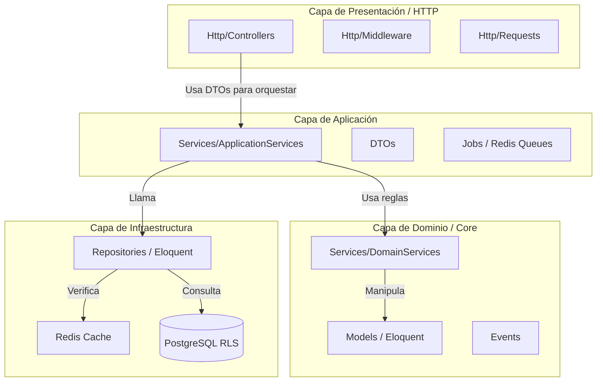
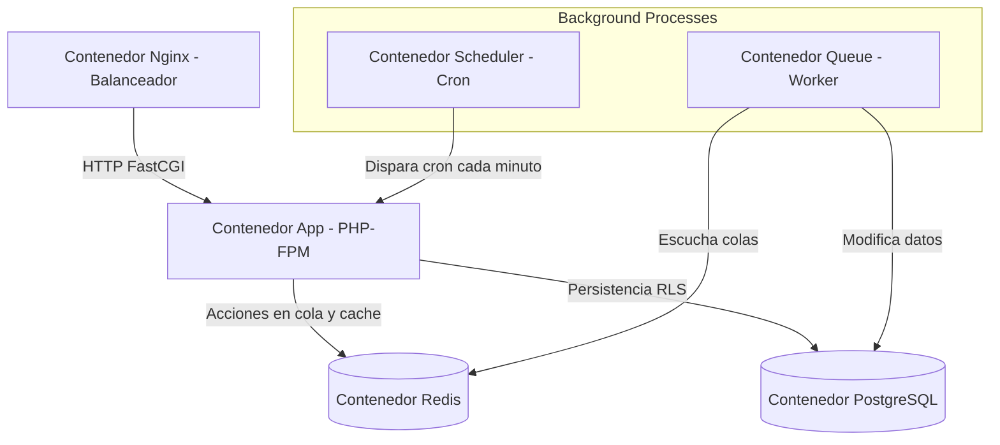

# Manual de Arquitectura de Backend Enterprise: Laravel 12 & PHP 8.4
## Patitas Soft - Especificación Definitiva para el Equipo de Desarrollo Senior

---

### Control de Documento
* **Proyecto:** Patitas Soft
* **Versión:** 2.0.0
* **Fecha:** 11 de Junio de 2026
* **Autores (Consorcio de Arquitectos):**
  * Laravel 12 Enterprise Architect
  * Senior Software Architect
  * SaaS Multi-Tenant Architect
  * DDD Specialist
  * Security Architect
  * PostgreSQL Architect
  * DevSecOps Engineer

---

## 1. Arquitectura de Software Enterprise: Laravel 12 & PHP 8.4

La arquitectura del backend de **Patitas Soft** se concibe como un diseño desacoplado que sintetiza el patrón **MVC** nativo de Laravel con principios de **Clean Architecture** y **Domain-Driven Design (DDD)**. 

### 1.1. Capas Arquitectónicas



### 1.2. Principios de Diseño
* **SOLID, DRY, KISS y Clean Code:** Forzados mediante tipado estricto (`declare(strict_types=1);`), inyección de dependencias por constructor, métodos de responsabilidad única y encapsulamiento de consultas Eloquent complejas.
* **Separación de Responsabilidades:** Los controladores no contienen lógica financiera, ni validaciones complejas, ni consultas crudas a la base de datos. Su única función es recibir la petición HTTP, validar la cabecera del Tenant, transformarla en un Data Transfer Object (DTO) inmutable, delegar la ejecución a la Capa de Servicios y retornar la respuesta estandarizada.

---

## 2. Estructura de Carpetas del Proyecto

El proyecto redefine el directorio `app/` tradicional de Laravel organizándolo por **Dominios de Negocio** e **Infraestructura Global**:

```text
app/
├── Domains/                   # Capa de Dominio (Organizado bajo DDD)
│   └── [NombreDominio]/       # ej: Pet, Inventory, Finance
│       ├── Models/            # Modelos Eloquent exclusivos del dominio
│       ├── Services/          # Domain Services específicos de este dominio
│       ├── Repositories/      # Interfaces y clases Eloquent del repositorio
│       ├── DTOs/              # Data Transfer Objects del dominio
│       ├── Policies/          # Reglas de autorización específicas (Policies)
│       └── Events/            # Eventos específicos del dominio (ej: PetCreated)
│
├── Http/                      # Capa de Presentación (Controladores y Rutas)
│   ├── Controllers/           # Controladores organizados por namespace de rol
│   │   ├── SuperAdmin/
│   │   ├── Admin/
│   │   ├── Vet/
│   │   └── Receptionist/
│   ├── Middleware/            # Middlewares de aislamiento y contexto
│   └── Requests/              # Form Requests globales de validación HTTP
│
├── Services/                  # Application Services globales (Orquestadores)
│   ├── Tenancy/               # Lógica de provisión e inicialización del Tenant
│   └── Billing/               # Integración con Stripe SaaS
│
├── Jobs/                      # Tareas asíncronas pesadas (Redis)
├── Notifications/             # Canales de comunicación (Email, SMS, WhatsApp)
├── Exceptions/                # Manejador global de excepciones del SaaS
└── Providers/                 # Service Providers de inicialización de contratos
```

---

## 3. Arquitectura por Dominios (DDD)

Para garantizar la mantenibilidad y prepararnos para una eventual transición hacia microservicios, aislamos las reglas de negocio en dominios independientes.

### 3.1. Listado de Dominios Oficiales
1. **Tenant:** Gestión de inquilinos, subdominios, marcas y límites comerciales de la clínica.
2. **User:** Gestión de usuarios, autenticación JWT, e identidades de veterinarios y recepcionistas.
3. **Owner:** Clientes propietarios de mascotas e información fiscal.
4. **Pet:** Pacientes animales (perros, gatos, exóticos), razas, especies, fotos de perfil.
5. **MedicalRecord:** Expedientes clínicos inmutables, consultas, diagnósticos (CIE-Vet), tratamientos y recetas.
6. **Appointment:** Agenda médica interactiva, horarios de veterinarios y turnos.
7. **Inventory:** Almacenes (`warehouses`), productos, lotes y movimientos de stock auditables.
8. **Medicine:** Subdominio específico que extiende productos para el control de dosis y principios activos de fármacos.
9. **Service:** Catálogo de servicios clínicos (estéticas, desparasitaciones, cirugías).
10. **Sale:** Gestión de ventas en POS, arqueos de cajas físicas e integraciones de cobros.
11. **Invoice:** Gestión fiscal, payloads XML timbrados ante el gobierno correspondiente.
12. **Notification:** Despacho automatizado de alertas de vacunación y citas por canales de mensajería.
13. **Audit:** Centralización de auditorías inmutables a nivel de base de datos.

---

## 4. Estrategia Multi-Tenant y Aislamiento RLS en Laravel 12

El aislamiento se implementa a nivel físico en base de datos mediante **PostgreSQL RLS (Row-Level Security)**. Para integrarlo a Laravel 12 de forma limpia y transparente para el desarrollador, implementamos los siguientes componentes:

### 4.1. Tenant Resolver (Servicio de Contexto)
```php
<?php
declare(strict_types=1);

namespace App\Services\Tenancy;

use App\Domains\Tenant\Models\Tenant;
use Illuminate\Support\Facades\Cache;
use Exception;

class TenantResolver
{
    private ?Tenant $currentTenant = null;

    /**
     * Resuelve el Tenant a partir del subdominio de la petición.
     */
    public function resolveFromSubdomain(string $subdomain): Tenant
    {
        $tenant = Cache::remember("tenant_meta:{$subdomain}", 3600, function () use ($subdomain) {
            return Tenant::where('subdominio', $subdomain)->first();
        });

        if (!$tenant || $tenant->status !== 'active') {
            throw new Exception("El Tenant especificado no está activo o no existe.", 404);
        }

        $this->currentTenant = $tenant;
        return $tenant;
    }

    public function getCurrentTenant(): ?Tenant
    {
        return $this->currentTenant;
    }
}
```

### 4.2. Middleware de Contexto de Inquilino
```php
<?php
declare(strict_types=1);

namespace App\Http\Middleware;

use Closure;
use Illuminate\Http\Request;
use App\Services\Tenancy\TenantResolver;
use Illuminate\Support\Facades\DB;
use Symfony\Component\HttpFoundation\Response;

class SetTenantContext
{
    public function __construct(
        private readonly TenantResolver $resolver
    ) {}

    public function handle(Request $request, Closure $next): Response
    {
        // Obtiene la cabecera provista por Flutter o el subdominio web
        $tenantHeader = $request->header('X-Tenant-ID');
        
        if ($tenantHeader) {
            $subdomain = $tenantHeader; // O buscar por UUID directo
        } else {
            $host = $request->getHost();
            $subdomain = explode('.', $host)[0];
        }

        try {
            $tenant = $this->resolver->resolveFromSubdomain($subdomain);
            
            // Configurar el contexto de sesión de PostgreSQL
            DB::statement("SET app.current_tenant_id = ?", [$tenant->id]);
            
        } catch (\Exception $e) {
            return response()->json([
                'success' => false,
                'message' => $e->getMessage()
            ], $e->getCode() ?: 400);
        }

        return $next($request);
    }
}
```

---

## 5. Estrategia de Capa de Servicios: Application vs. Domain Services

### 5.1. Definiciones
* **Domain Services (Servicios de Dominio):** Almacenan lógica de negocio pura que no pertenece a un solo modelo. No tocan peticiones HTTP, ni envían correos, ni se comunican con Stripe. Operan de forma matemática/lógica e inmutable.
* **Application Services (Servicios de Aplicación):** Orquestan casos de uso completos. Reciben DTOs, abren transacciones de base de datos, llaman a repositorios, ejecutan lógica de servicios de dominio, y disparan eventos o colas de fondo.

### 5.2. Ejemplo de Implementación

#### Servicio de Dominio (Domain Service)
```php
<?php
declare(strict_types=1);

namespace App\Domains\Inventory\Services;

use App\Domains\Inventory\Models\ProductBatch;
use Exception;

class StockReductionService
{
    /**
     * Ejecuta la lógica matemática de deducción de stock en base a lotes con fecha de caducidad.
     */
    public function calculateDeduction(ProductBatch $batch, int $quantityToDeduct): int
    {
        if ($batch->quantity < $quantityToDeduct) {
            throw new Exception("Stock insuficiente en el lote {$batch->batch_number}.");
        }

        if ($batch->expiration_date && $batch->expiration_date->isPast()) {
            throw new Exception("El lote {$batch->batch_number} está caducado.");
        }

        return $batch->quantity - $quantityToDeduct;
    }
}
```

#### Servicio de Aplicación (Application Service)
```php
<?php
declare(strict_types=1);

namespace App\Services\Inventory;

use App\Domains\Inventory\Repositories\Contracts\ProductBatchRepositoryInterface;
use App\Domains\Inventory\Services\StockReductionService;
use App\Domains\Inventory\DTOs\StockReductionDTO;
use Illuminate\Support\Facades\DB;
use App\Domains\Inventory\Events\StockAdjusted;

class InventoryApplicationService
{
    public function __construct(
        private readonly ProductBatchRepositoryInterface $batchRepository,
        private readonly StockReductionService $domainService
    ) {}

    /**
     * Orquesta el caso de uso del Punto de Venta al descontar inventario de forma segura.
     */
    public function reduceStock(StockReductionDTO $dto): void
    {
        DB::transaction(function () use ($dto) {
            $batch = $this->batchRepository->find($dto->batchId);
            
            // Lógica de Dominio
            $newQuantity = $this->domainService->calculateDeduction($batch, $dto->quantity);
            
            // Persistencia
            $this->batchRepository->updateQuantity($batch->id, $newQuantity);

            // Registro en historial y despacho de evento
            event(new StockAdjusted($batch->id, $dto->quantity));
        });
    }
}
```

---

## 6. Patrón Repository (Desacoplamiento de Datos)

### 6.1. Definición
Se implementa el patrón **Repository** interponiendo una interfaz entre la lógica del servicio y los modelos Eloquent de Laravel.

* **Ventajas:** Desacopla la lógica del backend del motor de persistencia, facilitando la escritura de pruebas unitarias (*mocking*) y centralizando consultas optimizadas en un solo lugar.
* **Desventajas:** Añade archivos extra (*boilerplates*). Se restringe su uso a dominios de negocio complejos (como inventario y ventas) y no para CRUDs estáticos.

### 6.2. Ejemplo de Implementación

#### Interfaz del Repositorio
```php
<?php
declare(strict_types=1);

namespace App\Domains\Pet\Repositories\Contracts;

use App\Domains\Pet\Models\Pet;
use Illuminate\Support\Collection;

interface PetRepositoryInterface
{
    public function findById(string $id): ?Pet;
    public function getActivePetsByOwner(string $ownerId): Collection;
}
```

#### Implementación en Eloquent
```php
<?php
declare(strict_types=1);

namespace App\Domains\Pet\Repositories\Eloquent;

use App\Domains\Pet\Repositories\Contracts\PetRepositoryInterface;
use App\Domains\Pet\Models\Pet;
use Illuminate\Support\Collection;

class PetEloquentRepository implements PetRepositoryInterface
{
    public function findById(string $id): ?Pet
    {
        // RLS en base de datos ya filtra automáticamente por tenant
        return Pet::find($id);
    }

    public function getActivePetsByOwner(string $ownerId): Collection
    {
        return Pet::where('owner_id', $ownerId)
            ->whereNull('deleted_at')
            ->orderBy('name')
            ->get();
    }
}
```

---

## 7. Data Transfer Objects (DTOs) en PHP 8.4

Los DTOs se utilizan para transportar información inmutable entre la capa HTTP (Controllers) y la capa de servicios de aplicación. En **PHP 8.4**, implementamos propiedades inmutables optimizadas por constructor.

```php
<?php
declare(strict_types=1);

namespace App\Domains\Pet\DTOs;

class StorePetDTO
{
    public function __construct(
        public readonly string $ownerId,
        public readonly int $speciesId,
        public readonly int $breedId,
        public readonly int $colorId,
        public readonly string $name,
        public readonly string $birthDate,
        public readonly string $gender,
        public readonly ?string $microchip = null
    ) {}

    /**
     * Construye un DTO limpio a partir de un Form Request validado.
     */
    public static function fromRequest(array $data): self
    {
        return new self(
            ownerId: $data['ownerId'],
            speciesId: (int) $data['speciesId'],
            breedId: (int) $data['breedId'],
            colorId: (int) $data['colorId'],
            name: $data['name'],
            birthDate: $data['birthDate'],
            gender: $data['gender'],
            microchip: $data['microchip'] ?? null
        );
    }
}
```

---

## 8. Arquitectura Dirigida por Eventos y Colas (Redis)

El procesamiento asíncrono se delega a colas de trabajo en **Redis**, garantizando que el usuario obtenga respuestas de la API en milisegundos.

### 8.1. Despacho de Eventos y Trabajos (Jobs)

#### Evento de Dominio: `SaleCompleted`
```php
<?php
declare(strict_types=1);

namespace App\Domains\Finance\Events;

use Illuminate\Foundation\Events\Dispatchable;
use Illuminate\Queue\SerializesModels;

class SaleCompleted
{
    use Dispatchable, SerializesModels;

    public function __construct(
        public readonly string $saleId
    ) {}
}
```

#### Listener: `TriggerBillingAndNotification`
```php
<?php
declare(strict_types=1);

namespace App\Domains\Finance\Listeners;

use App\Domains\Finance\Events\SaleCompleted;
use App\Jobs\ProcessInvoiceJob;
use App\Jobs\SendWhatsAppAlertJob;

class TriggerBillingAndNotification
{
    /**
     * Intercepta la venta completada y encola los procesos asíncronos en Redis.
     */
    public function handle(SaleCompleted $event): void
    {
        // Encolar generación de factura fiscal
        ProcessInvoiceJob::dispatch($event->saleId)->onQueue('billing');

        // Encolar mensaje de agradecimiento al cliente
        SendWhatsAppAlertJob::dispatch($event->saleId)->onQueue('notifications');
    }
}
```

#### Job en Cola (Redis): `ProcessInvoiceJob`
```php
<?php
declare(strict_types=1);

namespace App\Jobs;

use Illuminate\Bus\Queueable;
use Illuminate\Contracts\Queue\ShouldQueue;
use Illuminate\Foundation\Bus\Dispatchable;
use Illuminate\Queue\InteractsWithQueue;
use Illuminate\Queue\SerializesModels;

class ProcessInvoiceJob implements ShouldQueue
{
    use Dispatchable, InteractsWithQueue, Queueable, SerializesModels;

    // Políticas de reintento en caso de fallo de conexión externa
    public int $tries = 5;
    public int $backoff = 30;

    public function __construct(
        public readonly string $saleId
    ) {}

    public function handle(): void
    {
        // Conexión externa con PAC fiscal (gubernamental)
        // Guardado de XML timbrado en disco S3 inmutable
    }
}
```

---

## 9. Autenticación y Autorización (RBAC & Gates)

### 9.1. Middleware de Validación de Roles en Laravel 12
```php
<?php
declare(strict_types=1);

namespace App\Http\Middleware;

use Closure;
use Illuminate\Http\Request;
use Symfony\Component\HttpFoundation\Response;

class CheckRole
{
    /**
     * Valida que el usuario tenga uno de los roles autorizados para consumir la ruta.
     */
    public function handle(Request $request, Closure $next, string ...$roles): Response
    {
        $user = $request->user();

        if (!$user || !in_array($user->role, $roles, true)) {
            return response()->json([
                'success' => false,
                'message' => 'Acceso no autorizado para este rol.'
            ], 403);
        }

        return $next($request);
    }
}
```

---

## 10. Estrategia de Caché en Redis

Para evitar consultas SQL innecesarias en cada Request, implementamos una estrategia de **Caché Semántico** con invalidación reactiva por eventos Eloquent.

### 10.1. Implementación en Observers de Laravel
```php
<?php
declare(strict_types=1);

namespace App\Domains\Tenant\Observers;

use App\Domains\Tenant\Models\Tenant;
use Illuminate\Support\Facades\Cache;

class TenantObserver
{
    /**
     * Invalida la caché del subdominio del inquilino al actualizar sus metadatos.
     */
    public function updated(Tenant $tenant): void
    {
        Cache::forget("tenant_meta:{$tenant->subdominio}");
    }

    public function deleted(Tenant $tenant): void
    {
        Cache::forget("tenant_meta:{$tenant->subdominio}");
    }
}
```

---

## 11. Estrategia de Pruebas (Testing) en Laravel 12

Utilizaremos **Pest PHP** como framework de pruebas. La estrategia requiere:
* **Cobertura Mínima (Coverage):** 85% de la aplicación.
* **Cobertura Crítica:** 100% en lógicas de cálculo de inventarios, arqueos de POS, y políticas de aislamiento RLS.

### 11.1. Estructura de Tests
```text
tests/
├── Unit/                       # Lógica aislada pura (Domain Services)
│   └── StockReductionTest.php
├── Feature/                    # Pruebas de integración HTTP y controladores
│   ├── Auth/
│   ├── Pets/
│   └── POS/
└── TestCase.php
```

### 11.2. Ejemplo de Test Feature de Aislamiento Tenant (Pest)
```php
<?php

use App\Domains\Pet\Models\Pet;
use App\Models\User;

test('no permite a un usuario del tenant A ver mascotas del tenant B', function () {
    // 1. Crear Tenants
    $tenantA = Tenant::factory()->create(['subdominio' => 'clinica-a']);
    $tenantB = Tenant::factory()->create(['subdominio' => 'clinica-b']);

    // 2. Crear Mascota en Tenant B
    $petB = Pet::factory()->create(['tenant_id' => $tenantB->id]);

    // 3. Autenticar Usuario en Tenant A
    $userA = User::factory()->create(['tenant_id' => $tenantA->id]);
    
    // 4. Consumir la API simulando cabecera de Tenant A
    $response = $this->actingAs($userA)
        ->withHeaders(['X-Tenant-ID' => $tenantA->id])
        ->getJson("/api/v1/pets/{$petB->id}");

    // 5. Debe retornar 403 o 404 (gracias a RLS de base de datos)
    $response->assertStatus(403);
});
```

---

## 12. Arquitectura de Docker para Producción

En entornos de producción, se distribuyen los procesos en contenedores independientes y especializados para evitar cuellos de botella en la CPU del servidor de aplicación.



---

## 13. Pipeline de Integración Continua DevSecOps (GitHub Actions)

El flujo de despliegue valida la calidad y seguridad en cada paso:

```text
[Desarrollador realiza Push]
      │
      ▼
┌──────────────┐
│   Linter &   │ ──► PHP_CodeSniffer / Pint (Estilos)
│ Code Quality │ ──► PHPStan / Level 7 (Errores estáticos)
└──────────────┘
      │
      ▼
┌──────────────┐
│  SAST Scans  │ ──► Snyk (Vulnerabilidades en paquetes Composer)
└──────────────┘
      │
      ▼
┌──────────────┐
│  Unit Tests  │ ──► Pest / PHPUnit (Verificación lógica)
└──────────────┘
      │
      ▼
┌──────────────┐
│  Trivy Scan  │ ──► Escaneo de imagen Docker (App de producción)
└──────────────┘
      │
      ▼
┌──────────────┐
│  ZAP (DAST)  │ ──► Escaneo dinámico contra sandbox
└──────────────┘
      │
      ▼
[Despliegue a Producción (Rolling Update)]
```

---

## 14. Roadmap Técnico de Implementación

### Semana 1: Configuración de Base de Datos y Aislamiento RLS
* Configurar extensiones de base de datos PostgreSQL, RLS, triggers y funciones de auditoría PL/pgSQL.
* Implementar el `TenantResolver` y el middleware `SetTenantContext` en Laravel 12.

### Semana 2: Identidad y Seguridad (Autenticación JWT)
* Configurar flujos de JWT RS256 con revocación activa en Redis.
* Desarrollar middleware de verificación de roles (`CheckRole`) y el modelo de usuarios del inquilino.

### Semana 3-5: Dominios Médicos Clínicos
* Desarrollar los dominios `Owner`, `Pet` y `MedicalRecord` siguiendo la estructura DDD y Repositorios.
* Programar el formulario del expediente del paciente y la subida segura de archivos a S3.

### Semana 6-8: Operaciones de Inventario y POS
* Implementar control de inventario por lotes y caducidad.
* Programar el módulo de Punto de Venta (POS) utilizando servicios de dominio inmutables para el balanceo físico de stock.
