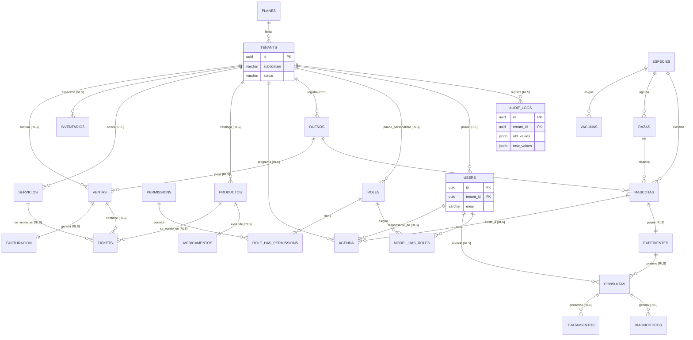

# Documento de Diseño de Base de Datos PostgreSQL: Patitas Soft
## Arquitectura de Datos SaaS Multi-Tenant y Seguridad RLS

---

### Control de Documento
* **Proyecto:** Patitas Soft
* **Versión:** 1.0.0
* **Fecha:** 10 de Junio de 2026
* **Autor:** PostgreSQL Database Architect Senior
* **Estatus:** Aprobado para Implementación

---

## 1. Decisiones de Arquitectura de Datos y Justificaciones

Como Arquitecto de Base de Datos PostgreSQL, he diseñado el modelo basándome en decisiones orientadas a la alta concurrencia, aislamiento criptográfico, auditabilidad inmutable y facilidad de escalabilidad horizontal. A continuación, se justifican las principales definiciones técnicas.

### 1.1. Claves Primarias: UUIDv7 vs. BIGINT vs. UUIDv4
Para el sistema transaccional de Patitas Soft, se ha definido el uso exclusivo de **UUIDv7** para todas las tablas multi-tenant y de negocio. Los identificadores tipo `BIGINT` secuenciales solo se utilizarán para tablas globales de configuración estática muy pequeña (ej. especies y razas pre-sembradas).

#### Cuadro Comparativo de Identificadores

| Criterio | BIGINT (Incremental) | UUIDv4 (Aleatorio) | UUIDv7 (Ordenado en el Tiempo) |
| :--- | :--- | :--- | :--- |
| **Seguridad / Ofuscación** | **Malo**. Permite enumeración de recursos externos (ej: `caja/ventas/1`). | **Excelente**. Totalmente impredecible. | **Excelente**. Impredecible para usuarios finales. |
| **Indexación (B-Tree)** | **Excelente**. Inserciones siempre al final de la página del índice. | **Malo**. Inserciones aleatorias que causan "Page Splits" y fragmentación. | **Excelente**. Inserciones secuenciales gracias al prefijo de Unix Epoch de 48-bits. |
| **Facilidad Sharding/Merge** | **Malo**. Colisiones de IDs inmediatas si se fusionan bases de datos. | **Excelente**. Nula probabilidad de colisión a nivel global. | **Excelente**. Nula probabilidad de colisión a nivel global. |
| **Caché Locality** | **Alto**. Páginas de índices calientes permanecen en memoria RAM. | **Muy Bajo**. Requiere leer páginas aleatorias de disco continuamente. | **Alto**. Excelente afinidad con la caché de memoria de Postgres. |
| **Tamaño en disco** | **8 bytes**. Muy compacto. | **16 bytes**. Mayor consumo de almacenamiento. | **16 bytes**. Mayor consumo pero óptimo rendimiento. |

**Justificación:** UUIDv7 combina el tamaño y la unicidad global de un UUID clásico con la velocidad de inserción y ordenamiento nativo de un entero secuencial (`BIGINT`), eliminando el cuello de botella tradicional de los índices en bases de datos PostgreSQL de gran volumen.

### 1.2. Estrategia de Aislamiento Multi-Tenant (`tenant_id` y RLS)
Para garantizar la separación lógica absoluta de la información de los inquilinos, se descartan los filtros en la capa de software (los cuales son vulnerables a fallos humanos) y se implementa **PostgreSQL Row-Level Security (RLS)** nativo.

* **Columna de Aislamiento:** Todas las tablas de datos de inquilinos tienen una columna `tenant_id UUID NOT NULL` indexada.
* **Sesión Segura:** En cada petición web, el middleware de Laravel establece una variable de configuración de sesión de corta duración utilizando `SET app.current_tenant_id = 'uuid-del-tenant'`.
* **Políticas en BD:** La política del motor de base de datos intercepta toda consulta SQL y valida que `tenant_id` sea igual a la variable configurada.
* **Super Administrador:** Las consultas realizadas por el rol de soporte del SaaS (`SuperAdmin`) pueden omitir las políticas de RLS mediante un bypass explícito en PostgreSQL (ej: `ALTER TABLE ... FORCE ROW LEVEL SECURITY` está apagado para superusuarios o políticas selectivas utilizando variables de bypass).

### 1.3. Estrategia de Soft Deletes
El borrado lógico (`Soft Delete`) se implementa a través de la columna `deleted_at TIMESTAMP WITH TIME ZONE NULL`. 
* **Optimizaciones a Nivel de Base de Datos:**
  * Las consultas típicas de la aplicación siempre filtran `WHERE deleted_at IS NULL`.
  * Para evitar búsquedas costosas en tablas gigantescas, todos los índices de negocio (ej. teléfonos de clientes, nombres de mascotas) se crean como **Índices Parciales** (ej: `CREATE INDEX ... WHERE deleted_at IS NULL`). Esto reduce significativamente el tamaño del índice en disco y acelera las lecturas críticas.

### 1.4. Estrategia de Auditoría Inmutable
Los registros de auditoría no deben ser escritos por Laravel. Si un administrador de base de datos (DBA) o un script malicioso modifica la base de datos por fuera de la aplicación, el log de auditoría tradicional de Laravel no se enteraría.
* **Implementación:** Creamos una tabla `audit_logs` particionada y un conjunto de **PostgreSQL Triggers** genéricos en PL/pgSQL que interceptan operaciones `INSERT`, `UPDATE` y `DELETE` a nivel de fila.
* **Mantenimiento:** El disparador compara el registro anterior (`OLD`) y el nuevo (`NEW`), guardando únicamente la diferencia (*diff*) en formato `JSONB` para optimizar espacio.

---

## 2. Diagrama de Entidad Relación Completo (ERD)

El siguiente modelo ilustra las relaciones funcionales y la propagación de llaves del sistema. Las tablas marcadas con **[RLS]** tienen políticas de Row-Level Security activas a nivel de PostgreSQL.



---

## 3. Definición DDL de Base de Datos (PostgreSQL 16+)

A continuación se detalla el esquema DDL completo optimizado. Incluye la inicialización de extensiones, creación de funciones generadoras de auditoría, configuración de RLS y definición exacta de tablas, índices y llaves foráneas.

### 3.1. Estructura Inicial y Extensiones
```sql
-- Habilitar extensión pgcrypto para hashing y manipulación de datos en caso de ser necesario
CREATE EXTENSION IF NOT EXISTS "pgcrypto";

-- Configurar zona horaria estándar empresarial UTC
SET timezone TO 'UTC';
```

### 3.2. Módulo de Planes e Inquilinos (Global Control)
Estas tablas controlan el acceso al SaaS y residen en el esquema público sin RLS activo (son tablas globales visibles por el sistema central).

```sql
CREATE TABLE planes (
    id UUID PRIMARY KEY DEFAULT gen_random_uuid(), -- En entornos productivos, se insertará el valor formateado como UUIDv7 desde Laravel
    nombre VARCHAR(100) NOT NULL,
    max_sucursales INT NOT NULL DEFAULT 1,
    max_usuarios INT NOT NULL DEFAULT 3,
    precio NUMERIC(12, 2) NOT NULL DEFAULT 0.00,
    caracteristicas JSONB,
    created_at TIMESTAMP WITH TIME ZONE DEFAULT CURRENT_TIMESTAMP,
    updated_at TIMESTAMP WITH TIME ZONE DEFAULT CURRENT_TIMESTAMP
);

CREATE TABLE tenants (
    id UUID PRIMARY KEY DEFAULT gen_random_uuid(),
    nombre VARCHAR(150) NOT NULL,
    subdominio VARCHAR(100) NOT NULL UNIQUE,
    dominio_personalizado VARCHAR(150) UNIQUE,
    plan_id UUID NOT NULL REFERENCES planes(id) ON DELETE RESTRICT,
    status VARCHAR(30) NOT NULL DEFAULT 'trial' CHECK (status IN ('active', 'suspended', 'trial')),
    created_at TIMESTAMP WITH TIME ZONE DEFAULT CURRENT_TIMESTAMP,
    updated_at TIMESTAMP WITH TIME ZONE DEFAULT CURRENT_TIMESTAMP
);

-- Índices globales de control
CREATE INDEX idx_tenants_subdomain ON tenants(subdominio);
CREATE INDEX idx_tenants_custom_domain ON tenants(dominio_personalizado) WHERE dominio_personalizado IS NOT NULL;
```

### 3.3. Módulo de Usuarios y Seguridad (Con RLS)
Permite gestionar los usuarios del tenant, roles y permisos en un modelo RBAC con soporte multitenant.

```sql
CREATE TABLE users (
    id UUID PRIMARY KEY,
    tenant_id UUID NOT NULL REFERENCES tenants(id) ON DELETE CASCADE,
    nombre VARCHAR(150) NOT NULL,
    email VARCHAR(150) NOT NULL,
    password VARCHAR(255) NOT NULL,
    is_active BOOLEAN NOT NULL DEFAULT TRUE,
    created_at TIMESTAMP WITH TIME ZONE DEFAULT CURRENT_TIMESTAMP,
    updated_at TIMESTAMP WITH TIME ZONE DEFAULT CURRENT_TIMESTAMP,
    deleted_at TIMESTAMP WITH TIME ZONE NULL
);

-- Índice compuesto para login rápido del usuario en su tenant
CREATE UNIQUE INDEX idx_users_tenant_email ON users(tenant_id, email) WHERE deleted_at IS NULL;

-- RBAC Tables
CREATE TABLE roles (
    id UUID PRIMARY KEY,
    tenant_id UUID NOT NULL REFERENCES tenants(id) ON DELETE CASCADE,
    name VARCHAR(100) NOT NULL,
    guard_name VARCHAR(50) NOT NULL DEFAULT 'web',
    created_at TIMESTAMP WITH TIME ZONE DEFAULT CURRENT_TIMESTAMP,
    updated_at TIMESTAMP WITH TIME ZONE DEFAULT CURRENT_TIMESTAMP
);

CREATE UNIQUE INDEX idx_roles_tenant_name ON roles(tenant_id, name);

CREATE TABLE permissions (
    id UUID PRIMARY KEY,
    name VARCHAR(100) NOT NULL UNIQUE,
    guard_name VARCHAR(50) NOT NULL DEFAULT 'web',
    created_at TIMESTAMP WITH TIME ZONE DEFAULT CURRENT_TIMESTAMP,
    updated_at TIMESTAMP WITH TIME ZONE DEFAULT CURRENT_TIMESTAMP
);

CREATE TABLE model_has_roles (
    model_id UUID NOT NULL,
    model_type VARCHAR(150) NOT NULL,
    role_id UUID NOT NULL REFERENCES roles(id) ON DELETE CASCADE,
    PRIMARY KEY (model_id, model_type, role_id)
);

CREATE TABLE role_has_permissions (
    role_id UUID NOT NULL REFERENCES roles(id) ON DELETE CASCADE,
    permission_id UUID NOT NULL REFERENCES permissions(id) ON DELETE CASCADE,
    PRIMARY KEY (role_id, permission_id)
);
```

### 3.4. Módulo de Clientes, Mascotas y Expedientes Clínicos (Con RLS)
Contiene la información de los pacientes y sus dueños.

```sql
CREATE TABLE dueños (
    id UUID PRIMARY KEY,
    tenant_id UUID NOT NULL REFERENCES tenants(id) ON DELETE CASCADE,
    nombre VARCHAR(100) NOT NULL,
    apellido VARCHAR(100) NOT NULL,
    telefono VARCHAR(30) NOT NULL,
    email VARCHAR(150) NULL,
    direccion TEXT NULL,
    dni_rfc VARCHAR(50) NULL,
    created_at TIMESTAMP WITH TIME ZONE DEFAULT CURRENT_TIMESTAMP,
    updated_at TIMESTAMP WITH TIME ZONE DEFAULT CURRENT_TIMESTAMP,
    deleted_at TIMESTAMP WITH TIME ZONE NULL
);

-- Búsquedas rápidas de clientes por teléfono o apellido dentro de la clínica
CREATE INDEX idx_dueños_tenant_search ON dueños(tenant_id, apellido, nombre) WHERE deleted_at IS NULL;
CREATE INDEX idx_dueños_tenant_telefono ON dueños(tenant_id, telefono) WHERE deleted_at IS NULL;

-- Catálogos Globales / Compartidos de Especies, Razas y Vacunas
CREATE TABLE especies (
    id SERIAL PRIMARY KEY,
    nombre VARCHAR(100) NOT NULL UNIQUE,
    created_at TIMESTAMP WITH TIME ZONE DEFAULT CURRENT_TIMESTAMP
);

CREATE TABLE razas (
    id SERIAL PRIMARY KEY,
    especie_id INT NOT NULL REFERENCES especies(id) ON DELETE CASCADE,
    nombre VARCHAR(100) NOT NULL,
    created_at TIMESTAMP WITH TIME ZONE DEFAULT CURRENT_TIMESTAMP,
    CONSTRAINT uq_especie_raza UNIQUE(especie_id, nombre)
);

CREATE TABLE vacunas (
    id SERIAL PRIMARY KEY,
    especie_id INT NOT NULL REFERENCES especies(id) ON DELETE CASCADE,
    nombre VARCHAR(150) NOT NULL,
    frecuencia_meses INT NOT NULL DEFAULT 12
);

-- Mascotas
CREATE TABLE mascotas (
    id UUID PRIMARY KEY,
    tenant_id UUID NOT NULL REFERENCES tenants(id) ON DELETE CASCADE,
    owner_id UUID NOT NULL REFERENCES dueños(id) ON DELETE RESTRICT,
    nombre VARCHAR(100) NOT NULL,
    especie_id INT NOT NULL REFERENCES especies(id) ON DELETE RESTRICT,
    raza_id INT NOT NULL REFERENCES razas(id) ON DELETE RESTRICT,
    fecha_nacimiento DATE NOT NULL,
    genero CHAR(1) NOT NULL CHECK (genero IN ('M', 'F')),
    color VARCHAR(100) NULL,
    microchip VARCHAR(50) NULL,
    created_at TIMESTAMP WITH TIME ZONE DEFAULT CURRENT_TIMESTAMP,
    updated_at TIMESTAMP WITH TIME ZONE DEFAULT CURRENT_TIMESTAMP,
    deleted_at TIMESTAMP WITH TIME ZONE NULL
);

CREATE INDEX idx_mascotas_tenant_owner ON mascotas(tenant_id, owner_id) WHERE deleted_at IS NULL;
CREATE INDEX idx_mascotas_tenant_microchip ON mascotas(tenant_id, microchip) WHERE microchip IS NOT NULL AND deleted_at IS NULL;

-- Expediente Clínico (Cabecera)
CREATE TABLE expedientes (
    id UUID PRIMARY KEY,
    tenant_id UUID NOT NULL REFERENCES tenants(id) ON DELETE CASCADE,
    mascota_id UUID NOT NULL UNIQUE REFERENCES mascotas(id) ON DELETE CASCADE,
    notas_criticas TEXT NULL, -- Alergias críticas, patologías crónicas
    created_at TIMESTAMP WITH TIME ZONE DEFAULT CURRENT_TIMESTAMP,
    updated_at TIMESTAMP WITH TIME ZONE DEFAULT CURRENT_TIMESTAMP
);

CREATE INDEX idx_expedientes_tenant ON expedientes(tenant_id);

-- Consultas Médicas
CREATE TABLE consultas (
    id UUID PRIMARY KEY,
    tenant_id UUID NOT NULL REFERENCES tenants(id) ON DELETE CASCADE,
    expediente_id UUID NOT NULL REFERENCES expedientes(id) ON DELETE CASCADE,
    veterinario_id UUID NOT NULL REFERENCES users(id) ON DELETE RESTRICT,
    peso_kg NUMERIC(6, 3) NOT NULL,
    temperatura_c NUMERIC(4, 2) NOT NULL,
    frecuencia_cardiaca_bpm INT NOT NULL,
    frecuencia_respiratoria_rpm INT NOT NULL,
    sintomas TEXT NOT NULL,
    created_at TIMESTAMP WITH TIME ZONE DEFAULT CURRENT_TIMESTAMP,
    updated_at TIMESTAMP WITH TIME ZONE DEFAULT CURRENT_TIMESTAMP
);

CREATE INDEX idx_consultas_tenant_expediente ON consultas(tenant_id, expediente_id);

-- Diagnósticos y Tratamientos asociados a la consulta
CREATE TABLE diagnosticos (
    id UUID PRIMARY KEY,
    tenant_id UUID NOT NULL REFERENCES tenants(id) ON DELETE CASCADE,
    consulta_id UUID NOT NULL REFERENCES consultas(id) ON DELETE CASCADE,
    codigo_cie_vet VARCHAR(20) NULL, -- Código de enfermedades veterinario si aplica
    descripcion TEXT NOT NULL,
    notas TEXT NULL,
    created_at TIMESTAMP WITH TIME ZONE DEFAULT CURRENT_TIMESTAMP
);

CREATE TABLE tratamientos (
    id UUID PRIMARY KEY,
    tenant_id UUID NOT NULL REFERENCES tenants(id) ON DELETE CASCADE,
    consulta_id UUID NOT NULL REFERENCES consultas(id) ON DELETE CASCADE,
    descripcion TEXT NOT NULL,
    fecha_inicio DATE NOT NULL,
    fecha_fin DATE NULL,
    created_at TIMESTAMP WITH TIME ZONE DEFAULT CURRENT_TIMESTAMP
);
```

### 3.5. Módulo de Operaciones, Agenda e Inventario (Con RLS)
Define la gestión de turnos médicos y stock de productos / medicamentos.

```sql
CREATE TABLE agenda (
    id UUID PRIMARY KEY,
    tenant_id UUID NOT NULL REFERENCES tenants(id) ON DELETE CASCADE,
    mascota_id UUID NOT NULL REFERENCES mascotas(id) ON DELETE CASCADE,
    veterinario_id UUID NOT NULL REFERENCES users(id) ON DELETE RESTRICT,
    fecha_hora_inicio TIMESTAMP WITH TIME ZONE NOT NULL,
    fecha_hora_fin TIMESTAMP WITH TIME ZONE NOT NULL,
    motivo VARCHAR(255) NOT NULL,
    status VARCHAR(30) NOT NULL DEFAULT 'pendiente' CHECK (status IN ('pendiente', 'confirmada', 'cancelada', 'completada')),
    created_at TIMESTAMP WITH TIME ZONE DEFAULT CURRENT_TIMESTAMP,
    updated_at TIMESTAMP WITH TIME ZONE DEFAULT CURRENT_TIMESTAMP
);

-- Índice para búsquedas por fecha y evitar sobre-agendamientos
CREATE INDEX idx_agenda_tenant_rango ON agenda(tenant_id, fecha_hora_inicio, fecha_hora_fin);

-- Productos, Servicios e Inventario
CREATE TABLE productos (
    id UUID PRIMARY KEY,
    tenant_id UUID NOT NULL REFERENCES tenants(id) ON DELETE CASCADE,
    nombre VARCHAR(150) NOT NULL,
    sku VARCHAR(50) NOT NULL,
    codigo_barras VARCHAR(100) NULL,
    precio_compra NUMERIC(12, 2) NOT NULL DEFAULT 0.00,
    precio_venta NUMERIC(12, 2) NOT NULL DEFAULT 0.00,
    es_medicamento BOOLEAN NOT NULL DEFAULT FALSE,
    created_at TIMESTAMP WITH TIME ZONE DEFAULT CURRENT_TIMESTAMP,
    updated_at TIMESTAMP WITH TIME ZONE DEFAULT CURRENT_TIMESTAMP,
    deleted_at TIMESTAMP WITH TIME ZONE NULL
);

CREATE UNIQUE INDEX idx_productos_tenant_sku ON productos(tenant_id, sku) WHERE deleted_at IS NULL;
CREATE INDEX idx_productos_tenant_barcode ON productos(tenant_id, codigo_barras) WHERE codigo_barras IS NOT NULL AND deleted_at IS NULL;

-- Tabla 1:1 con Productos para Medicamentos
CREATE TABLE medicamentos (
    id UUID PRIMARY KEY REFERENCES productos(id) ON DELETE CASCADE,
    tenant_id UUID NOT NULL REFERENCES tenants(id) ON DELETE CASCADE,
    principio_activo VARCHAR(150) NOT NULL,
    concentracion VARCHAR(50) NOT NULL,
    presentacion VARCHAR(100) NOT NULL -- Inyectable, Tableta, Jarabe, etc.
);

CREATE TABLE servicios (
    id UUID PRIMARY KEY,
    tenant_id UUID NOT NULL REFERENCES tenants(id) ON DELETE CASCADE,
    nombre VARCHAR(150) NOT NULL,
    precio NUMERIC(12, 2) NOT NULL DEFAULT 0.00,
    is_active BOOLEAN NOT NULL DEFAULT TRUE,
    created_at TIMESTAMP WITH TIME ZONE DEFAULT CURRENT_TIMESTAMP,
    updated_at TIMESTAMP WITH TIME ZONE DEFAULT CURRENT_TIMESTAMP
);

CREATE TABLE inventarios (
    id UUID PRIMARY KEY,
    tenant_id UUID NOT NULL REFERENCES tenants(id) ON DELETE CASCADE,
    producto_id UUID NOT NULL REFERENCES productos(id) ON DELETE RESTRICT,
    stock INT NOT NULL DEFAULT 0 CHECK (stock >= 0),
    stock_minimo INT NOT NULL DEFAULT 5 CHECK (stock_minimo >= 0),
    stock_maximo INT NOT NULL DEFAULT 100 CHECK (stock_maximo > 0),
    ubicacion VARCHAR(100) NULL,
    updated_at TIMESTAMP WITH TIME ZONE DEFAULT CURRENT_TIMESTAMP
);

CREATE UNIQUE INDEX idx_inventarios_tenant_producto ON inventarios(tenant_id, producto_id);
```

### 3.6. Módulo de Ventas y Facturación (Con RLS)
Tablas que registran el cobro de insumos y servicios médicos.

```sql
CREATE TABLE ventas (
    id UUID PRIMARY KEY,
    tenant_id UUID NOT NULL REFERENCES tenants(id) ON DELETE CASCADE,
    cliente_id UUID NULL REFERENCES dueños(id) ON DELETE RESTRICT,
    cajero_id UUID NOT NULL REFERENCES users(id) ON DELETE RESTRICT,
    total NUMERIC(12, 2) NOT NULL DEFAULT 0.00,
    descuento NUMERIC(12, 2) NOT NULL DEFAULT 0.00,
    impuesto NUMERIC(12, 2) NOT NULL DEFAULT 0.00,
    metodo_pago VARCHAR(50) NOT NULL CHECK (metodo_pago IN ('efectivo', 'tarjeta', 'transferencia')),
    status VARCHAR(30) NOT NULL DEFAULT 'pagada' CHECK (status IN ('pagada', 'cancelada', 'reembolsada')),
    created_at TIMESTAMP WITH TIME ZONE DEFAULT CURRENT_TIMESTAMP,
    updated_at TIMESTAMP WITH TIME ZONE DEFAULT CURRENT_TIMESTAMP
);

CREATE INDEX idx_ventas_tenant_fecha ON ventas(tenant_id, created_at);

-- Detalle de Tickets de Venta
CREATE TABLE tickets (
    id UUID PRIMARY KEY,
    tenant_id UUID NOT NULL REFERENCES tenants(id) ON DELETE CASCADE,
    venta_id UUID NOT NULL REFERENCES ventas(id) ON DELETE CASCADE,
    producto_id UUID NULL REFERENCES productos(id) ON DELETE RESTRICT,
    servicio_id UUID NULL REFERENCES servicios(id) ON DELETE RESTRICT,
    cantidad INT NOT NULL CHECK (cantidad > 0),
    precio_unitario NUMERIC(12, 2) NOT NULL,
    descuento NUMERIC(12, 2) NOT NULL DEFAULT 0.00,
    total NUMERIC(12, 2) NOT NULL,
    created_at TIMESTAMP WITH TIME ZONE DEFAULT CURRENT_TIMESTAMP,
    CONSTRAINT ck_ticket_item CHECK (
        (producto_id IS NOT NULL AND servicio_id IS NULL) OR
        (producto_id IS NULL AND servicio_id IS NOT NULL)
    )
);

CREATE INDEX idx_tickets_venta ON tickets(venta_id);

-- Facturación Electrónica Fiscal
CREATE TABLE facturacion (
    id UUID PRIMARY KEY,
    tenant_id UUID NOT NULL REFERENCES tenants(id) ON DELETE CASCADE,
    venta_id UUID NOT NULL UNIQUE REFERENCES ventas(id) ON DELETE CASCADE,
    uuid_fiscal VARCHAR(100) NOT NULL, -- UUID provisto por el ente tributario (SAT, DIAN, etc.)
    xml_payload TEXT NOT NULL,
    pdf_url VARCHAR(255) NULL,
    status VARCHAR(30) NOT NULL DEFAULT 'emitida' CHECK (status IN ('emitida', 'cancelada', 'fallida')),
    created_at TIMESTAMP WITH TIME ZONE DEFAULT CURRENT_TIMESTAMP
);
```

---

## 4. Configuración RLS (Row-Level Security) en PostgreSQL

Ejecutamos la activación de seguridad en cada una de las tablas correspondientes a los inquilinos.

```sql
-- Habilitar RLS en cada tabla Multi-Tenant
ALTER TABLE users ENABLE ROW LEVEL SECURITY;
ALTER TABLE roles ENABLE ROW LEVEL SECURITY;
ALTER TABLE dueños ENABLE ROW LEVEL SECURITY;
ALTER TABLE mascotas ENABLE ROW LEVEL SECURITY;
ALTER TABLE expedientes ENABLE ROW LEVEL SECURITY;
ALTER TABLE consultas ENABLE ROW LEVEL SECURITY;
ALTER TABLE diagnosticos ENABLE ROW LEVEL SECURITY;
ALTER TABLE tratamientos ENABLE ROW LEVEL SECURITY;
ALTER TABLE agenda ENABLE ROW LEVEL SECURITY;
ALTER TABLE productos ENABLE ROW LEVEL SECURITY;
ALTER TABLE medicamentos ENABLE ROW LEVEL SECURITY;
ALTER TABLE servicios ENABLE ROW LEVEL SECURITY;
ALTER TABLE inventarios ENABLE ROW LEVEL SECURITY;
ALTER TABLE ventas ENABLE ROW LEVEL SECURITY;
ALTER TABLE tickets ENABLE ROW LEVEL SECURITY;
ALTER TABLE facturacion ENABLE ROW LEVEL SECURITY;

-- Crear la política de aislamiento genérica basada en la sesión app.current_tenant_id
CREATE POLICY tenant_isolation_users ON users FOR ALL USING (tenant_id = NULLIF(current_setting('app.current_tenant_id', true), '')::uuid);
CREATE POLICY tenant_isolation_roles ON roles FOR ALL USING (tenant_id = NULLIF(current_setting('app.current_tenant_id', true), '')::uuid);
CREATE POLICY tenant_isolation_dueños ON dueños FOR ALL USING (tenant_id = NULLIF(current_setting('app.current_tenant_id', true), '')::uuid);
CREATE POLICY tenant_isolation_mascotas ON mascotas FOR ALL USING (tenant_id = NULLIF(current_setting('app.current_tenant_id', true), '')::uuid);
CREATE POLICY tenant_isolation_expedientes ON expedientes FOR ALL USING (tenant_id = NULLIF(current_setting('app.current_tenant_id', true), '')::uuid);
CREATE POLICY tenant_isolation_consultas ON consultas FOR ALL USING (tenant_id = NULLIF(current_setting('app.current_tenant_id', true), '')::uuid);
CREATE POLICY tenant_isolation_diagnosticos ON diagnosticos FOR ALL USING (tenant_id = NULLIF(current_setting('app.current_tenant_id', true), '')::uuid);
CREATE POLICY tenant_isolation_tratamientos ON tratamientos FOR ALL USING (tenant_id = NULLIF(current_setting('app.current_tenant_id', true), '')::uuid);
CREATE POLICY tenant_isolation_agenda ON agenda FOR ALL USING (tenant_id = NULLIF(current_setting('app.current_tenant_id', true), '')::uuid);
CREATE POLICY tenant_isolation_productos ON productos FOR ALL USING (tenant_id = NULLIF(current_setting('app.current_tenant_id', true), '')::uuid);
CREATE POLICY tenant_isolation_medicamentos ON medicamentos FOR ALL USING (tenant_id = NULLIF(current_setting('app.current_tenant_id', true), '')::uuid);
CREATE POLICY tenant_isolation_servicios ON servicios FOR ALL USING (tenant_id = NULLIF(current_setting('app.current_tenant_id', true), '')::uuid);
CREATE POLICY tenant_isolation_inventarios ON inventarios FOR ALL USING (tenant_id = NULLIF(current_setting('app.current_tenant_id', true), '')::uuid);
CREATE POLICY tenant_isolation_ventas ON ventas FOR ALL USING (tenant_id = NULLIF(current_setting('app.current_tenant_id', true), '')::uuid);
CREATE POLICY tenant_isolation_tickets ON tickets FOR ALL USING (tenant_id = NULLIF(current_setting('app.current_tenant_id', true), '')::uuid);
CREATE POLICY tenant_isolation_facturacion ON facturacion FOR ALL USING (tenant_id = NULLIF(current_setting('app.current_tenant_id', true), '')::uuid);
```

---

## 5. Estrategia de Auditoría Inmutable (Triggers en PostgreSQL)

Diseñamos una tabla de logs de auditoría central y un trigger en PL/pgSQL que captura los cambios en formato JSONB.

### 5.1. Tabla de Auditoría (Particionada por Rango de Tiempo de Creación)
```sql
CREATE TABLE audit_logs (
    id UUID NOT NULL,
    tenant_id UUID NOT NULL,
    user_id UUID NULL,
    accion VARCHAR(20) NOT NULL CHECK (accion IN ('INSERT', 'UPDATE', 'DELETE')),
    nombre_tabla VARCHAR(100) NOT NULL,
    registro_id UUID NOT NULL,
    valores_anteriores JSONB NULL,
    valores_nuevos JSONB NULL,
    direccion_ip VARCHAR(45) NULL,
    agente_usuario TEXT NULL,
    created_at TIMESTAMP WITH TIME ZONE DEFAULT CURRENT_TIMESTAMP NOT NULL,
    PRIMARY KEY (id, created_at) -- Requerido por la estrategia de particionado en PostgreSQL
) PARTITION BY RANGE (created_at);

-- Habilitar RLS en logs de auditoría
ALTER TABLE audit_logs ENABLE ROW LEVEL SECURITY;
CREATE POLICY tenant_isolation_audit ON audit_logs FOR ALL USING (tenant_id = NULLIF(current_setting('app.current_tenant_id', true), '')::uuid);
```

### 5.2. Función del Trigger del Sistema de Auditoría
Esta función lee el ID del usuario directamente del contexto de base de datos establecido en la transacción (`app.current_user_id`), garantizando trazabilidad absoluta.

```sql
CREATE OR REPLACE FUNCTION fn_audit_trigger_handler()
RETURNS TRIGGER AS $$
DECLARE
    v_user_id UUID;
    v_tenant_id UUID;
    v_old JSONB := NULL;
    v_new JSONB := NULL;
    v_registro_id UUID;
BEGIN
    -- Intentar obtener el ID de usuario del contexto de sesión
    BEGIN
        v_user_id := NULLIF(current_setting('app.current_user_id', true), '')::uuid;
    EXCEPTION WHEN OTHERS THEN
        v_user_id := NULL;
    END;

    -- Obtener el ID del Tenant según la operación
    IF (TG_OP = 'DELETE') THEN
        v_tenant_id := OLD.tenant_id;
        v_registro_id := OLD.id;
        v_old := to_jsonb(OLD) - 'tenant_id' - 'updated_at'; -- Excluir metadatos del log para optimizar tamaño
    ELSIF (TG_OP = 'UPDATE') THEN
        v_tenant_id := NEW.tenant_id;
        v_registro_id := NEW.id;
        v_old := to_jsonb(OLD) - 'tenant_id' - 'updated_at';
        v_new := to_jsonb(NEW) - 'tenant_id' - 'updated_at';
        
        -- Si los datos no cambiaron, no registrar auditoría
        IF (v_old = v_new) THEN
            RETURN NEW;
        END IF;
    ELSIF (TG_OP = 'INSERT') THEN
        v_tenant_id := NEW.tenant_id;
        v_registro_id := NEW.id;
        v_new := to_jsonb(NEW) - 'tenant_id' - 'updated_at';
    END IF;

    -- Generar UUIDv7 de forma simulada en base de datos o usar UUID genérico para auditoría
    INSERT INTO audit_logs (id, tenant_id, user_id, accion, nombre_tabla, registro_id, valores_anteriores, valores_nuevos, created_at)
    VALUES (
        gen_random_uuid(), -- En producción, idealmente se pasa como UUIDv7 precalculado
        v_tenant_id,
        v_user_id,
        TG_OP,
        TG_TABLE_NAME,
        v_registro_id,
        v_old,
        v_new,
        CURRENT_TIMESTAMP
    );

    IF (TG_OP = 'DELETE') THEN
        RETURN OLD;
    ELSE
        RETURN NEW;
    END IF;
END;
$$ LANGUAGE plpgsql SECURITY DEFINER;
```

### 5.3. Asignación del Trigger a Tablas Sensibles (Ejemplo: Inventario y Ventas)
```sql
CREATE TRIGGER tr_audit_inventarios
    AFTER INSERT OR UPDATE OR DELETE ON inventarios
    FOR EACH ROW EXECUTE FUNCTION fn_audit_trigger_handler();

CREATE TRIGGER tr_audit_ventas
    AFTER INSERT OR UPDATE OR DELETE ON ventas
    FOR EACH ROW EXECUTE FUNCTION fn_audit_trigger_handler();
    
CREATE TRIGGER tr_audit_mascotas
    AFTER INSERT OR UPDATE OR DELETE ON mascotas
    FOR EACH ROW EXECUTE FUNCTION fn_audit_trigger_handler();
```

---

## 6. Particionamiento de Datos en Producción

Para mitigar el crecimiento desmesurado de tablas transaccionales o de bitácoras históricas, aplicaremos particionado nativo en PostgreSQL.

### 6.1. Particionamiento de la Tabla `audit_logs` (Por Rango Mensual)
En producción se inicializan las tablas hijas para albergar los datos del año fiscal en curso:

```sql
CREATE TABLE audit_logs_y2026m06 PARTITION OF audit_logs
    FOR VALUES FROM ('2026-06-01 00:00:00+00') TO ('2026-07-01 00:00:00+00');

CREATE TABLE audit_logs_y2026m07 PARTITION OF audit_logs
    FOR VALUES FROM ('2026-07-01 00:00:00+00') TO ('2026-08-01 00:00:00+00');

CREATE TABLE audit_logs_y2026m08 PARTITION OF audit_logs
    FOR VALUES FROM ('2026-08-01 00:00:00+00') TO ('2026-09-01 00:00:00+00');
```
* **Ventaja Administrativa:** Para depurar o archivar datos de auditoría con antigüedad superior a 1 año, en lugar de realizar una costosa operación de borrado (`DELETE FROM ... WHERE created_at < ...` que satura el WAL y genera fragmentación por MVCC), simplemente desvinculamos la tabla hija (`ALTER TABLE ... DETACH PARTITION`) y la respaldamos externamente.

### 6.2. Candidatos a Particionamiento Adicional (V2 / V3)
* **`tickets` y `ventas`:** A partir de 10 millones de filas consolidadas, estas tablas se particionarán por rango trimestral de tiempo.
* **`consultas` y `diagnósticos`:** Al ser registros clínicos de consulta inmutables (históricos), se particionarán mediante **Hash por `tenant_id`**, lo que distribuye de manera balanceada los datos a nivel físico.

---

## 7. Optimización y Estrategias de Consulta en PostgreSQL

El rendimiento del motor de base de datos se basa en políticas estructuradas de indexación y sintonización de parámetros.

### 7.1. Directrices de Índices Compuestos
En un esquema RLS, **todas** las consultas de filtrado contienen la columna `tenant_id`. Por ende, los índices compuestos deben planificarse con precisión:
1. **Regla de Oro:** La columna `tenant_id` debe ir en **primer lugar** en el orden de columnas del índice compuesto.
2. **Ejemplo práctico:** Para buscar un paciente por nombre en la veterinaria, el índice óptimo es:
   ```sql
   CREATE INDEX idx_mascotas_tenant_nombre ON mascotas(tenant_id, nombre) WHERE deleted_at IS NULL;
   ```
   Postgres ejecutará un escaneo tipo `Index Only Scan` o `Index Scan` enfocado directamente en el inquilino activo, descartando instantáneamente al 99.9% de los registros globales en microsegundos.

### 7.2. Tuning de Parámetros del Servidor (Para Servidor con 8GB RAM dedicada)
Ajustes recomendados en `postgresql.conf` para optimizar el comportamiento SaaS:
* `shared_buffers = 2GB` (25% de la RAM total del servidor).
* `work_mem = 64MB` (Evita que las ordenaciones complejas de expedientes se ejecuten en disco de swap).
* `maintenance_work_mem = 512MB` (Acelera la creación de índices y limpiezas de VACUUM).
* `effective_cache_size = 6GB` (Le dice a Postgres cuánta memoria está disponible para almacenamiento en caché del sistema operativo).
* `random_page_cost = 1.1` (Sintonizado para almacenamiento en estado sólido SSD / NVMe moderno).

### 7.3. PgBouncer Connection Pooling
Dado que Laravel inicializa una conexión por cada Request HTTP, la base de datos se saturaría al pasar los 300 usuarios concurrentes. 
* **Configuración:** PgBouncer se sitúa frente a PostgreSQL.
* **Modo de Operación:** `pool_mode = transaction`.
* **Impacto:** Las transacciones se ejecutan en milisegundos, liberando inmediatamente la conexión física para que sea reutilizada por otro Request de la cola HTTP. Aumenta la escalabilidad de conexiones concurrentes de 100 a más de 5,000 en el mismo servidor de base de datos.
