# Guía de Especificación de Migraciones y Base de Datos
## Patitas Soft - Esquema Físico de Datos y Sprints de Despliegue (Laravel 12)

---

### Control de Documento
* **Proyecto:** Patitas Soft
* **Versión:** 1.0.0
* **Fecha:** 11 de Junio de 2026
* **Autores (Consorcio de Arquitectos):**
  * Laravel 12 Enterprise Architect
  * PostgreSQL Database Architect
  * SaaS Multi-Tenant Architect
  * Security Architect
  * DevSecOps Engineer

---

## 1. Orden de Ejecución y Dependencias de Migraciones

Para evitar errores de violación de claves foráneas (`Foreign Key Violations`) durante el comando de migración de Laravel, el orden físico de ejecución se ha planificado meticulosamente respetando el árbol de dependencias.

### 1.1. Diagrama de Dependencias de Migraciones

```mermaid
graph TD
    %% Nivel 1: Tablas Core Sin Llaves Foráneas
    plans[0001_plans] --> tenants[0002_tenants]
    
    %% Nivel 2: Dependencias de Tenants
    tenants --> subscriptions[0003_subscriptions]
    tenants --> users[0004_users]
    tenants --> roles[0005_roles]
    tenants --> permissions[0006_permissions]
    tenants --> branches[0007_branches]
    tenants --> owners[0008_owners]
    tenants --> pet_species[0009_pet_species]
    tenants --> pet_colors[0010_pet_colors]
    tenants --> appointment_statuses[0011_appointment_statuses]
    tenants --> payment_methods[0012_payment_methods]
    
    %% Nivel 3: Relacionales Cruzadas
    users --> branch_users[0013_branch_users]
    branches --> branch_users
    
    roles --> role_permissions[0014_role_permissions]
    permissions --> role_permissions
    
    owners --> owner_contacts[0015_owner_contacts]
    
    pet_species --> pet_breeds[0016_pet_breeds]
    
    %% Nivel 4: Mascotas y Derivados
    pets[0017_pets] --> pet_photos[0018_pet_photos]
    pets --> medical_records[0019_medical_records]
    pets --> pet_vaccines[0020_pet_vaccines]
    pets --> pet_dewormings[0021_pet_dewormings]
    pets --> pet_surgeries[0022_pet_surgeries]
    pets --> hospitalizations[0023_hospitalizations]
    pets --> appointments[0024_appointments]
    
    pet_breeds --> pets
    pet_colors --> pets
    owners --> pets
    
    %% Nivel 5: Clínico Avanzado
    medical_records --> consultations[0025_consultations]
    consultations --> diagnoses[0026_diagnoses]
    consultations --> treatments[0027_treatments]
    consultations --> prescriptions[0028_prescriptions]
    consultations --> attachments[0029_attachments]
    
    %% Nivel 6: Comercial e Inventario
    branches --> warehouses[0030_warehouses]
    product_categories[0031_product_categories] --> products[0032_products]
    products --> product_batches[0033_product_batches]
    warehouses --> product_batches
    
    products --> medicines[0034_medicines]
    product_batches --> medicine_batches[0035_medicine_batches]
    
    product_batches --> inventory_movements[0036_inventory_movements]
    
    %% Nivel 7: POS y Ventas
    cash_registers[0037_cash_registers] --> sales[0038_sales]
    sales --> sale_details[0039_sale_details]
    sales --> payments[0040_payments]
    payment_methods --> payments
    
    %% Nivel 8: Facturación
    sales --> invoices[0041_invoices]
    invoices --> invoice_details[0042_invoice_details]
    
    %% Nivel 9: Notificaciones y Auditoría
    tenants --> audit_logs[0043_audit_logs]
```

### 1.2. Orden de Archivos Físicos Creados
Las migraciones se han consolidado en el directorio `database/migrations/` en el siguiente orden temporal para forzar la ejecución secuencial:

1. `0001_01_01_000000_create_users_table.php` (Sobrescribe e inicializa: `plans`, `tenants`, `subscriptions`, `users`, `password_reset_tokens`, `sessions`).
2. `2026_06_11_000001_create_roles_permissions_and_audit_tables.php` (Roles, Permisos, Intermedias de Auth, `audit_logs`).
3. `2026_06_11_000002_create_branches_and_owners_tables.php` (Sucursales, Intermedia de Sucursal-Usuario, Dueños de mascota y contactos).
4. `2026_06_11_000003_create_pets_and_catalogs_tables.php` (Catálogos estáticos: especies, razas, colores, tabla de Mascotas y fotos).
5. `2026_06_11_000004_create_medical_records_and_consultations_tables.php` (Expedientes, Consultas, Catálogo e Historial de diagnósticos/tratamientos, recetas y adjuntos).
6. `2026_06_11_000005_create_vaccines_dewormings_surgeries_and_hospitalization_tables.php` (Catálogos e Historial de vacunas, desparasitaciones, cirugías e hospitalizaciones).
7. `2026_06_11_000006_create_appointments_and_schedules_tables.php` (Estados de cita, Citas médicas locales e Incompatibilidad de horarios de veterinarios).
8. `2026_06_11_000007_create_services_tables.php` (Servicios cobrables de la clínica).
9. `2026_06_11_000008_create_inventory_tables.php` (Almacenes, proveedores, productos, lotes y movimientos de stock).
10. `2026_06_11_000009_create_medicines_tables.php` (Extensiones 1:1 para medicamentos y lotes farmacéuticos).
11. `2026_06_11_000010_create_point_of_sale_tables.php` (Apertura de cajas, ventas, detalle de cobros y transacciones).
12. `2026_06_11_000011_create_billing_tables.php` (Facturación y detalles fiscales).
13. `2026_06_11_000012_create_notifications_tables.php` (Plantillas de avisos e historial de notificaciones).

---

## 2. Análisis por Sprint (Diseño Físico e Índices)

A continuación, se detalla la justificación de los índices, llaves y decisiones para cada Sprint.

### 2.1. Sprint 1: Plataforma
* **Aislamiento Multi-Tenant:** La tabla `users` contiene la columna `tenant_id` vinculada a la tabla global `tenants`.
* **Sintonización de Índices:**
  * `idx_users_tenant_email` es un índice único compuesto (`tenant_id, email`) filtrado por `deleted_at IS NULL`. Esto permite que un mismo correo exista en dos clínicas distintas del SaaS (por ejemplo, un veterinario con pluriempleo), pero impide la duplicidad de cuentas dentro de la misma clínica.
* **Seguridad OWASP (Authentication):** Passwords validadas con bcrypt/argon2id nativo, longitudes estrictas y token de sesiones inmutable.

### 2.2. Sprint 2: Dueños y Mascotas
* **Aislamiento Multi-Tenant:** `owners`, `owner_contacts`, `pets` y `pet_photos` contienen la columna `tenant_id` con políticas RLS activas.
* **Sintonización de Índices:**
  * `idx_owners_tenant_names` indexa `(tenant_id, last_name, first_name)`. Al realizar búsquedas rápidas en recepción por apellido, Postgres descarta inmediatamente el resto de inquilinos y aprovecha el B-Tree ordenado.
  * `idx_pets_tenant_owner` indexa `(tenant_id, owner_id)`. Acelera la carga en UI de las mascotas pertenecientes a un cliente.

### 2.3. Sprint 3: Expediente Clínico
* **Inmutabilidad Médica:** Las tablas `medical_records`, `consultations`, `diagnoses`, `treatments`, `prescriptions`, `prescription_details` y `attachments` **no utilizan Soft Deletes**. Si se comete un error, el médico debe registrar una nueva consulta o agregar notas aclaratorias.
* **Aislamiento Multi-Tenant:** El expediente clínico está ligado obligatoriamente a la mascota, la cual ya está restringida por `tenant_id`. No obstante, para máxima seguridad de RLS, las tablas clínicas replican la columna `tenant_id` para validar la consulta antes de subir al expediente.

### 2.4. Sprint 4: Vacunación y Servicios Médicos
* **Relaciones e Historial:** Las tablas `pet_vaccines`, `pet_dewormings` y `pet_surgeries` documentan el historial médico.
* **Índices de Trazabilidad:**
  * Índices compuestos sobre `(tenant_id, pet_id)` agilizan la obtención del carnet de vacunación del perro en el portal del cliente.

### 2.5. Sprint 5: Agenda
* **Prevención de Solapamiento:** La tabla `appointments` utiliza el índice compuesto de rango `(tenant_id, start_time, end_time)`.
* **Horarios de Veterinarios:** La tabla `schedules` restringe la disponibilidad horaria del médico por día de la semana (`day_of_week` de 0 a 6).

### 2.6. Sprint 6: Servicios
* **Catálogo:** Estructura sencilla de categorías y precios con borrado lógico (`deleted_at`).

### 2.7. Sprint 7 y 8: Inventario y Medicamentos
* **Integridad por Lote:** La tabla `product_batches` utiliza un índice único de negocio:
  `UNIQUE(tenant_id, warehouse_id, product_id, batch_number)`.
  Esto garantiza que no puedan registrarse dos lotes idénticos del mismo producto en el mismo almacén de la clínica.
* **Medicamentos (Extensión 1:1):** Las tablas `medicines` y `medicine_batches` heredan el ID del producto y lote respectivamente como llave primaria y foránea al mismo tiempo, optimizando el tamaño físico de la tabla y manteniendo la coherencia semántica.

### 2.8. Sprint 9 y 10: POS y Facturación
* **Punto de Venta:** Exclusividad de item de detalle forzado por restricción CHECK en base de datos:
  `CHECK ((product_id IS NOT NULL AND service_id IS NULL) OR (product_id IS NULL AND service_id IS NOT NULL))`.
  Esto impide que un cajero cree un registro inválido que intente facturar un producto y un servicio en la misma fila del ticket.
* **Facturación Inmutable:** Las facturas (`invoices`) y detalles (`invoice_details`) son estrictamente inmutables. El campo `fiscal_uuid` contiene el UUID único devuelto por el ente tributario oficial, asegurando la correspondencia uno a uno con la venta.

---

## 3. Seeders y Catálogos Iniciales Recomendados

Para poner en marcha la base de datos tras las migraciones, la inicialización de datos estáticos se orquesta a través del archivo [DatabaseSeeder.php](file:///c:/workspace/patitasSoft/database/seeders/DatabaseSeeder.php), que inserta de forma incondicional (`insertOrIgnore`):

1. **Planes SaaS comerciales:** Trial, Standard, Enterprise.
2. **Especies pre-configuradas:** Canino, Felino, Ave, Reptil, Roedor.
3. **Razas más comunes:** Pastor Alemán, Golden Retriever, Chihuahua, Pug, Persa, Siamés, Maine Coon, Mestizo.
4. **Colores de pelaje base:** Negro, Blanco, Marrón, Gris, Dorado, Atigrado.
5. **Estados del flujo de Citas:** Pendiente, Confirmada, Cancelada, Completada, Ausente.
6. **Métodos de pago aceptados:** Efectivo, Tarjeta, Transferencia.
7. **Permisos base de sistema (ACL):** `view_tenants`, `manage_users`, `view_medical_records`, `process_sales`, etc.

---

## 4. Estrategia de Rollback y Despliegue en Producción

### 4.1. Rollback por Sprints
Cada archivo de migración implementa la reversión segura en el método `down()`. Debido a las dependencias cruzadas, el comando `php artisan migrate:rollback` eliminará las tablas en el orden inverso exacto al de su creación, evitando errores de restricción de integridad (`Integrity Constraint Violation`).

### 4.2. Recomendaciones de Despliegue en Producción
1. **Migraciones con Zero-Downtime:**
   Durante actualizaciones del SaaS, **no corra migraciones que alteren o borren columnas en uso activo**. Si requiere renombrar una columna, siga la estrategia de tres pasos:
   * **Paso A:** Crear la nueva columna y programar la escritura dual en código.
   * **Paso B:** Ejecutar un Job en segundo plano para migrar los datos viejos a la nueva columna.
   * **Paso C:** Desactivar la columna vieja en el código y posteriormente borrarla con una migración de limpieza.
2. **Monitoreo de Bloqueos:**
   Antes de correr migraciones pesadas (ej: agregar llaves foráneas en tablas con millones de registros), valide el estado de bloqueos en PostgreSQL para evitar bloqueos exclusivos prolongados que causen denegación de servicio (*exclusive lock queues*).
