# Especificación Técnica de Arquitectura de Base de Datos y Modelo de Datos
## Patitas Soft SaaS Multi-Tenant (Escalabilidad de 100 a 10,000 Inquilinos)

---

### Control de Documento
* **Proyecto:** Patitas Soft
* **Versión:** 2.0.0
* **Fecha:** 11 de Junio de 2026
* **Autores (Consorcio de Arquitectos):**
  * PostgreSQL Database Architect Senior
  * Enterprise Data Modeler
  * SaaS Multi-Tenant Architect
  * Laravel 12 Architect
  * Performance Engineer
  * Security Architect
  * DevSecOps Engineer

---

## 1. Introducción y Metas de Escalabilidad

Este documento define la especificación técnica definitiva del modelo de datos de la plataforma **Patitas Soft**. El diseño está orientado a soportar el crecimiento de la plataforma en tres fases críticas de volumen:

* **Fase 1 (100 Tenants):** Enfoque en aislamiento lógico estricto y bajo costo operativo base.
* **Fase 2 (1,000 Tenants):** Enfoque en sintonización de índices, particionado por tiempo y optimización del pool de conexiones.
* **Fase 3 (10,000 Tenants):** Enfoque en escalabilidad horizontal mediante segmentación (*sharding*), réplicas de lectura y balanceo geográfico, sin requerir rediseños del esquema físico de datos.

---

## 2. Modelo Conceptual y Reglas de Negocio

El modelo de datos se organiza en torno a 16 módulos funcionales que interactúan bajo las siguientes reglas de negocio críticas:

1. **Inquilinos y Suscripciones:** Un inquilino (`tenant`) posee un plan activo (`plan`) regulado por una suscripción (`subscription`). El inquilino es el límite geográfico, financiero e identitario primario del sistema.
2. **Estructura Multi-Sucursal:** Un inquilino puede operar múltiples sucursales (`branches`). Los usuarios se asignan a sucursales (`branch_users`), delimitando su alcance operativo (ABAC).
3. **Pacientes y Clientes:** Un dueño (`owner`) puede registrar múltiples mascotas (`pets`). Cada mascota posee un expediente clínico único (`medical_record`).
4. **Registro Médico Clínico:** El expediente consolida consultas, diagnósticos, tratamientos, vacunas, desparasitaciones, cirugías e hospitalizaciones de forma inmutable.
5. **Inventario Loteado:** El inventario se controla por sucursal, almacén (`warehouse`) y lote (`product_batches` / `medicine_batches`) con fechas de caducidad.
6. **Flujo de Caja y Ventas:** El Punto de Venta (POS) requiere la apertura de una caja física (`cash_registers`). Las ventas consolidan la venta de productos o servicios y pueden estar ligadas a un paciente/dueño para trazabilidad médica.
7. **Facturación Fiscal:** Cada venta pagada puede generar una factura (`invoice`) inmutable timbrada ante el ente tributario correspondiente.

---

## 3. Estrategia Multi-Tenant y Aislamiento

### 3.1. Clasificación de Tablas

Para balancear la facilidad de despliegue y los costos de infraestructura, se utiliza una estrategia de **Esquema Compartido (Shared Schema) con Aislamiento por RLS** y clasificación de tablas en tres niveles:

1. **Tablas Globales:** No contienen la columna `tenant_id`. Son administradas por el SuperAdmin del SaaS.
   * *Ejemplos:* `plans`, `subscriptions`, `permissions`, `appointment_statuses`, `pet_species`, `pet_breeds`, `pet_colors`, `payment_methods`.
2. **Tablas de Inquilinos (Multi-Tenant RLS):** Contienen obligatoriamente `tenant_id UUID` y su seguridad está delegada a las políticas RLS de PostgreSQL.
   * *Ejemplos:* `users`, `roles`, `branches`, `owners`, `pets`, `medical_records`, `consultations`, `products`, `sales`, `invoices`, `audit_logs`.
3. **Tablas Híbridas (Catálogos Sembrados + Personalizados):** Contienen `tenant_id UUID` de forma **opcional (nullable)**. Si `tenant_id IS NULL`, el registro es global (visible para todos); si tiene valor, es exclusivo de esa clínica.
   * *Ejemplos:* `vaccines`, `dewormings`, `surgeries`, `notification_templates`.

### 3.2. Aislamiento Cruzado (Prevención de Acceso Cruzado)
El aislamiento de información se logra mediante políticas de **Row-Level Security (RLS)** a nivel de base de datos PostgreSQL. La base de datos intercepta cada consulta y aplica un filtro implícito sobre `tenant_id` basándose en la variable de sesión configurada por la aplicación en cada transacción (`app.current_tenant_id`).

---

## 4. Análisis de Identificadores (UUID vs. ULID vs. BIGINT)

Tras evaluar la escalabilidad y compatibilidad en Laravel 12, se definen las siguientes estrategias de identificadores:

### 4.1. Definición por Tabla

| Tipo de Identificador | Tablas Destinatarias | Justificación Técnica |
| :--- | :--- | :--- |
| **UUIDv7 (UUID)** | Todas las tablas de inquilinos, transaccionales, clínicas y médicas (ej. `pets`, `consultations`, `sales`, `users`). | **Ordenado por Tiempo:** Su prefijo timestamp de 48-bits evita la fragmentación de índices B-Tree de Postgres. **Seguridad:** Evita la enumeración de endpoints (OWASP A01). **Unicidad Global:** Permite sharding o merges futuros sin colisiones. |
| **BIGINT (Identity)** | Tablas globales estáticas y catálogos muy pequeños (ej. `pet_species`, `pet_breeds`, `pet_colors`). | **Compacto (8 bytes):** Ahorra espacio de almacenamiento e indexación en tablas que nunca se fragmentarán y no representan riesgo de enumeración externa. |
| **ULID (String)** | Ninguna tabla física en Postgres. | En PostgreSQL, el tipo `uuid` nativo (16 bytes binario) es significativamente más eficiente que almacenar ULIDs como cadenas de texto (`VARCHAR(26)`), que consumen más espacio y ralentizan las uniones (JOINs). |

---

## 5. Matriz de Soft Deletes

Para cumplir con la legislación fiscal y los estándares médicos de retención de datos inmutables, la implementación de borrado lógico se restringe estrictamente:

### 5.1. Definición por Tabla

| Tabla | Usa Soft Deletes | Justificación |
| :--- | :--- | :--- |
| `users`, `owners`, `pets`, `branches`, `warehouses`, `suppliers` | **SÍ** | Son entidades operativas. Su eliminación accidental debe ser reversible para el usuario final sin corromper la integridad de llaves foráneas. |
| `products`, `services` | **SÍ** | Si un producto se deja de vender, se borra lógicamente para no mostrarlo en inventario actual, pero sigue existiendo en el historial de ventas históricas. |
| `medical_records`, `consultations`, `diagnoses`, `treatments`, `pet_vaccines`, `pet_dewormings`, `pet_surgeries` | **NO** | **Historial Clínico Inmutable:** La eliminación de registros médicos es ilegal y atenta contra la ética profesional. Los errores se corrigen con notas aclaratorias (addendums), nunca borrando el registro. |
| `sales`, `sale_details`, `payments`, `invoices`, `invoice_details` | **NO** | **Integridad Financiera:** Las transacciones contables y fiscales no pueden ser alteradas ni borradas. Si una venta se cancela, se emite una nota de crédito o reembolso inmutable que balancea el libro mayor. |
| `audit_logs`, `inventory_movements` | **NO** | **Trazabilidad:** Representan la bitácora inmutable de seguridad del sistema. Su modificación o borrado invalidaría cualquier auditoría de cumplimiento. |

---

## 6. Estrategia de Auditoría Inmutable

La auditoría en Patitas Soft opera de forma reactiva en el motor de base de datos a través de disparadores (**PostgreSQL Triggers**). 

### 6.1. Flujo de Captura de Datos
1. Laravel inicia una transacción.
2. Laravel establece el usuario activo: `SET LOCAL app.current_user_id = 'uuid-del-usuario'`.
3. Laravel realiza la modificación en la base de datos (INSERT/UPDATE/DELETE).
4. El Trigger PL/pgSQL intercepta el cambio, evalúa las diferencias (`OLD` vs `NEW`) y registra el cambio en la tabla particionada `audit_logs` con formato `JSONB`.

---

## 7. Diagrama de Entidad Relación Completo (ERD)

El siguiente diagrama Mermaid representa el esquema completo de las 45 tablas distribuidas en los 16 módulos de Patitas Soft:

```mermaid
erDiagram
    %% MÓDULO PLATAFORMA
    plans ||--o{ tenants : "limita"
    tenants ||--o{ subscriptions : "tiene"
    tenants ||--o{ users : "posee [RLS]"
    tenants ||--o{ roles : "personaliza [RLS]"
    users ||--o{ model_has_roles : "tiene"
    roles ||--o{ model_has_roles : "asigna"
    roles ||--o{ role_permissions : "tiene"
    permissions ||--o{ role_permissions : "permite"
    tenants ||--o{ audit_logs : "registra [RLS]"

    %% MÓDULO SUCURSALES
    tenants ||--o{ branches : "posee [RLS]"
    branches ||--o{ branch_users : "asigna [RLS]"
    users ||--o{ branch_users : "trabaja_en [RLS]"

    %% MÓDULO DUEÑOS Y MASCOTAS
    tenants ||--o{ owners : "registra [RLS]"
    owners ||--o{ owner_contacts : "tiene [RLS]"
    owners ||--o{ pets : "es_dueño_de [RLS]"
    pet_species ||--o{ pets : "clasifica"
    pet_species ||--o{ pet_breeds : "agrupa"
    pet_breeds ||--o{ pets : "clasifica"
    pet_colors ||--o{ pets : "asigna"
    pets ||--o{ pet_photos : "tiene [RLS]"

    %% MÓDULO EXPEDIENTE CLÍNICO
    pets ||--|| medical_records : "posee [RLS]"
    medical_records ||--o{ consultations : "contiene [RLS]"
    users ||--o{ consultations : "atiende [RLS]"
    consultations ||--o{ diagnoses : "genera [RLS]"
    consultations ||--o{ consultation_diagnoses : "tiene [RLS]"
    diagnoses ||--o{ consultation_diagnoses : "asigna [RLS]"
    consultations ||--o{ treatments : "prescribe [RLS]"
    consultations ||--o{ consultation_treatments : "tiene [RLS]"
    treatments ||--o{ consultation_treatments : "asigna [RLS]"
    consultations ||--o{ prescriptions : "receta [RLS]"
    prescriptions ||--o{ prescription_details : "detalle [RLS]"
    consultations ||--o{ attachments : "adjunta [RLS]"

    %% MÓDULO VACUNACIÓN, DESPARASITACIONES, CIRUGÍAS Y HOSPITALIZACIONES
    vaccines ||--o{ pet_vaccines : "aplica [RLS]"
    pets ||--o{ pet_vaccines : "recibe [RLS]"
    dewormings ||--o{ pet_dewormings : "aplica [RLS]"
    pets ||--o{ pet_dewormings : "recibe [RLS]"
    surgeries ||--o{ pet_surgeries : "se_realiza [RLS]"
    pets ||--o{ pet_surgeries : "recibe [RLS]"
    users ||--o{ pet_surgeries : "opera [RLS]"
    pets ||--o{ hospitalizations : "ingresa [RLS]"
    branches ||--o{ hospitalizations : "aloja [RLS]"

    %% MÓDULO AGENDA
    pets ||--o{ appointments : "asiste [RLS]"
    users ||--o{ appointments : "atiende [RLS]"
    appointment_statuses ||--o{ appointments : "estado"
    users ||--o{ schedules : "disponibilidad [RLS]"

    %% MÓDULO SERVICIOS
    service_categories ||--o{ services : "agrupa [RLS]"

    %% MÓDULO INVENTARIO Y MEDICAMENTOS
    branches ||--o{ warehouses : "tiene [RLS]"
    tenants ||--o{ suppliers : "registra [RLS]"
    product_categories ||--o{ products : "agrupa [RLS]"
    products ||--o{ product_batches : "loteado [RLS]"
    warehouses ||--o{ product_batches : "almacena [RLS]"
    product_batches ||--o{ inventory_movements : "registra [RLS]"
    users ||--o{ inventory_movements : "autoriza [RLS]"
    products ||--|| medicines : "extiende [RLS]"
    product_batches ||--|| medicine_batches : "extiende [RLS]"

    %% MÓDULO PUNTO DE VENTA Y FACTURACIÓN
    branches ||--o{ cash_registers : "opera [RLS]"
    users ||--o{ cash_registers : "abre [RLS]"
    cash_registers ||--o{ sales : "cierra [RLS]"
    sales ||--o{ sale_details : "detalla [RLS]"
    products ||--o{ sale_details : "vende [RLS]"
    services ||--o{ sale_details : "cobra [RLS]"
    sales ||--o{ payments : "paga [RLS]"
    payment_methods ||--o{ payments : "procesa"
    sales ||--|| invoices : "genera [RLS]"
    invoices ||--o{ invoice_details : "detalla [RLS]"

    %% MÓDULO NOTIFICACIONES
    notification_templates ||--o{ notifications : "genera [RLS]"
    users ||--o{ notifications : "recibe [RLS]"
```



---

## 8. Diccionario de Datos del Sistema

A continuación se definen los campos, tipos de datos, restricciones y descripciones detalladas de las tablas del sistema agrupadas por sus módulos correspondientes.

---

### Módulo 1: Plataforma (SaaS Core)

#### Tabla: `plans`
* **id:** `BIGSERIAL` (PK) - Identificador secuencial global.
* **name:** `VARCHAR(100) NOT NULL` - Nombre del plan comercial.
* **max_branches:** `INT NOT NULL DEFAULT 1` - Límite de sucursales permitidas.
* **max_users:** `INT NOT NULL DEFAULT 3` - Límite de usuarios permitidos.
* **price:** `NUMERIC(12, 2) NOT NULL DEFAULT 0.00` - Precio mensual del plan.
* **features:** `JSONB NULL` - Lista dinámica de características comerciales.
* **created_at:** `TIMESTAMP WITH TIME ZONE DEFAULT CURRENT_TIMESTAMP`

#### Tabla: `tenants`
* **id:** `UUID` (PK) - UUIDv7 autogenerado en Laravel.
* **plan_id:** `BIGINT NOT NULL REFERENCES plans(id)` - Enlace al plan de cobros.
* **name:** `VARCHAR(150) NOT NULL` - Nombre legal de la clínica veterinaria.
* **subdomain:** `VARCHAR(100) NOT NULL UNIQUE` - Subdominio exclusivo (ej: `san-martin`).
* **custom_domain:** `VARCHAR(150) NULL UNIQUE` - Dominio propio si el cliente paga plan avanzado.
* **status:** `VARCHAR(30) NOT NULL DEFAULT 'trial' CHECK (status IN ('active', 'suspended', 'trial'))`
* **created_at:** `TIMESTAMP WITH TIME ZONE DEFAULT CURRENT_TIMESTAMP`
* **updated_at:** `TIMESTAMP WITH TIME ZONE DEFAULT CURRENT_TIMESTAMP`

#### Tabla: `subscriptions`
* **id:** `UUID` (PK) - Identificador único de suscripción.
* **tenant_id:** `UUID NOT NULL REFERENCES tenants(id) ON DELETE CASCADE`
* **stripe_subscription_id:** `VARCHAR(150) NOT NULL UNIQUE` - ID de suscripción de Stripe.
* **status:** `VARCHAR(50) NOT NULL` - Estado de la pasarela de pagos.
* **trial_ends_at:** `TIMESTAMP WITH TIME ZONE NULL`
* **ends_at:** `TIMESTAMP WITH TIME ZONE NULL`
* **created_at:** `TIMESTAMP WITH TIME ZONE DEFAULT CURRENT_TIMESTAMP`

#### Tabla: `users`
* **id:** `UUID` (PK)
* **tenant_id:** `UUID NOT NULL REFERENCES tenants(id) ON DELETE CASCADE`
* **name:** `VARCHAR(150) NOT NULL`
* **email:** `VARCHAR(150) NOT NULL`
* **password:** `VARCHAR(255) NOT NULL`
* **role:** `VARCHAR(50) NOT NULL` - Rol principal del usuario.
* **is_active:** `BOOLEAN NOT NULL DEFAULT TRUE`
* **created_at:** `TIMESTAMP WITH TIME ZONE DEFAULT CURRENT_TIMESTAMP`
* **updated_at:** `TIMESTAMP WITH TIME ZONE DEFAULT CURRENT_TIMESTAMP`
* **deleted_at:** `TIMESTAMP WITH TIME ZONE NULL` (Soft Delete)
* *Restricción:* Único email por inquilino (`UNIQUE(tenant_id, email) WHERE deleted_at IS NULL`).

#### Tabla: `roles`
* **id:** `UUID` (PK)
* **tenant_id:** `UUID NOT NULL REFERENCES tenants(id) ON DELETE CASCADE`
* **name:** `VARCHAR(100) NOT NULL`
* **guard_name:** `VARCHAR(50) NOT NULL DEFAULT 'web'`
* **created_at:** `TIMESTAMP WITH TIME ZONE DEFAULT CURRENT_TIMESTAMP`
* *Restricción:* Único nombre de rol por inquilino (`UNIQUE(tenant_id, name)`).

#### Tabla: `permissions`
* **id:** `BIGSERIAL` (PK) - Permisos globales del sistema definidos en el código.
* **name:** `VARCHAR(100) NOT NULL UNIQUE`
* **guard_name:** `VARCHAR(50) NOT NULL DEFAULT 'web'`

#### Tabla: `model_has_roles`
* **model_id:** `UUID NOT NULL`
* **model_type:** `VARCHAR(150) NOT NULL`
* **role_id:** `UUID NOT NULL REFERENCES roles(id) ON DELETE CASCADE`
* *Restricción:* Llave Primaria compuesta (`(model_id, model_type, role_id)`).

#### Tabla: `role_permissions`
* **role_id:** `UUID NOT NULL REFERENCES roles(id) ON DELETE CASCADE`
* **permission_id:** `BIGINT NOT NULL REFERENCES permissions(id) ON DELETE CASCADE`
* *Restricción:* Llave Primaria compuesta (`(role_id, permission_id)`).

#### Tabla: `audit_logs` (Particionada por mes de `created_at`)
* **id:** `UUID` (PK junto a `created_at`)
* **tenant_id:** `UUID NOT NULL`
* **user_id:** `UUID NULL`
* **accion:** `VARCHAR(20) NOT NULL` (INSERT/UPDATE/DELETE)
* **nombre_tabla:** `VARCHAR(100) NOT NULL`
* **registro_id:** `UUID NOT NULL`
* **valores_anteriores:** `JSONB NULL`
* **valores_nuevos:** `JSONB NULL`
* **direccion_ip:** `VARCHAR(45) NULL`
* **agente_usuario:** `TEXT NULL`
* **created_at:** `TIMESTAMP WITH TIME ZONE DEFAULT CURRENT_TIMESTAMP`

---

### Módulo 2: Sucursales

#### Tabla: `branches`
* **id:** `UUID` (PK)
* **tenant_id:** `UUID NOT NULL REFERENCES tenants(id) ON DELETE CASCADE`
* **name:** `VARCHAR(100) NOT NULL`
* **address:** `TEXT NOT NULL`
* **phone:** `VARCHAR(30) NOT NULL`
* **created_at:** `TIMESTAMP WITH TIME ZONE DEFAULT CURRENT_TIMESTAMP`
* **deleted_at:** `TIMESTAMP WITH TIME ZONE NULL` (Soft Delete)

#### Tabla: `branch_users`
* **branch_id:** `UUID NOT NULL REFERENCES branches(id) ON DELETE CASCADE`
* **user_id:** `UUID NOT NULL REFERENCES users(id) ON DELETE CASCADE`
* *Restricción:* Llave Primaria compuesta (`(branch_id, user_id)`).

---

### Módulo 3: Dueños

#### Tabla: `owners`
* **id:** `UUID` (PK)
* **tenant_id:** `UUID NOT NULL REFERENCES tenants(id) ON DELETE CASCADE`
* **first_name:** `VARCHAR(100) NOT NULL`
* **last_name:** `VARCHAR(100) NOT NULL`
* **dni_rfc:** `VARCHAR(50) NULL` - Campo cifrado (Encrypted cast en Laravel).
* **created_at:** `TIMESTAMP WITH TIME ZONE DEFAULT CURRENT_TIMESTAMP`
* **updated_at:** `TIMESTAMP WITH TIME ZONE DEFAULT CURRENT_TIMESTAMP`
* **deleted_at:** `TIMESTAMP WITH TIME ZONE NULL` (Soft Delete)

#### Tabla: `owner_contacts`
* **id:** `UUID` (PK)
* **owner_id:** `UUID NOT NULL REFERENCES owners(id) ON DELETE CASCADE`
* **type:** `VARCHAR(30) NOT NULL` (teléfono, email, red social)
* **value:** `VARCHAR(150) NOT NULL`
* **is_primary:** `BOOLEAN NOT NULL DEFAULT FALSE`

---

### Módulo 4: Mascotas

#### Tabla: `pet_species`
* **id:** `BIGSERIAL` (PK) - Lista estática base (Perro, Gato, Ave).
* **name:** `VARCHAR(100) NOT NULL UNIQUE`

#### Tabla: `pet_breeds`
* **id:** `BIGSERIAL` (PK)
* **species_id:** `BIGINT NOT NULL REFERENCES pet_species(id) ON DELETE CASCADE`
* **name:** `VARCHAR(100) NOT NULL`
* *Restricción:* Llave única compuesta (`UNIQUE(species_id, name)`).

#### Tabla: `pet_colors`
* **id:** `BIGSERIAL` (PK)
* **name:** `VARCHAR(50) NOT NULL UNIQUE`

#### Tabla: `pets`
* **id:** `UUID` (PK)
* **tenant_id:** `UUID NOT NULL REFERENCES tenants(id) ON DELETE CASCADE`
* **owner_id:** `UUID NOT NULL REFERENCES owners(id) ON DELETE RESTRICT`
* **species_id:** `BIGINT NOT NULL REFERENCES pet_species(id) ON DELETE RESTRICT`
* **breed_id:** `BIGINT NOT NULL REFERENCES pet_breeds(id) ON DELETE RESTRICT`
* **color_id:** `BIGINT NOT NULL REFERENCES pet_colors(id) ON DELETE RESTRICT`
* **name:** `VARCHAR(100) NOT NULL`
* **birth_date:** `DATE NOT NULL`
* **gender:** `CHAR(1) NOT NULL CHECK (gender IN ('M', 'F'))`
* **microchip:** `VARCHAR(50) NULL`
* **created_at:** `TIMESTAMP WITH TIME ZONE DEFAULT CURRENT_TIMESTAMP`
* **updated_at:** `TIMESTAMP WITH TIME ZONE DEFAULT CURRENT_TIMESTAMP`
* **deleted_at:** `TIMESTAMP WITH TIME ZONE NULL` (Soft Delete)

#### Tabla: `pet_photos`
* **id:** `UUID` (PK)
* **pet_id:** `UUID NOT NULL REFERENCES pets(id) ON DELETE CASCADE`
* **photo_url:** `VARCHAR(255) NOT NULL`
* **is_profile:** `BOOLEAN NOT NULL DEFAULT FALSE`
* **created_at:** `TIMESTAMP WITH TIME ZONE DEFAULT CURRENT_TIMESTAMP`

---

### Módulo 5: Expediente Clínico (Clínico Core)

#### Tabla: `medical_records`
* **id:** `UUID` (PK)
* **tenant_id:** `UUID NOT NULL REFERENCES tenants(id) ON DELETE CASCADE`
* **pet_id:** `UUID NOT NULL UNIQUE REFERENCES pets(id) ON DELETE CASCADE`
* **critical_notes:** `TEXT NULL`
* **created_at:** `TIMESTAMP WITH TIME ZONE DEFAULT CURRENT_TIMESTAMP`
* **updated_at:** `TIMESTAMP WITH TIME ZONE DEFAULT CURRENT_TIMESTAMP`

#### Tabla: `consultations`
* **id:** `UUID` (PK)
* **tenant_id:** `UUID NOT NULL REFERENCES tenants(id) ON DELETE CASCADE`
* **medical_record_id:** `UUID NOT NULL REFERENCES medical_records(id) ON DELETE CASCADE`
* **branch_id:** `UUID NOT NULL REFERENCES branches(id) ON DELETE RESTRICT`
* **veterinarian_id:** `UUID NOT NULL REFERENCES users(id) ON DELETE RESTRICT`
* **weight_kg:** `NUMERIC(6, 3) NOT NULL`
* **temperature_c:** `NUMERIC(4, 2) NOT NULL`
* **heart_rate_bpm:** `INT NOT NULL`
* **respiratory_rate_rpm:** `INT NOT NULL`
* **symptoms:** `TEXT NOT NULL`
* **medical_notes:** `TEXT NULL`
* **created_at:** `TIMESTAMP WITH TIME ZONE DEFAULT CURRENT_TIMESTAMP`
* **updated_at:** `TIMESTAMP WITH TIME ZONE DEFAULT CURRENT_TIMESTAMP`

#### Tabla: `diagnoses` (Catálogo de diagnósticos estándar/personalizables)
* **id:** `UUID` (PK)
* **tenant_id:** `UUID NULL REFERENCES tenants(id) ON DELETE CASCADE` -- Null = Diagnóstico global (CIE-Vet)
* **code:** `VARCHAR(20) NULL` -- Código internacional
* **name:** `VARCHAR(255) NOT NULL`
* **description:** `TEXT NULL`

#### Tabla: `consultation_diagnoses`
* **id:** `UUID` (PK)
* **tenant_id:** `UUID NOT NULL REFERENCES tenants(id) ON DELETE CASCADE`
* **consultation_id:** `UUID NOT NULL REFERENCES consultations(id) ON DELETE CASCADE`
* **diagnosis_id:** `UUID NOT NULL REFERENCES diagnoses(id) ON DELETE RESTRICT`
* **notes:** `TEXT NULL`
* **created_at:** `TIMESTAMP WITH TIME ZONE DEFAULT CURRENT_TIMESTAMP`

#### Tabla: `treatments` (Catálogo de tratamientos base)
* **id:** `UUID` (PK)
* **tenant_id:** `UUID NULL REFERENCES tenants(id) ON DELETE CASCADE`
* **name:** `VARCHAR(255) NOT NULL`
* **description:** `TEXT NULL`

#### Tabla: `consultation_treatments`
* **id:** `UUID` (PK)
* **tenant_id:** `UUID NOT NULL REFERENCES tenants(id) ON DELETE CASCADE`
* **consultation_id:** `UUID NOT NULL REFERENCES consultations(id) ON DELETE CASCADE`
* **treatment_id:** `UUID NOT NULL REFERENCES treatments(id) ON DELETE RESTRICT`
* **dosage_notes:** `TEXT NOT NULL`
* **start_date:** `DATE NOT NULL`
* **end_date:** `DATE NULL`

#### Tabla: `prescriptions`
* **id:** `UUID` (PK)
* **tenant_id:** `UUID NOT NULL REFERENCES tenants(id) ON DELETE CASCADE`
* **consultation_id:** `UUID NOT NULL REFERENCES consultations(id) ON DELETE CASCADE`
* **created_at:** `TIMESTAMP WITH TIME ZONE DEFAULT CURRENT_TIMESTAMP`

#### Tabla: `prescription_details`
* **id:** `UUID` (PK)
* **prescription_id:** `UUID NOT NULL REFERENCES prescriptions(id) ON DELETE CASCADE`
* **medicine_name:** `VARCHAR(150) NOT NULL` -- Capturado estático o del catálogo de medicamentos.
* **dosage:** `VARCHAR(255) NOT NULL`
* **frequency:** `VARCHAR(100) NOT NULL`
* **duration_days:** `INT NOT NULL`

#### Tabla: `attachments`
* **id:** `UUID` (PK)
* **tenant_id:** `UUID NOT NULL REFERENCES tenants(id) ON DELETE CASCADE`
* **consultation_id:** `UUID NOT NULL REFERENCES consultations(id) ON DELETE CASCADE`
* **file_name:** `VARCHAR(150) NOT NULL`
* **file_url:** `VARCHAR(255) NOT NULL` -- Bucket S3 privado.
* **mime_type:** `VARCHAR(50) NOT NULL`
* **created_at:** `TIMESTAMP WITH TIME ZONE DEFAULT CURRENT_TIMESTAMP`

---

### Módulo 6: Vacunación

#### Tabla: `vaccines` (Catálogo Híbrido)
* **id:** `UUID` (PK)
* **tenant_id:** `UUID NULL REFERENCES tenants(id) ON DELETE CASCADE`
* **name:** `VARCHAR(150) NOT NULL`
* **target_species_id:** `BIGINT NOT NULL REFERENCES pet_species(id) ON DELETE CASCADE`

#### Tabla: `pet_vaccines`
* **id:** `UUID` (PK)
* **tenant_id:** `UUID NOT NULL REFERENCES tenants(id) ON DELETE CASCADE`
* **pet_id:** `UUID NOT NULL REFERENCES pets(id) ON DELETE CASCADE`
* **vaccine_id:** `UUID NOT NULL REFERENCES vaccines(id) ON DELETE RESTRICT`
* **administered_by:** `UUID NOT NULL REFERENCES users(id) ON DELETE RESTRICT`
* **batch_number:** `VARCHAR(50) NULL`
* **administered_at:** `DATE NOT NULL`
* **next_due_at:** `DATE NOT NULL`

---

### Módulo 7: Desparasitaciones

#### Tabla: `dewormings` (Catálogo Híbrido)
* **id:** `UUID` (PK)
* **tenant_id:** `UUID NULL REFERENCES tenants(id) ON DELETE CASCADE`
* **name:** `VARCHAR(150) NOT NULL`
* **type:** `VARCHAR(30) NOT NULL` (interno, externo)

#### Tabla: `pet_dewormings`
* **id:** `UUID` (PK)
* **tenant_id:** `UUID NOT NULL REFERENCES tenants(id) ON DELETE CASCADE`
* **pet_id:** `UUID NOT NULL REFERENCES pets(id) ON DELETE CASCADE`
* **deworming_id:** `UUID NOT NULL REFERENCES dewormings(id) ON DELETE RESTRICT`
* **administered_by:** `UUID NOT NULL REFERENCES users(id) ON DELETE RESTRICT`
* **weight_kg:** `NUMERIC(6, 3) NOT NULL`
* **administered_at:** `DATE NOT NULL`
* **next_due_at:** `DATE NOT NULL`

---

### Módulo 8: Cirugías

#### Tabla: `surgeries` (Catálogo Híbrido)
* **id:** `UUID` (PK)
* **tenant_id:** `UUID NULL REFERENCES tenants(id) ON DELETE CASCADE`
* **name:** `VARCHAR(150) NOT NULL`
* **description:** `TEXT NULL`

#### Tabla: `pet_surgeries`
* **id:** `UUID` (PK)
* **tenant_id:** `UUID NOT NULL REFERENCES tenants(id) ON DELETE CASCADE`
* **pet_id:** `UUID NOT NULL REFERENCES pets(id) ON DELETE CASCADE`
* **surgery_id:** `UUID NOT NULL REFERENCES surgeries(id) ON DELETE RESTRICT`
* **surgeon_id:** `UUID NOT NULL REFERENCES users(id) ON DELETE RESTRICT`
* **performed_at:** `TIMESTAMP WITH TIME ZONE NOT NULL`
* **post_operative_notes:** `TEXT NULL`

---

### Módulo 9: Hospitalizaciones

#### Tabla: `hospitalizations`
* **id:** `UUID` (PK)
* **tenant_id:** `UUID NOT NULL REFERENCES tenants(id) ON DELETE CASCADE`
* **pet_id:** `UUID NOT NULL REFERENCES pets(id) ON DELETE CASCADE`
* **branch_id:** `UUID NOT NULL REFERENCES branches(id) ON DELETE RESTRICT`
* **reason:** `TEXT NOT NULL`
* **cage_number:** `VARCHAR(30) NULL`
* **admitted_at:** `TIMESTAMP WITH TIME ZONE NOT NULL`
* **discharged_at:** `TIMESTAMP WITH TIME ZONE NULL`
* **discharge_notes:** `TEXT NULL`

---

### Módulo 10: Agenda

#### Tabla: `appointment_statuses`
* **id:** `BIGSERIAL` (PK) -- Global (pendiente, confirmada, cancelada, completada, ausente).
* **name:** `VARCHAR(50) NOT NULL UNIQUE`

#### Tabla: `appointments`
* **id:** `UUID` (PK)
* **tenant_id:** `UUID NOT NULL REFERENCES tenants(id) ON DELETE CASCADE`
* **branch_id:** `UUID NOT NULL REFERENCES branches(id) ON DELETE RESTRICT`
* **pet_id:** `UUID NOT NULL REFERENCES pets(id) ON DELETE CASCADE`
* **veterinarian_id:** `UUID NOT NULL REFERENCES users(id) ON DELETE RESTRICT`
* **status_id:** `BIGINT NOT NULL REFERENCES appointment_statuses(id) ON DELETE RESTRICT`
* **start_time:** `TIMESTAMP WITH TIME ZONE NOT NULL`
* **end_time:** `TIMESTAMP WITH TIME ZONE NOT NULL`
* **reason:** `VARCHAR(255) NOT NULL`
* **created_at:** `TIMESTAMP WITH TIME ZONE DEFAULT CURRENT_TIMESTAMP`

#### Tabla: `schedules`
* **id:** `UUID` (PK)
* **tenant_id:** `UUID NOT NULL REFERENCES tenants(id) ON DELETE CASCADE`
* **user_id:** `UUID NOT NULL REFERENCES users(id) ON DELETE CASCADE` -- Veterinario
* **day_of_week:** `INT NOT NULL CHECK (day_of_week BETWEEN 0 AND 6)` -- 0 = Domingo
* **start_time:** `TIME NOT NULL`
* **end_time:** `TIME NOT NULL`

---

### Módulo 11: Servicios

#### Tabla: `service_categories`
* **id:** `UUID` (PK)
* **tenant_id:** `UUID NOT NULL REFERENCES tenants(id) ON DELETE CASCADE`
* **name:** `VARCHAR(100) NOT NULL`
* **created_at:** `TIMESTAMP WITH TIME ZONE DEFAULT CURRENT_TIMESTAMP`

#### Tabla: `services`
* **id:** `UUID` (PK)
* **tenant_id:** `UUID NOT NULL REFERENCES tenants(id) ON DELETE CASCADE`
* **category_id:** `UUID NOT NULL REFERENCES service_categories(id) ON DELETE RESTRICT`
* **name:** `VARCHAR(150) NOT NULL`
* **price:** `NUMERIC(12, 2) NOT NULL DEFAULT 0.00`
* **created_at:** `TIMESTAMP WITH TIME ZONE DEFAULT CURRENT_TIMESTAMP`
* **deleted_at:** `TIMESTAMP WITH TIME ZONE NULL` (Soft Delete)

---

### Módulo 12: Inventario (Gestión de Stock)

#### Tabla: `warehouses`
* **id:** `UUID` (PK)
* **tenant_id:** `UUID NOT NULL REFERENCES tenants(id) ON DELETE CASCADE`
* **branch_id:** `UUID NOT NULL REFERENCES branches(id) ON DELETE CASCADE`
* **name:** `VARCHAR(100) NOT NULL`
* **created_at:** `TIMESTAMP WITH TIME ZONE DEFAULT CURRENT_TIMESTAMP`
* **deleted_at:** `TIMESTAMP WITH TIME ZONE NULL` (Soft Delete)

#### Tabla: `suppliers`
* **id:** `UUID` (PK)
* **tenant_id:** `UUID NOT NULL REFERENCES tenants(id) ON DELETE CASCADE`
* **name:** `VARCHAR(150) NOT NULL`
* **phone:** `VARCHAR(30) NULL`
* **email:** `VARCHAR(150) NULL`
* **address:** `TEXT NULL`
* **created_at:** `TIMESTAMP WITH TIME ZONE DEFAULT CURRENT_TIMESTAMP`
* **deleted_at:** `TIMESTAMP WITH TIME ZONE NULL` (Soft Delete)

#### Tabla: `product_categories`
* **id:** `UUID` (PK)
* **tenant_id:** `UUID NOT NULL REFERENCES tenants(id) ON DELETE CASCADE`
* **name:** `VARCHAR(100) NOT NULL`

#### Tabla: `products`
* **id:** `UUID` (PK)
* **tenant_id:** `UUID NOT NULL REFERENCES tenants(id) ON DELETE CASCADE`
* **category_id:** `UUID NOT NULL REFERENCES product_categories(id) ON DELETE RESTRICT`
* **name:** `VARCHAR(150) NOT NULL`
* **sku:** `VARCHAR(50) NOT NULL`
* **barcode:** `VARCHAR(100) NULL`
* **purchase_price:** `NUMERIC(12, 2) NOT NULL DEFAULT 0.00`
* **sale_price:** `NUMERIC(12, 2) NOT NULL DEFAULT 0.00`
* **is_medicine:** `BOOLEAN NOT NULL DEFAULT FALSE`
* **created_at:** `TIMESTAMP WITH TIME ZONE DEFAULT CURRENT_TIMESTAMP`
* **deleted_at:** `TIMESTAMP WITH TIME ZONE NULL` (Soft Delete)
* *Restricción:* SKU único por inquilino (`UNIQUE(tenant_id, sku) WHERE deleted_at IS NULL`).

#### Tabla: `product_batches`
* **id:** `UUID` (PK)
* **tenant_id:** `UUID NOT NULL REFERENCES tenants(id) ON DELETE CASCADE`
* **product_id:** `UUID NOT NULL REFERENCES products(id) ON DELETE CASCADE`
* **warehouse_id:** `UUID NOT NULL REFERENCES warehouses(id) ON DELETE RESTRICT`
* **batch_number:** `VARCHAR(50) NOT NULL`
* **quantity:** `INT NOT NULL DEFAULT 0 CHECK (quantity >= 0)`
* **expiration_date:** `DATE NULL`
* **created_at:** `TIMESTAMP WITH TIME ZONE DEFAULT CURRENT_TIMESTAMP`

#### Tabla: `inventory_movements`
* **id:** `UUID` (PK)
* **tenant_id:** `UUID NOT NULL REFERENCES tenants(id) ON DELETE CASCADE`
* **batch_id:** `UUID NOT NULL REFERENCES product_batches(id) ON DELETE CASCADE`
* **user_id:** `UUID NOT NULL REFERENCES users(id) ON DELETE RESTRICT`
* **type:** `VARCHAR(30) NOT NULL` (entrada_compra, salida_venta, merma, transferencia)
* **quantity:** `INT NOT NULL` -- Positivos para entradas, negativos para salidas.
* **reason:** `VARCHAR(255) NULL`
* **created_at:** `TIMESTAMP WITH TIME ZONE DEFAULT CURRENT_TIMESTAMP`

---

### Módulo 13: Medicamentos

#### Tabla: `medicines`
* **id:** `UUID` (PK) - Vinculación 1:1 con tabla `products`.
* **tenant_id:** `UUID NOT NULL REFERENCES tenants(id) ON DELETE CASCADE`
* **generic_name:** `VARCHAR(150) NOT NULL` -- Principio activo.
* **concentration:** `VARCHAR(50) NOT NULL` -- Ej: 500mg.
* **dosage_form:** `VARCHAR(100) NOT NULL` -- Inyectable, Comprimido.

#### Tabla: `medicine_batches`
* **id:** `UUID` (PK) - Vinculación 1:1 con tabla `product_batches`.
* **tenant_id:** `UUID NOT NULL REFERENCES tenants(id) ON DELETE CASCADE`
* **registration_number:** `VARCHAR(100) NULL` -- Registro sanitario gubernamental de salud animal.

---

### Módulo 14: Punto de Venta (POS)

#### Tabla: `cash_registers`
* **id:** `UUID` (PK)
* **tenant_id:** `UUID NOT NULL REFERENCES tenants(id) ON DELETE CASCADE`
* **branch_id:** `UUID NOT NULL REFERENCES branches(id) ON DELETE CASCADE`
* **opened_by:** `UUID NOT NULL REFERENCES users(id) ON DELETE RESTRICT`
* **closed_by:** `UUID NULL REFERENCES users(id) ON DELETE RESTRICT`
* **opening_balance:** `NUMERIC(12, 2) NOT NULL DEFAULT 0.00`
* **closing_balance:** `NUMERIC(12, 2) NULL`
* **opened_at:** `TIMESTAMP WITH TIME ZONE DEFAULT CURRENT_TIMESTAMP`
* **closed_at:** `TIMESTAMP WITH TIME ZONE NULL`

#### Tabla: `sales`
* **id:** `UUID` (PK)
* **tenant_id:** `UUID NOT NULL REFERENCES tenants(id) ON DELETE CASCADE`
* **branch_id:** `UUID NOT NULL REFERENCES branches(id) ON DELETE RESTRICT`
* **cash_register_id:** `UUID NOT NULL REFERENCES cash_registers(id) ON DELETE RESTRICT`
* **owner_id:** `UUID NULL REFERENCES owners(id) ON DELETE RESTRICT` -- Dueño que realiza la compra.
* **pet_id:** `UUID NULL REFERENCES pets(id) ON DELETE RESTRICT` -- Mascota asociada opcionalmente.
* **total:** `NUMERIC(12, 2) NOT NULL DEFAULT 0.00`
* **tax:** `NUMERIC(12, 2) NOT NULL DEFAULT 0.00`
* **status:** `VARCHAR(30) NOT NULL DEFAULT 'paid'` (paid, refunded, cancelled)
* **created_at:** `TIMESTAMP WITH TIME ZONE DEFAULT CURRENT_TIMESTAMP`

#### Tabla: `sale_details`
* **id:** `UUID` (PK)
* **tenant_id:** `UUID NOT NULL REFERENCES tenants(id) ON DELETE CASCADE`
* **sale_id:** `UUID NOT NULL REFERENCES sales(id) ON DELETE CASCADE`
* **product_id:** `UUID NULL REFERENCES products(id) ON DELETE RESTRICT`
* **service_id:** `UUID NULL REFERENCES services(id) ON DELETE RESTRICT`
* **quantity:** `INT NOT NULL CHECK (quantity > 0)`
* **unit_price:** `NUMERIC(12, 2) NOT NULL`
* **total:** `NUMERIC(12, 2) NOT NULL`
* *Restricción:* Debe ser un producto o un servicio, no ambos (`CONSTRAINT ck_detail_item CHECK ((product_id IS NOT NULL AND service_id IS NULL) OR (product_id IS NULL AND service_id IS NOT NULL))`).

#### Tabla: `payment_methods`
* **id:** `BIGSERIAL` (PK) -- Global.
* **name:** `VARCHAR(50) NOT NULL UNIQUE` (efectivo, tarjeta, transferencia, pasarela)

#### Tabla: `payments`
* **id:** `UUID` (PK)
* **tenant_id:** `UUID NOT NULL REFERENCES tenants(id) ON DELETE CASCADE`
* **sale_id:** `UUID NOT NULL REFERENCES sales(id) ON DELETE CASCADE`
* **payment_method_id:** `BIGINT NOT NULL REFERENCES payment_methods(id) ON DELETE RESTRICT`
* **amount:** `NUMERIC(12, 2) NOT NULL`
* **created_at:** `TIMESTAMP WITH TIME ZONE DEFAULT CURRENT_TIMESTAMP`

---

### Módulo 15: Facturación

#### Tabla: `invoices`
* **id:** `UUID` (PK)
* **tenant_id:** `UUID NOT NULL REFERENCES tenants(id) ON DELETE CASCADE`
* **sale_id:** `UUID NOT NULL UNIQUE REFERENCES sales(id) ON DELETE RESTRICT`
* **tax_identifier:** `VARCHAR(50) NOT NULL` -- DNI/RFC del emisor.
* **invoice_number:** `VARCHAR(50) NOT NULL` -- Serie y folio interno.
* **fiscal_uuid:** `VARCHAR(100) NOT NULL UNIQUE` -- UUID provisto por el PAC / SAT.
* **xml_payload:** `TEXT NOT NULL`
* **status:** `VARCHAR(30) NOT NULL DEFAULT 'issued'` (issued, cancelled)
* **created_at:** `TIMESTAMP WITH TIME ZONE DEFAULT CURRENT_TIMESTAMP`

#### Tabla: `invoice_details`
* **id:** `UUID` (PK)
* **tenant_id:** `UUID NOT NULL REFERENCES tenants(id) ON DELETE CASCADE`
* **invoice_id:** `UUID NOT NULL REFERENCES invoices(id) ON DELETE CASCADE`
* **description:** `VARCHAR(255) NOT NULL`
* **quantity:** `INT NOT NULL`
* **price:** `NUMERIC(12, 2) NOT NULL`
* **tax_amount:** `NUMERIC(12, 2) NOT NULL`
* **total:** `NUMERIC(12, 2) NOT NULL`

---

### Módulo 16: Notificaciones

#### Tabla: `notification_templates` (Híbrido)
* **id:** `UUID` (PK)
* **tenant_id:** `UUID NULL REFERENCES tenants(id) ON DELETE CASCADE`
* **trigger_event:** `VARCHAR(100) NOT NULL` -- Ej: `vaccine_reminder`.
* **channels:** `VARCHAR(50)[] NOT NULL` -- Array: `['whatsapp', 'email']`.
* **message_body:** `TEXT NOT NULL`

#### Tabla: `notifications`
* **id:** `UUID` (PK)
* **tenant_id:** `UUID NOT NULL REFERENCES tenants(id) ON DELETE CASCADE`
* **user_id:** `UUID NULL REFERENCES users(id) ON DELETE CASCADE`
* **owner_id:** `UUID NULL REFERENCES owners(id) ON DELETE CASCADE`
* **template_id:** `UUID NOT NULL REFERENCES notification_templates(id) ON DELETE RESTRICT`
* **channel:** `VARCHAR(30) NOT NULL`
* **recipient:** `VARCHAR(150) NOT NULL` -- Teléfono o Email.
* **status:** `VARCHAR(30) NOT NULL DEFAULT 'pending'` (pending, sent, failed)
* **created_at:** `TIMESTAMP WITH TIME ZONE DEFAULT CURRENT_TIMESTAMP`

---

## 9. Modelo Físico SQL DDL (PostgreSQL 16+)

A continuación, se detalla el script DDL completo listo para ser ejecutado en el contenedor de base de datos PostgreSQL 16+.

```sql
-- ============================================================================
-- 1. EXTENSIONES Y SEGURIDAD INICIAL
-- ============================================================================
CREATE EXTENSION IF NOT EXISTS "uuid-ossp";
CREATE EXTENSION IF NOT EXISTS "pgcrypto";
SET timezone TO 'UTC';

-- ============================================================================
-- 2. TABLAS GLOBALES (SIN RLS)
-- ============================================================================
CREATE TABLE plans (
    id BIGSERIAL PRIMARY KEY,
    name VARCHAR(100) NOT NULL UNIQUE,
    max_branches INT NOT NULL DEFAULT 1,
    max_users INT NOT NULL DEFAULT 3,
    price NUMERIC(12, 2) NOT NULL DEFAULT 0.00,
    features JSONB,
    created_at TIMESTAMP WITH TIME ZONE DEFAULT CURRENT_TIMESTAMP
);

CREATE TABLE tenants (
    id UUID PRIMARY KEY, -- Se poblará con UUIDv7
    plan_id BIGINT NOT NULL REFERENCES plans(id) ON DELETE RESTRICT,
    nombre VARCHAR(150) NOT NULL,
    subdominio VARCHAR(100) NOT NULL UNIQUE,
    dominio_personalizado VARCHAR(150) UNIQUE,
    status VARCHAR(30) NOT NULL DEFAULT 'trial' CHECK (status IN ('active', 'suspended', 'trial')),
    created_at TIMESTAMP WITH TIME ZONE DEFAULT CURRENT_TIMESTAMP,
    updated_at TIMESTAMP WITH TIME ZONE DEFAULT CURRENT_TIMESTAMP
);

CREATE TABLE subscriptions (
    id UUID PRIMARY KEY,
    tenant_id UUID NOT NULL REFERENCES tenants(id) ON DELETE CASCADE,
    stripe_subscription_id VARCHAR(150) NOT NULL UNIQUE,
    status VARCHAR(50) NOT NULL,
    trial_ends_at TIMESTAMP WITH TIME ZONE NULL,
    ends_at TIMESTAMP WITH TIME ZONE NULL,
    created_at TIMESTAMP WITH TIME ZONE DEFAULT CURRENT_TIMESTAMP
);

CREATE TABLE permissions (
    id BIGSERIAL PRIMARY KEY,
    name VARCHAR(100) NOT NULL UNIQUE,
    guard_name VARCHAR(50) NOT NULL DEFAULT 'web'
);

CREATE TABLE pet_species (
    id BIGSERIAL PRIMARY KEY,
    name VARCHAR(100) NOT NULL UNIQUE
);

CREATE TABLE pet_breeds (
    id BIGSERIAL PRIMARY KEY,
    species_id BIGINT NOT NULL REFERENCES pet_species(id) ON DELETE CASCADE,
    name VARCHAR(100) NOT NULL,
    CONSTRAINT uq_species_breed UNIQUE(species_id, name)
);

CREATE TABLE pet_colors (
    id BIGSERIAL PRIMARY KEY,
    name VARCHAR(50) NOT NULL UNIQUE
);

CREATE TABLE appointment_statuses (
    id BIGSERIAL PRIMARY KEY,
    name VARCHAR(50) NOT NULL UNIQUE
);

CREATE TABLE payment_methods (
    id BIGSERIAL PRIMARY KEY,
    name VARCHAR(50) NOT NULL UNIQUE
);

-- ============================================================================
-- 3. TABLAS DE INQUILINO (APLICARÁN RLS)
-- ============================================================================

-- Usuarios y Roles
CREATE TABLE users (
    id UUID PRIMARY KEY,
    tenant_id UUID NOT NULL REFERENCES tenants(id) ON DELETE CASCADE,
    nombre VARCHAR(150) NOT NULL,
    email VARCHAR(150) NOT NULL,
    password VARCHAR(255) NOT NULL,
    role VARCHAR(50) NOT NULL,
    is_active BOOLEAN NOT NULL DEFAULT TRUE,
    created_at TIMESTAMP WITH TIME ZONE DEFAULT CURRENT_TIMESTAMP,
    updated_at TIMESTAMP WITH TIME ZONE DEFAULT CURRENT_TIMESTAMP,
    deleted_at TIMESTAMP WITH TIME ZONE NULL
);
CREATE UNIQUE INDEX idx_users_tenant_email ON users(tenant_id, email) WHERE deleted_at IS NULL;

CREATE TABLE roles (
    id UUID PRIMARY KEY,
    tenant_id UUID NOT NULL REFERENCES tenants(id) ON DELETE CASCADE,
    name VARCHAR(100) NOT NULL,
    guard_name VARCHAR(50) NOT NULL DEFAULT 'web',
    created_at TIMESTAMP WITH TIME ZONE DEFAULT CURRENT_TIMESTAMP,
    CONSTRAINT uq_roles_tenant_name UNIQUE(tenant_id, name)
);

CREATE TABLE model_has_roles (
    model_id UUID NOT NULL,
    model_type VARCHAR(150) NOT NULL,
    role_id UUID NOT NULL REFERENCES roles(id) ON DELETE CASCADE,
    PRIMARY KEY (model_id, model_type, role_id)
);

CREATE TABLE role_permissions (
    role_id UUID NOT NULL REFERENCES roles(id) ON DELETE CASCADE,
    permission_id BIGINT NOT NULL REFERENCES permissions(id) ON DELETE CASCADE,
    PRIMARY KEY (role_id, permission_id)
);

-- Sucursales
CREATE TABLE branches (
    id UUID PRIMARY KEY,
    tenant_id UUID NOT NULL REFERENCES tenants(id) ON DELETE CASCADE,
    name VARCHAR(100) NOT NULL,
    address TEXT NOT NULL,
    phone VARCHAR(30) NOT NULL,
    created_at TIMESTAMP WITH TIME ZONE DEFAULT CURRENT_TIMESTAMP,
    deleted_at TIMESTAMP WITH TIME ZONE NULL
);

CREATE TABLE branch_users (
    branch_id UUID NOT NULL REFERENCES branches(id) ON DELETE CASCADE,
    user_id UUID NOT NULL REFERENCES users(id) ON DELETE CASCADE,
    PRIMARY KEY (branch_id, user_id)
);

-- Dueños y Mascotas
CREATE TABLE owners (
    id UUID PRIMARY KEY,
    tenant_id UUID NOT NULL REFERENCES tenants(id) ON DELETE CASCADE,
    first_name VARCHAR(100) NOT NULL,
    last_name VARCHAR(100) NOT NULL,
    dni_rfc VARCHAR(255) NULL, -- Guardado cifrado en aplicación
    created_at TIMESTAMP WITH TIME ZONE DEFAULT CURRENT_TIMESTAMP,
    updated_at TIMESTAMP WITH TIME ZONE DEFAULT CURRENT_TIMESTAMP,
    deleted_at TIMESTAMP WITH TIME ZONE NULL
);
CREATE INDEX idx_owners_tenant_names ON owners(tenant_id, last_name, first_name) WHERE deleted_at IS NULL;

CREATE TABLE owner_contacts (
    id UUID PRIMARY KEY,
    owner_id UUID NOT NULL REFERENCES owners(id) ON DELETE CASCADE,
    type VARCHAR(30) NOT NULL,
    value VARCHAR(150) NOT NULL,
    is_primary BOOLEAN NOT NULL DEFAULT FALSE
);

CREATE TABLE pets (
    id UUID PRIMARY KEY,
    tenant_id UUID NOT NULL REFERENCES tenants(id) ON DELETE CASCADE,
    owner_id UUID NOT NULL REFERENCES owners(id) ON DELETE RESTRICT,
    species_id BIGINT NOT NULL REFERENCES pet_species(id) ON DELETE RESTRICT,
    breed_id BIGINT NOT NULL REFERENCES pet_breeds(id) ON DELETE RESTRICT,
    color_id BIGINT NOT NULL REFERENCES pet_colors(id) ON DELETE RESTRICT,
    name VARCHAR(100) NOT NULL,
    birth_date DATE NOT NULL,
    gender CHAR(1) NOT NULL CHECK (gender IN ('M', 'F')),
    microchip VARCHAR(50) NULL,
    created_at TIMESTAMP WITH TIME ZONE DEFAULT CURRENT_TIMESTAMP,
    updated_at TIMESTAMP WITH TIME ZONE DEFAULT CURRENT_TIMESTAMP,
    deleted_at TIMESTAMP WITH TIME ZONE NULL
);
CREATE INDEX idx_pets_tenant_owner ON pets(tenant_id, owner_id) WHERE deleted_at IS NULL;

CREATE TABLE pet_photos (
    id UUID PRIMARY KEY,
    pet_id UUID NOT NULL REFERENCES pets(id) ON DELETE CASCADE,
    photo_url VARCHAR(255) NOT NULL,
    is_profile BOOLEAN NOT NULL DEFAULT FALSE,
    created_at TIMESTAMP WITH TIME ZONE DEFAULT CURRENT_TIMESTAMP
);

-- Expediente Clínico (Inmutable)
CREATE TABLE medical_records (
    id UUID PRIMARY KEY,
    tenant_id UUID NOT NULL REFERENCES tenants(id) ON DELETE CASCADE,
    pet_id UUID NOT NULL UNIQUE REFERENCES pets(id) ON DELETE CASCADE,
    critical_notes TEXT NULL,
    created_at TIMESTAMP WITH TIME ZONE DEFAULT CURRENT_TIMESTAMP,
    updated_at TIMESTAMP WITH TIME ZONE DEFAULT CURRENT_TIMESTAMP
);

CREATE TABLE consultations (
    id UUID PRIMARY KEY,
    tenant_id UUID NOT NULL REFERENCES tenants(id) ON DELETE CASCADE,
    medical_record_id UUID NOT NULL REFERENCES medical_records(id) ON DELETE CASCADE,
    branch_id UUID NOT NULL REFERENCES branches(id) ON DELETE RESTRICT,
    veterinarian_id UUID NOT NULL REFERENCES users(id) ON DELETE RESTRICT,
    weight_kg NUMERIC(6, 3) NOT NULL,
    temperature_c NUMERIC(4, 2) NOT NULL,
    heart_rate_bpm INT NOT NULL,
    respiratory_rate_rpm INT NOT NULL,
    symptoms TEXT NOT NULL,
    medical_notes TEXT NULL,
    created_at TIMESTAMP WITH TIME ZONE DEFAULT CURRENT_TIMESTAMP,
    updated_at TIMESTAMP WITH TIME ZONE DEFAULT CURRENT_TIMESTAMP
);

CREATE TABLE diagnoses (
    id UUID PRIMARY KEY,
    tenant_id UUID NULL REFERENCES tenants(id) ON DELETE CASCADE,
    code VARCHAR(20) NULL,
    name VARCHAR(255) NOT NULL,
    description TEXT NULL
);

CREATE TABLE consultation_diagnoses (
    id UUID PRIMARY KEY,
    tenant_id UUID NOT NULL REFERENCES tenants(id) ON DELETE CASCADE,
    consultation_id UUID NOT NULL REFERENCES consultations(id) ON DELETE CASCADE,
    diagnosis_id UUID NOT NULL REFERENCES diagnoses(id) ON DELETE RESTRICT,
    notes TEXT NULL,
    created_at TIMESTAMP WITH TIME ZONE DEFAULT CURRENT_TIMESTAMP
);

CREATE TABLE treatments (
    id UUID PRIMARY KEY,
    tenant_id UUID NULL REFERENCES tenants(id) ON DELETE CASCADE,
    name VARCHAR(255) NOT NULL,
    description TEXT NULL
);

CREATE TABLE consultation_treatments (
    id UUID PRIMARY KEY,
    tenant_id UUID NOT NULL REFERENCES tenants(id) ON DELETE CASCADE,
    consultation_id UUID NOT NULL REFERENCES consultations(id) ON DELETE CASCADE,
    treatment_id UUID NOT NULL REFERENCES treatments(id) ON DELETE RESTRICT,
    dosage_notes TEXT NOT NULL,
    start_date DATE NOT NULL,
    end_date DATE NULL
);

CREATE TABLE prescriptions (
    id UUID PRIMARY KEY,
    tenant_id UUID NOT NULL REFERENCES tenants(id) ON DELETE CASCADE,
    consultation_id UUID NOT NULL REFERENCES consultations(id) ON DELETE CASCADE,
    created_at TIMESTAMP WITH TIME ZONE DEFAULT CURRENT_TIMESTAMP
);

CREATE TABLE prescription_details (
    id UUID PRIMARY KEY,
    prescription_id UUID NOT NULL REFERENCES prescriptions(id) ON DELETE CASCADE,
    medicine_name VARCHAR(150) NOT NULL,
    dosage VARCHAR(255) NOT NULL,
    frequency VARCHAR(100) NOT NULL,
    duration_days INT NOT NULL
);

CREATE TABLE attachments (
    id UUID PRIMARY KEY,
    tenant_id UUID NOT NULL REFERENCES tenants(id) ON DELETE CASCADE,
    consultation_id UUID NOT NULL REFERENCES consultations(id) ON DELETE CASCADE,
    file_name VARCHAR(150) NOT NULL,
    file_url VARCHAR(255) NOT NULL,
    mime_type VARCHAR(50) NOT NULL,
    created_at TIMESTAMP WITH TIME ZONE DEFAULT CURRENT_TIMESTAMP
);

-- Catálogos Híbridos Clínicos
CREATE TABLE vaccines (
    id UUID PRIMARY KEY,
    tenant_id UUID NULL REFERENCES tenants(id) ON DELETE CASCADE,
    name VARCHAR(150) NOT NULL,
    target_species_id BIGINT NOT NULL REFERENCES pet_species(id) ON DELETE CASCADE
);

CREATE TABLE pet_vaccines (
    id UUID PRIMARY KEY,
    tenant_id UUID NOT NULL REFERENCES tenants(id) ON DELETE CASCADE,
    pet_id UUID NOT NULL REFERENCES pets(id) ON DELETE CASCADE,
    vaccine_id UUID NOT NULL REFERENCES vaccines(id) ON DELETE RESTRICT,
    administered_by UUID NOT NULL REFERENCES users(id) ON DELETE RESTRICT,
    batch_number VARCHAR(50) NULL,
    administered_at DATE NOT NULL,
    next_due_at DATE NOT NULL
);

CREATE TABLE dewormings (
    id UUID PRIMARY KEY,
    tenant_id UUID NULL REFERENCES tenants(id) ON DELETE CASCADE,
    name VARCHAR(150) NOT NULL,
    type VARCHAR(30) NOT NULL
);

CREATE TABLE pet_dewormings (
    id UUID PRIMARY KEY,
    tenant_id UUID NOT NULL REFERENCES tenants(id) ON DELETE CASCADE,
    pet_id UUID NOT NULL REFERENCES pets(id) ON DELETE CASCADE,
    deworming_id UUID NOT NULL REFERENCES dewormings(id) ON DELETE RESTRICT,
    administered_by UUID NOT NULL REFERENCES users(id) ON DELETE RESTRICT,
    weight_kg NUMERIC(6, 3) NOT NULL,
    administered_at DATE NOT NULL,
    next_due_at DATE NOT NULL
);

CREATE TABLE surgeries (
    id UUID PRIMARY KEY,
    tenant_id UUID NULL REFERENCES tenants(id) ON DELETE CASCADE,
    name VARCHAR(150) NOT NULL,
    description TEXT NULL
);

CREATE TABLE pet_surgeries (
    id UUID PRIMARY KEY,
    tenant_id UUID NOT NULL REFERENCES tenants(id) ON DELETE CASCADE,
    pet_id UUID NOT NULL REFERENCES pets(id) ON DELETE CASCADE,
    surgery_id UUID NOT NULL REFERENCES surgeries(id) ON DELETE RESTRICT,
    surgeon_id UUID NOT NULL REFERENCES users(id) ON DELETE RESTRICT,
    performed_at TIMESTAMP WITH TIME ZONE NOT NULL,
    post_operative_notes TEXT NULL
);

CREATE TABLE hospitalizations (
    id UUID PRIMARY KEY,
    tenant_id UUID NOT NULL REFERENCES tenants(id) ON DELETE CASCADE,
    pet_id UUID NOT NULL REFERENCES pets(id) ON DELETE CASCADE,
    branch_id UUID NOT NULL REFERENCES branches(id) ON DELETE RESTRICT,
    reason TEXT NOT NULL,
    cage_number VARCHAR(30) NULL,
    admitted_at TIMESTAMP WITH TIME ZONE NOT NULL,
    discharged_at TIMESTAMP WITH TIME ZONE NULL,
    discharge_notes TEXT NULL
);

-- Módulo Agenda
CREATE TABLE appointments (
    id UUID PRIMARY KEY,
    tenant_id UUID NOT NULL REFERENCES tenants(id) ON DELETE CASCADE,
    branch_id UUID NOT NULL REFERENCES branches(id) ON DELETE RESTRICT,
    pet_id UUID NOT NULL REFERENCES pets(id) ON DELETE CASCADE,
    veterinarian_id UUID NOT NULL REFERENCES users(id) ON DELETE RESTRICT,
    status_id BIGINT NOT NULL REFERENCES appointment_statuses(id) ON DELETE RESTRICT,
    start_time TIMESTAMP WITH TIME ZONE NOT NULL,
    end_time TIMESTAMP WITH TIME ZONE NOT NULL,
    reason VARCHAR(255) NOT NULL,
    created_at TIMESTAMP WITH TIME ZONE DEFAULT CURRENT_TIMESTAMP
);
CREATE INDEX idx_appointments_tenant_time ON appointments(tenant_id, start_time, end_time);

CREATE TABLE schedules (
    id UUID PRIMARY KEY,
    tenant_id UUID NOT NULL REFERENCES tenants(id) ON DELETE CASCADE,
    user_id UUID NOT NULL REFERENCES users(id) ON DELETE CASCADE,
    day_of_week INT NOT NULL CHECK (day_of_week BETWEEN 0 AND 6),
    start_time TIME NOT NULL,
    end_time TIME NOT NULL
);

-- Servicios
CREATE TABLE service_categories (
    id UUID PRIMARY KEY,
    tenant_id UUID NOT NULL REFERENCES tenants(id) ON DELETE CASCADE,
    name VARCHAR(100) NOT NULL,
    created_at TIMESTAMP WITH TIME ZONE DEFAULT CURRENT_TIMESTAMP
);

CREATE TABLE services (
    id UUID PRIMARY KEY,
    tenant_id UUID NOT NULL REFERENCES tenants(id) ON DELETE CASCADE,
    category_id UUID NOT NULL REFERENCES service_categories(id) ON DELETE RESTRICT,
    name VARCHAR(150) NOT NULL,
    price NUMERIC(12, 2) NOT NULL DEFAULT 0.00,
    created_at TIMESTAMP WITH TIME ZONE DEFAULT CURRENT_TIMESTAMP,
    deleted_at TIMESTAMP WITH TIME ZONE NULL
);

-- Almacenes, Inventario e Insumos
CREATE TABLE warehouses (
    id UUID PRIMARY KEY,
    tenant_id UUID NOT NULL REFERENCES tenants(id) ON DELETE CASCADE,
    branch_id UUID NOT NULL REFERENCES branches(id) ON DELETE CASCADE,
    name VARCHAR(100) NOT NULL,
    created_at TIMESTAMP WITH TIME ZONE DEFAULT CURRENT_TIMESTAMP,
    deleted_at TIMESTAMP WITH TIME ZONE NULL
);

CREATE TABLE suppliers (
    id UUID PRIMARY KEY,
    tenant_id UUID NOT NULL REFERENCES tenants(id) ON DELETE CASCADE,
    name VARCHAR(150) NOT NULL,
    phone VARCHAR(30) NULL,
    email VARCHAR(150) NULL,
    address TEXT NULL,
    created_at TIMESTAMP WITH TIME ZONE DEFAULT CURRENT_TIMESTAMP,
    deleted_at TIMESTAMP WITH TIME ZONE NULL
);

CREATE TABLE product_categories (
    id UUID PRIMARY KEY,
    tenant_id UUID NOT NULL REFERENCES tenants(id) ON DELETE CASCADE,
    name VARCHAR(100) NOT NULL
);

CREATE TABLE products (
    id UUID PRIMARY KEY,
    tenant_id UUID NOT NULL REFERENCES tenants(id) ON DELETE CASCADE,
    category_id UUID NOT NULL REFERENCES product_categories(id) ON DELETE RESTRICT,
    name VARCHAR(150) NOT NULL,
    sku VARCHAR(50) NOT NULL,
    barcode VARCHAR(100) NULL,
    purchase_price NUMERIC(12, 2) NOT NULL DEFAULT 0.00,
    sale_price NUMERIC(12, 2) NOT NULL DEFAULT 0.00,
    is_medicine BOOLEAN NOT NULL DEFAULT FALSE,
    created_at TIMESTAMP WITH TIME ZONE DEFAULT CURRENT_TIMESTAMP,
    deleted_at TIMESTAMP WITH TIME ZONE NULL
);
CREATE UNIQUE INDEX idx_products_tenant_sku ON products(tenant_id, sku) WHERE deleted_at IS NULL;

CREATE TABLE product_batches (
    id UUID PRIMARY KEY,
    tenant_id UUID NOT NULL REFERENCES tenants(id) ON DELETE CASCADE,
    product_id UUID NOT NULL REFERENCES products(id) ON DELETE CASCADE,
    warehouse_id UUID NOT NULL REFERENCES warehouses(id) ON DELETE RESTRICT,
    batch_number VARCHAR(50) NOT NULL,
    quantity INT NOT NULL DEFAULT 0 CHECK (quantity >= 0),
    expiration_date DATE NULL,
    created_at TIMESTAMP WITH TIME ZONE DEFAULT CURRENT_TIMESTAMP
);

CREATE TABLE inventory_movements (
    id UUID PRIMARY KEY,
    tenant_id UUID NOT NULL REFERENCES tenants(id) ON DELETE CASCADE,
    batch_id UUID NOT NULL REFERENCES product_batches(id) ON DELETE CASCADE,
    user_id UUID NOT NULL REFERENCES users(id) ON DELETE RESTRICT,
    type VARCHAR(30) NOT NULL,
    quantity INT NOT NULL,
    reason VARCHAR(255) NULL,
    created_at TIMESTAMP WITH TIME ZONE DEFAULT CURRENT_TIMESTAMP
);

-- Módulo Medicamentos (Estructura Relacional 1:1)
CREATE TABLE medicines (
    id UUID PRIMARY KEY REFERENCES products(id) ON DELETE CASCADE,
    tenant_id UUID NOT NULL REFERENCES tenants(id) ON DELETE CASCADE,
    generic_name VARCHAR(150) NOT NULL,
    concentration VARCHAR(50) NOT NULL,
    dosage_form VARCHAR(100) NOT NULL
);

CREATE TABLE medicine_batches (
    id UUID PRIMARY KEY REFERENCES product_batches(id) ON DELETE CASCADE,
    tenant_id UUID NOT NULL REFERENCES tenants(id) ON DELETE CASCADE,
    registration_number VARCHAR(100) NULL
);

-- Módulo Punto de Venta (POS)
CREATE TABLE cash_registers (
    id UUID PRIMARY KEY,
    tenant_id UUID NOT NULL REFERENCES tenants(id) ON DELETE CASCADE,
    branch_id UUID NOT NULL REFERENCES branches(id) ON DELETE CASCADE,
    opened_by UUID NOT NULL REFERENCES users(id) ON DELETE RESTRICT,
    closed_by UUID NULL REFERENCES users(id) ON DELETE RESTRICT,
    opening_balance NUMERIC(12, 2) NOT NULL DEFAULT 0.00,
    closing_balance NUMERIC(12, 2) NULL,
    opened_at TIMESTAMP WITH TIME ZONE DEFAULT CURRENT_TIMESTAMP,
    closed_at TIMESTAMP WITH TIME ZONE NULL
);

CREATE TABLE sales (
    id UUID PRIMARY KEY,
    tenant_id UUID NOT NULL REFERENCES tenants(id) ON DELETE CASCADE,
    branch_id UUID NOT NULL REFERENCES branches(id) ON DELETE RESTRICT,
    cash_register_id UUID NOT NULL REFERENCES cash_registers(id) ON DELETE RESTRICT,
    owner_id UUID NULL REFERENCES owners(id) ON DELETE RESTRICT,
    pet_id UUID NULL REFERENCES pets(id) ON DELETE RESTRICT,
    total NUMERIC(12, 2) NOT NULL DEFAULT 0.00,
    tax NUMERIC(12, 2) NOT NULL DEFAULT 0.00,
    status VARCHAR(30) NOT NULL DEFAULT 'paid',
    created_at TIMESTAMP WITH TIME ZONE DEFAULT CURRENT_TIMESTAMP
);

CREATE TABLE sale_details (
    id UUID PRIMARY KEY,
    tenant_id UUID NOT NULL REFERENCES tenants(id) ON DELETE CASCADE,
    sale_id UUID NOT NULL REFERENCES sales(id) ON DELETE CASCADE,
    product_id UUID NULL REFERENCES products(id) ON DELETE RESTRICT,
    service_id UUID NULL REFERENCES services(id) ON DELETE RESTRICT,
    quantity INT NOT NULL CHECK (quantity > 0),
    unit_price NUMERIC(12, 2) NOT NULL,
    total NUMERIC(12, 2) NOT NULL,
    CONSTRAINT ck_detail_item CHECK (
        (product_id IS NOT NULL AND service_id IS NULL) OR
        (product_id IS NULL AND service_id IS NOT NULL)
    )
);

CREATE TABLE payments (
    id UUID PRIMARY KEY,
    tenant_id UUID NOT NULL REFERENCES tenants(id) ON DELETE CASCADE,
    sale_id UUID NOT NULL REFERENCES sales(id) ON DELETE CASCADE,
    payment_method_id BIGINT NOT NULL REFERENCES payment_methods(id) ON DELETE RESTRICT,
    amount NUMERIC(12, 2) NOT NULL,
    created_at TIMESTAMP WITH TIME ZONE DEFAULT CURRENT_TIMESTAMP
);

-- Módulo Facturación Fiscal
CREATE TABLE invoices (
    id UUID PRIMARY KEY,
    tenant_id UUID NOT NULL REFERENCES tenants(id) ON DELETE CASCADE,
    sale_id UUID NOT NULL UNIQUE REFERENCES sales(id) ON DELETE RESTRICT,
    tax_identifier VARCHAR(50) NOT NULL,
    invoice_number VARCHAR(50) NOT NULL,
    fiscal_uuid VARCHAR(100) NOT NULL UNIQUE,
    xml_payload TEXT NOT NULL,
    status VARCHAR(30) NOT NULL DEFAULT 'issued',
    created_at TIMESTAMP WITH TIME ZONE DEFAULT CURRENT_TIMESTAMP
);

CREATE TABLE invoice_details (
    id UUID PRIMARY KEY,
    tenant_id UUID NOT NULL REFERENCES tenants(id) ON DELETE CASCADE,
    invoice_id UUID NOT NULL REFERENCES invoices(id) ON DELETE CASCADE,
    description VARCHAR(255) NOT NULL,
    quantity INT NOT NULL,
    price NUMERIC(12, 2) NOT NULL,
    tax_amount NUMERIC(12, 2) NOT NULL,
    total NUMERIC(12, 2) NOT NULL
);

-- Módulo Notificaciones
CREATE TABLE notification_templates (
    id UUID PRIMARY KEY,
    tenant_id UUID NULL REFERENCES tenants(id) ON DELETE CASCADE,
    trigger_event VARCHAR(100) NOT NULL,
    channels VARCHAR(50)[] NOT NULL,
    message_body TEXT NOT NULL
);

CREATE TABLE notifications (
    id UUID PRIMARY KEY,
    tenant_id UUID NOT NULL REFERENCES tenants(id) ON DELETE CASCADE,
    user_id UUID NULL REFERENCES users(id) ON DELETE CASCADE,
    owner_id UUID NULL REFERENCES owners(id) ON DELETE CASCADE,
    template_id UUID NOT NULL REFERENCES notification_templates(id) ON DELETE RESTRICT,
    channel VARCHAR(30) NOT NULL,
    recipient VARCHAR(150) NOT NULL,
    status VARCHAR(30) NOT NULL DEFAULT 'pending',
    created_at TIMESTAMP WITH TIME ZONE DEFAULT CURRENT_TIMESTAMP
);

-- ============================================================================
-- 4. CONFIGURACIÓN ROW-LEVEL SECURITY (RLS)
-- ============================================================================
ALTER TABLE users ENABLE ROW LEVEL SECURITY;
ALTER TABLE roles ENABLE ROW LEVEL SECURITY;
ALTER TABLE branches ENABLE ROW LEVEL SECURITY;
ALTER TABLE owners ENABLE ROW LEVEL SECURITY;
ALTER TABLE owner_contacts ENABLE ROW LEVEL SECURITY;
ALTER TABLE pets ENABLE ROW LEVEL SECURITY;
ALTER TABLE pet_photos ENABLE ROW LEVEL SECURITY;
ALTER TABLE medical_records ENABLE ROW LEVEL SECURITY;
ALTER TABLE consultations ENABLE ROW LEVEL SECURITY;
ALTER TABLE consultation_diagnoses ENABLE ROW LEVEL SECURITY;
ALTER TABLE consultation_treatments ENABLE ROW LEVEL SECURITY;
ALTER TABLE prescriptions ENABLE ROW LEVEL SECURITY;
ALTER TABLE prescription_details ENABLE ROW LEVEL SECURITY;
ALTER TABLE attachments ENABLE ROW LEVEL SECURITY;
ALTER TABLE pet_vaccines ENABLE ROW LEVEL SECURITY;
ALTER TABLE pet_dewormings ENABLE ROW LEVEL SECURITY;
ALTER TABLE pet_surgeries ENABLE ROW LEVEL SECURITY;
ALTER TABLE hospitalizations ENABLE ROW LEVEL SECURITY;
ALTER TABLE appointments ENABLE ROW LEVEL SECURITY;
ALTER TABLE schedules ENABLE ROW LEVEL SECURITY;
ALTER TABLE service_categories ENABLE ROW LEVEL SECURITY;
ALTER TABLE services ENABLE ROW LEVEL SECURITY;
ALTER TABLE warehouses ENABLE ROW LEVEL SECURITY;
ALTER TABLE suppliers ENABLE ROW LEVEL SECURITY;
ALTER TABLE product_categories ENABLE ROW LEVEL SECURITY;
ALTER TABLE products ENABLE ROW LEVEL SECURITY;
ALTER TABLE product_batches ENABLE ROW LEVEL SECURITY;
ALTER TABLE inventory_movements ENABLE ROW LEVEL SECURITY;
ALTER TABLE medicines ENABLE ROW LEVEL SECURITY;
ALTER TABLE cash_registers ENABLE ROW LEVEL SECURITY;
ALTER TABLE sales ENABLE ROW LEVEL SECURITY;
ALTER TABLE sale_details ENABLE ROW LEVEL SECURITY;
ALTER TABLE payments ENABLE ROW LEVEL SECURITY;
ALTER TABLE invoices ENABLE ROW LEVEL SECURITY;
ALTER TABLE invoice_details ENABLE ROW LEVEL SECURITY;
ALTER TABLE notifications ENABLE ROW LEVEL SECURITY;

-- Políticas genéricas basadas en sesión
CREATE POLICY tenant_isolation ON users FOR ALL USING (tenant_id = NULLIF(current_setting('app.current_tenant_id', true), '')::uuid);
CREATE POLICY tenant_isolation ON roles FOR ALL USING (tenant_id = NULLIF(current_setting('app.current_tenant_id', true), '')::uuid);
CREATE POLICY tenant_isolation ON branches FOR ALL USING (tenant_id = NULLIF(current_setting('app.current_tenant_id', true), '')::uuid);
CREATE POLICY tenant_isolation ON owners FOR ALL USING (tenant_id = NULLIF(current_setting('app.current_tenant_id', true), '')::uuid);
CREATE POLICY tenant_isolation ON pets FOR ALL USING (tenant_id = NULLIF(current_setting('app.current_tenant_id', true), '')::uuid);
CREATE POLICY tenant_isolation ON medical_records FOR ALL USING (tenant_id = NULLIF(current_setting('app.current_tenant_id', true), '')::uuid);
CREATE POLICY tenant_isolation ON consultations FOR ALL USING (tenant_id = NULLIF(current_setting('app.current_tenant_id', true), '')::uuid);
CREATE POLICY tenant_isolation ON sales FOR ALL USING (tenant_id = NULLIF(current_setting('app.current_tenant_id', true), '')::uuid);
CREATE POLICY tenant_isolation ON invoices FOR ALL USING (tenant_id = NULLIF(current_setting('app.current_tenant_id', true), '')::uuid);

-- ============================================================================
-- 5. TRIGGER DE AUDITORÍA
-- ============================================================================
CREATE OR REPLACE FUNCTION fn_audit_trigger_handler()
RETURNS TRIGGER AS $$
DECLARE
    v_user_id UUID;
    v_tenant_id UUID;
    v_old JSONB := NULL;
    v_new JSONB := NULL;
    v_registro_id UUID;
BEGIN
    BEGIN
        v_user_id := NULLIF(current_setting('app.current_user_id', true), '')::uuid;
    EXCEPTION WHEN OTHERS THEN
        v_user_id := NULL;
    END;

    IF (TG_OP = 'DELETE') THEN
        v_tenant_id := OLD.tenant_id;
        v_registro_id := OLD.id;
        v_old := to_jsonb(OLD) - 'tenant_id' - 'updated_at';
    ELSIF (TG_OP = 'UPDATE') THEN
        v_tenant_id := NEW.tenant_id;
        v_registro_id := NEW.id;
        v_old := to_jsonb(OLD) - 'tenant_id' - 'updated_at';
        v_new := to_jsonb(NEW) - 'tenant_id' - 'updated_at';
        IF (v_old = v_new) THEN
            RETURN NEW;
        END IF;
    ELSIF (TG_OP = 'INSERT') THEN
        v_tenant_id := NEW.tenant_id;
        v_registro_id := NEW.id;
        v_new := to_jsonb(NEW) - 'tenant_id' - 'updated_at';
    END IF;

    INSERT INTO audit_logs (id, tenant_id, user_id, accion, nombre_tabla, registro_id, valores_anteriores, valores_nuevos, created_at)
    VALUES (
        gen_random_uuid(),
        v_tenant_id,
        v_user_id,
        TG_OP,
        TG_TABLE_NAME,
        v_registro_id,
        v_old,
        v_new,
        CURRENT_TIMESTAMP
    );

    IF (TG_OP = 'DELETE') THEN
        RETURN OLD;
    ELSE
        RETURN NEW;
    END IF;
END;
$$ LANGUAGE plpgsql SECURITY DEFINER;

-- Aplicación del Trigger a tablas transaccionales
CREATE TRIGGER tr_audit_sales AFTER INSERT OR UPDATE OR DELETE ON sales FOR EACH ROW EXECUTE FUNCTION fn_audit_trigger_handler();
CREATE TRIGGER tr_audit_inventory_movements AFTER INSERT OR UPDATE OR DELETE ON inventory_movements FOR EACH ROW EXECUTE FUNCTION fn_audit_trigger_handler();
```

---

## 10. Estrategia de Auditoría en Laravel 12

Para que la base de datos conozca al usuario logueado en cada consulta HTTP que realiza Eloquent, la inyección del contexto se realiza mediante eventos en el ciclo de vida de la conexión.

### 10.1. Middleware de Inyección de Usuario de Auditoría
Además del middleware de Tenant, registramos el ID del usuario autenticado en la sesión de base de datos PostgreSQL:

```php
<?php

namespace App\Http\Middleware;

use Closure;
use Illuminate\Http\Request;
use Illuminate\Support\Facades\DB;
use Illuminate\Support\Facades\Auth;
use Symfony\Component\HttpFoundation\Response;

class SetAuditUserContext
{
    /**
     * Inyecta el ID de usuario activo en la sesión de base de datos.
     */
    public function handle(Request $request, Closure $next): Response
    {
        if (Auth::check()) {
            // Establece la variable de sesión local de la base de datos
            DB::statement("SET app.current_user_id = ?", [Auth::id()]);
        }

        return $next($request);
    }
}
```

---

## 11. Estrategia de Rendimiento e Indexación

### 11.1. Índices Compuestos Críticos
Dado que PostgreSQL Row-Level Security inyecta un filtro implícito sobre `tenant_id` en todas las consultas de la aplicación, los índices deben estar sintonizados con este comportamiento.

1. **Búsqueda en POS (Ventas por Fecha):**
   ```sql
   CREATE INDEX idx_sales_tenant_date ON sales(tenant_id, created_at DESC);
   ```
2. **Alertas de Inventario (Bajo Stock por Almacén):**
   ```sql
   CREATE INDEX idx_batches_tenant_warehouse_qty ON product_batches(tenant_id, warehouse_id, quantity) WHERE quantity <= 5;
   ```
3. **Búsqueda de Mascotas por Dueño:**
   ```sql
   CREATE INDEX idx_pets_tenant_owner_active ON pets(tenant_id, owner_id) WHERE deleted_at IS NULL;
   ```

### 11.2. Particionamiento de Datos
* **`audit_logs`:** Particionado por mes de creación (`created_at`) utilizando la directiva `PARTITION BY RANGE (created_at)`.
* **`inventory_movements`:** A partir de 1,000 inquilinos activos, esta tabla se particionará utilizando **Hash por `tenant_id`** para balancear las operaciones de escritura IOPS a través de diferentes discos físicos.

---

## 12. Estrategia de Respaldos y Recuperación

### 12.1. Métricas RPO y RTO
* **RPO (Recovery Point Objective):** Máximo 1 hora.
* **RTO (Recovery Time Objective):** Máximo 2 horas.

### 12.2. Implementación de Respaldos Continuos
1. **Respaldos en Caliente (Continuous Archiving):**
   Uso de la herramienta **pgBackRest** para transmitir de manera constante los archivos de registro de escritura previa (WAL) de PostgreSQL hacia un almacenamiento inmutable S3 con encriptación AES-256 en reposo. Esto permite recuperar la base de datos en un punto exacto en el tiempo (*Point-in-Time Recovery - PITR*).
2. **Respaldos Lógicos Diarios:**
   Ejecución automatizada a las 02:00 UTC de `pg_dump` cifrado de las tablas de control global.

---

## 13. Recomendaciones de Integración (Flutter, APIs e Inteligencia Artificial)

### 13.1. Integración con Aplicación Móvil (Flutter)
* **API REST Stateless:** La comunicación con la app Flutter se realizará a través de endpoints REST API securizados por JWT.
* **Sincronización Offline:** La base de datos móvil SQLite/Hive de Flutter utilizará el mismo formato de IDs (UUIDv7) que la base de datos PostgreSQL, eliminando la necesidad de remapeos de llaves durante los procesos de sincronización offline-to-online.

### 13.2. Integración con Inteligencia Artificial (Vector Database con `pgvector`)
Para futuras funciones predictivas y análisis asistido por IA (Fase V3):
* **Extensión `pgvector`:** Recomendamos habilitar la extensión de base de datos `pgvector` en PostgreSQL.
* **Caso de Uso (Búsqueda de Patrones Clínicos):**
  Al registrar diagnósticos o notas médicas detalladas, el sistema generará un *embedding* vectorial del texto clínico (ej. vía OpenAI embeddings o modelo local HuggingFace) y lo almacenará en una columna de tipo `vector` en la tabla `consultations`.
  ```sql
  -- Columna vectorial en consultas clínicas ( embeddings de 1536 dimensiones)
  ALTER TABLE consultations ADD COLUMN clinical_embedding vector(1536);
  ```
  Esto permitirá buscar de forma instantánea qué otros pacientes en la historia de la clínica veterinaria (o globalmente si es anonimizado) presentaron sintomatologías y diagnósticos similares mediante distancia del coseno:
  ```sql
  SELECT id, medical_notes FROM consultations 
  ORDER BY clinical_embedding <=> '[vector-de-busqueda]' LIMIT 5;
  ```

---

## 14. Riesgos Técnicos Detectados y Mitigaciones

1. **Riesgo: Bloqueo de Pool de Conexiones por RLS**
   * *Descripción:* Al escalar a 10,000 inquilinos, la asignación y reconfiguración de variables de sesión (`SET app.current_tenant_id`) puede provocar saturación en el pool de conexiones físicas de PostgreSQL.
   * *Mitigación:* Forzar el uso de **PgBouncer** en modo de transacción (`pool_mode = transaction`). Adicionalmente, el controlador de Laravel debe restablecer la sesión o configurar variables utilizando la cláusula `SET LOCAL` dentro de transacciones para garantizar su limpieza automática.
2. **Riesgo: Noisy Neighbor (Inquilino Ruidoso)**
   * *Descripción:* Un inquilino con 50 sucursales y alto volumen de facturación puede saturar la base de datos compartida afectando a clínicas pequeñas.
   * *Mitigación:* Implementar rate-limiting a nivel de Nginx/Laravel por subdominio y, de ser necesario en la Fase 3, migrar los inquilinos empresariales (de alto volumen) a bases de datos físicas independientes utilizando el soporte multi-conexión de Laravel 12.
