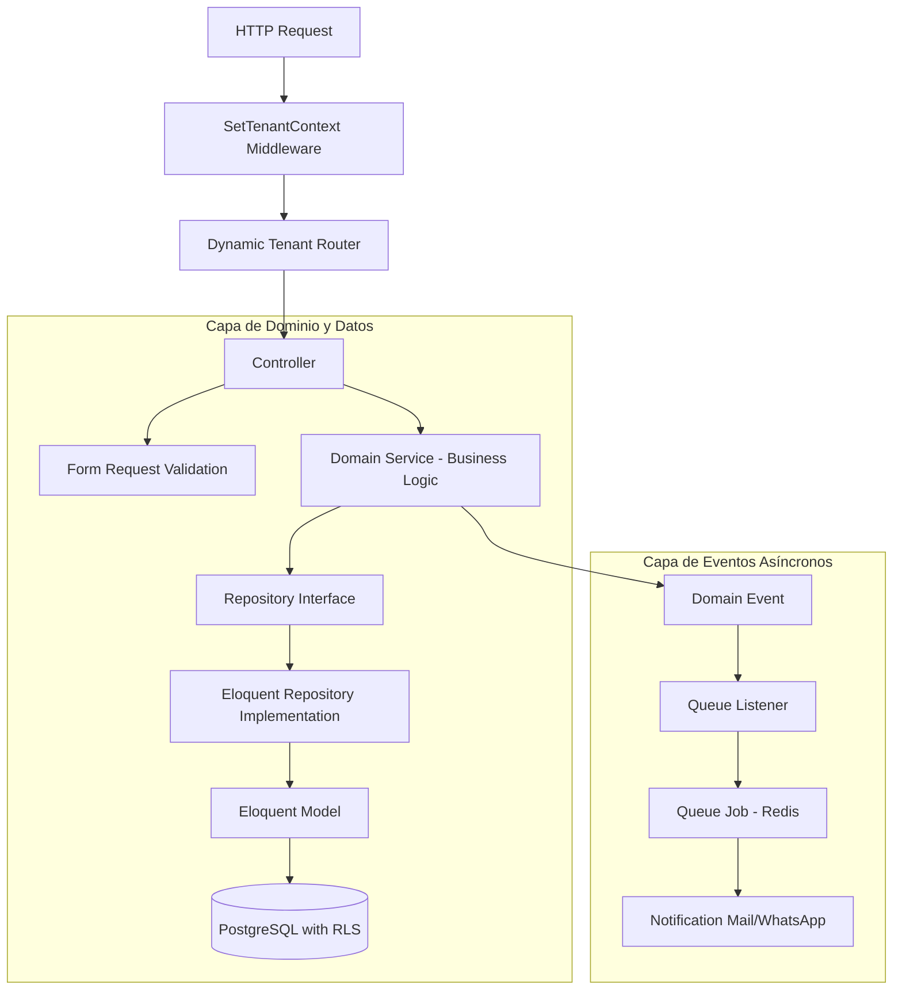

# Guía de Arquitectura de Software: Laravel 12 Multi-Tenant
## Patitas Soft - Especificación para Equipo de Ingeniería Senior

---

### Control de Documento
* **Proyecto:** Patitas Soft
* **Versión:** 1.0.0
* **Fecha:** 10 de Junio de 2026
* **Autor:** Laravel 12 Enterprise Architect
* **Estatus:** Aprobado para Desarrollo

---

## 1. Patrones de Diseño y Decisiones Arquitectónicas

Para garantizar la mantenibilidad a largo plazo de Patitas Soft, el sistema se estructurará siguiendo los estándares de **Clean Architecture** adaptados a los patrones nativos de **Laravel 12** y **PHP 8.4**.

### 1.1. Principios de Ingeniería Aplicados
* **SOLID:** Desacoplamiento de la lógica de persistencia mediante el patrón *Repository*. Inyección de dependencias en constructores de servicios.
* **DRY (Don't Repeat Yourself):** Reutilización de consultas recurrentes a través de *Eloquent Query Builders* personalizados y centralización de reglas de validación en *Form Requests*.
* **KISS (Keep It Simple, Stupid):** Evitar sobre-ingeniería. Si un flujo es puramente CRUD, se utilizará Eloquent de forma directa en el controlador. Si el flujo contiene reglas de negocio complejas (ej. arqueo de caja o registro de consulta con descuento), se delegará a un *Domain Service*.
* **Clean Code:** Métodos de menos de 20 líneas de código, tipado estricto (Type Hinting) nativo de PHP 8.4, y declaración de propiedades asimétricas (*readonly*).

### 1.2. Patrones Estructurales Clave



---

## 2. Estructura de Carpetas (Arquitectura Modular por Dominios)

Se implementará una arquitectura basada en **Dominios de Negocio** independientes dentro de `app/`. Esto evita el crecimiento caótico de un monolito estándar agrupando las clases por su relevancia funcional.

```text
app/
├── Domains/
│   ├── Tenant/
│   │   ├── Models/             # Tenant, Plan
│   │   ├── Services/           # TenantProvisioningService
│   │   └── Repositories/       # TenantRepository
│   ├── User/
│   │   ├── Models/             # User, Role, Permission
│   │   ├── Services/           # UserAuthService
│   │   └── Policies/           # UserPolicy
│   ├── Pet/
│   │   ├── Models/             # Pet, Owner, MedicalRecord, ClinicalEntry
│   │   ├── Services/           # ClinicalHistoryService
│   │   └── Repositories/       # PetRepository
│   ├── Appointment/
│   │   ├── Models/             # Appointment
│   │   └── Services/           # SchedulingService
│   ├── Inventory/
│   │   ├── Models/             # Product, Medication, Inventory
│   │   └── Services/           # StockManagementService
│   └── Finance/
│       ├── Models/             # Sale, SaleItem, Invoice
│       └── Services/           # CashRegisterService, BillingService
│
├── Http/
│   ├── Middleware/
│   │   ├── SetTenantContext.php       # Resuelve el inquilino e inyecta el ID en Postgres
│   │   └── CheckRole.php              # Validador de roles del sistema
│   └── Controllers/
│       ├── Auth/
│       ├── SuperAdmin/                # Controladores globales
│       ├── Admin/                     # Gestión de la clínica
│       ├── Vet/                       # Gestión médica
│       └── Receptionist/              # Gestión operativa
│
├── Jobs/                              # Tareas en segundo plano (Redis)
│   ├── ProcessInvoiceJob.php
│   └── SendWhatsAppAlertJob.php
│
└── Providers/
    ├── AppServiceProvider.php
    ├── RepositoryServiceProvider.php  # Vincula las interfaces de repositorios a implementaciones
    └── TenancyServiceProvider.php     # Inicializa rutas y lógica de aislamiento
```

---

## 3. Implementación Core: Aislamiento Multitenant en Laravel 12

Para que el Row-Level Security (RLS) definido en PostgreSQL funcione de manera automática en la capa de aplicación Laravel, implementamos dos piezas clave de infraestructura: el Middleware de inicialización de conexión y el Trait Eloquent para nuevos registros.

### 3.1. Middleware de Contexto de Inquilino

Este middleware se ejecuta en el grupo de rutas de inquilinos. Su responsabilidad es capturar el subdominio de la petición, verificar que el tenant esté activo, almacenar el `tenant_id` en la sesión y configurar la sesión de la conexión PostgreSQL.

```php
<?php

namespace App\Http\Middleware;

use Closure;
use Illuminate\Http\Request;
use App\Domains\Tenant\Models\Tenant;
use Illuminate\Support\Facades\DB;
use Illuminate\Support\Facades\Auth;
use Symfony\Component\HttpFoundation\Response;

class SetTenantContext
{
    /**
     * Maneja la petición entrante resolviendo el contexto del Tenant y configurando PostgreSQL.
     */
    public function handle(Request $request, Closure $next): Response
    {
        // 1. Obtener el subdominio de la URL (ej: clinica-norte.patitassoft.com)
        $host = $request->getHost();
        $subdomain = explode('.', $host)[0];

        // 2. Buscar el Tenant en la base de datos (con caché de Redis para alto rendimiento)
        $tenant = cache()->remember("tenant_meta:{$subdomain}", 3600, function () use ($subdomain) {
            return Tenant::where('subdominio', $subdomain)->first();
        });

        if (!$tenant || $tenant->status !== 'active') {
            abort(404, 'La veterinaria solicitada no existe o se encuentra suspendida.');
        }

        // 3. Guardar en sesión/request para uso en la app
        session(['tenant_id' => $tenant->id]);
        $request->merge(['current_tenant' => $tenant]);

        // 4. Inyectar variables de contexto en la sesión de la base de datos de PostgreSQL
        // RLS utilizará esta variable de sesión para filtrar automáticamente todas las consultas
        DB::statement("SET app.current_tenant_id = ?", [$tenant->id]);

        // 5. Si el usuario está autenticado, inyectar también su ID para el trigger de auditoría
        if (Auth::check()) {
            DB::statement("SET app.current_user_id = ?", [Auth::id()]);
        }

        return $next($request);
    }
}
```

### 3.2. Trait `BelongsToTenant` para Modelos Eloquent
Aunque la lectura de datos está blindada por RLS a nivel de base de datos, cuando insertamos un nuevo registro mediante Eloquent, debemos asegurarnos de rellenar la columna `tenant_id`. Este Trait intercepta el evento de creación del modelo e inyecta el ID del tenant activo de forma transparente.

```php
<?php

namespace App\Domains\Tenant\Traits;

use Exception;

trait BelongsToTenant
{
    /**
     * Inicializa el trait vinculando el evento de creación.
     */
    protected static function bootBelongsToTenant(): void
    {
        static::creating(function ($model) {
            $tenantId = session('tenant_id');

            if (!$tenantId) {
                throw new Exception("No se ha establecido un contexto de Tenant activo para crear este registro (" . get_class($model) . ").");
            }

            $model->tenant_id = $tenantId;
        });
    }
}
```

---

## 4. Diseño del Frontend y Flujo de Navegación

El frontend se construirá con plantillas **Blade** renderizadas en el servidor (SSR) para obtener velocidades de carga óptimas en clínicas con redes de internet limitadas, utilizando **TailwindCSS** para un diseño responsivo adaptado a tablets y dispositivos móviles de los médicos veterinarios.

### 4.1. Estructura de Navegación y Menús Adaptativos por Rol
El sistema de navegación compartirá una estructura común (Layout) pero filtrará los módulos visibles basándose en las directivas de autorización `@can` o comprobación de roles de Laravel:

```text
[Sidebar Principal - Dashboard Patitas Soft]
├── [Global] Cambiar Sucursal (Selector dinámico si ClinicOwner tiene >1 sucursal)
├── [SuperAdmin]
│   ├── Panel Global (Métricas consolidadas de cobro SaaS)
│   ├── Gestión de Inquilinos (Activación / Suspensión)
│   ├── Planes y Suscripciones (Configuración de precios)
│   └── Auditoría de Plataforma (Log de base de datos global)
│
├── [ClinicOwner / Admin]
│   ├── Panel Financiero (Gráficas de ventas por sucursal)
│   ├── Configuración de Clínica (Datos fiscales, logotipo)
│   ├── Usuarios y Roles (Permisos del personal)
│   ├── Servicios (Catálogo de precios de consultas y estéticas)
│   └── Reportes Avanzados (Exportación de libros de IVA e inventarios)
│
├── [Veterinario / ClinicOwner]
│   ├── Agenda de Consultas (Calendario interactivo)
│   ├── Buscar Expediente (Acceso directo a mascotas)
│   └── Consultas Activas (Fila de pacientes en espera)
│
└── [Recepcionista / Admin]
    ├── Recepción de Pacientes (Registro rápido de dueño y mascota)
    ├── Calendario de Citas (Agendamiento rápido)
    └── Punto de Venta (POS - Caja activa para cobros y productos)
```

---

## 5. Wireframes Funcionales y Estructuras UX en Blade

A continuación, se detalla la arquitectura de las interfaces de usuario críticas para el desarrollo del frontend.

### 5.1. Pantalla de Consulta Médica (Veterinario)
Esta interfaz unifica la visualización del historial del paciente y el formulario de diagnóstico médico en una sola pantalla de alta usabilidad.

```text
+-----------------------------------------------------------------------------------------+
| [Header] Paciente: MAX (Canino - Golden Retriever) | Propietario: Juan Pérez            |
+-----------------------------------------------------------------------------------------+
| [Columna Izquierda: Historial Clínico]      | [Columna Derecha: Nueva Consulta]         |
|                                             |                                           |
| * 10/05/2026 - Vacuna Rabia (Completo)      | Constantes Vitales:                       |
|   Médico: Dra. Ana Gómez                    | Peso (kg): [ 32.5 ]  Temp (°C): [ 38.5 ]  |
|                                             | F.C. (bpm): [ 80  ]  F.R. (rpm): [ 20  ]  |
| * 22/04/2026 - Otitis Externa               |                                           |
|   Diagnóstico: Infección bacteriana.        | Síntomas y Motivo de Consulta:            |
|   Tratamiento: Gotas Otogen 5 gotas/12h.    | [ El perro sacude la cabeza constantemente]  |
|                                             |                                           |
| * 15/01/2026 - Control de Cachorros         | Diagnóstico:                              |
|   Notas: Sano, desparasitado.               | [ Otitis externa bilateral               ]  |
|                                             |                                           |
|                                             | Plan de Tratamiento y Recetario:          |
|                                             | [ Limpieza con solución ótica cada 24h.  ]  |
|                                             | [ Prescribir: Otoclean suspension.       ]  |
|                                             |                                           |
|                                             | +---------------------------------------+ |
|                                             | | [✓] Guardar y Generar Receta PDF       | |
|                                             | +---------------------------------------+ |
+-----------------------------------------------------------------------------------------+
```

### 5.2. Interfaz de Punto de Venta / POS (Cajero y Recepcionista)
Optimizado para ingreso táctil y lectura rápida con lector de código de barras.

```text
+-----------------------------------------------------------------------------------------+
| POS - CAJA INICIALIZADA | Sucursal: Norte | Operador: Carlos López                     |
+-----------------------------------------------------------------------------------------+
| [Buscador rápido de Productos/Servicios: [ Sku / Nombre / Código ]                    ] |
+---------------------------------------------+-------------------------------------------+
| [Detalle de Venta]                          | [Resumen de Pago]                         |
|                                             |                                           |
| Cant  Cod/Item         P.Unit   Total       | Subtotal:     $ 500.00                    |
| [ 1 ] Consulta Médica  $350.00  $350.00 [x] | Impuesto (16%):$ 80.00                    |
| [ 2 ] Alimento Canino  $150.00  $300.00 [x] | Descuento:    $  50.00                    |
|                                             | TOTAL A PAGAR: $ 530.00                   |
|                                             |                                           |
|                                             | Método de Pago:                           |
|                                             | ( ) Efectivo  (•) Tarjeta  ( ) Transfer.  |
|                                             |                                           |
|                                             | [Cliente Facturable: Juan Pérez         ] |
|                                             |                                           |
|                                             | +---------------------------------------+ |
|                                             | | [✓] Cobrar e Imprimir Comprobante      | |
|                                             | +---------------------------------------+ |
+---------------------------------------------+-------------------------------------------+
```

---

## 6. Hoja de Ruta Técnica (Fases de Implementación)

### Fase 1: Núcleo de Plataforma e Infraestructura Base (Semanas 1-4)
1. **Configuración de Docker:** Inicializar la red de contenedores PHP 8.4, PostgreSQL con la extensión `pgcrypto`, Redis y servidor de archivos local MinIO.
2. **Base de Datos Core:** Ejecutar el DDL global, crear la función y triggers de auditoría inmutable, y activar el comando `ENABLE ROW LEVEL SECURITY` en las tablas multi-tenant.
3. **Middleware Tenancy:** Desarrollar `SetTenantContext.php` y el Trait Eloquent `BelongsToTenant` para pruebas de estrés de aislamiento cruzado.

### Fase 2: Registro de Pacientes y Módulo Clínico (Semanas 5-8)
1. **Modelos y Repositorios:** Implementar los dominios de `User`, `Pet` y `Appointment`.
2. **Controladores y Vistas Blade:** Construir las interfaces responsivas de registro de dueños, expedientes médicos inmutables, recetario digital y el calendario de citas interactivo.
3. **Colas en Redis:** Configurar el despachador de notificaciones para que envíe avisos asíncronos vía Webhook de WhatsApp al agendar citas.

### Fase 3: Operaciones Comerciales y POS (Semanas 9-12)
1. **Inventario:** Desarrollar el módulo de carga de productos, alertas de stock mínimo por sucursal y compras a proveedores.
2. **Punto de Venta (POS):** Programar el controlador transaccional de ventas garantizando la integridad de datos mediante bloqueos optimistas en la base de datos (evitando doble venta de stock).
3. **Facturación:** Integrar el proceso de generación de facturas XML/PDF en background mediante Laravel Queue Workers y firma electrónica gubernamental.

---

## 7. Estrategia de Crecimiento y Escalabilidad de Software

Para soportar el crecimiento de Patitas Soft de 10 inquilinos iniciales a más de 1,000 en el primer año sin degradación del servicio, el equipo de ingeniería debe seguir las siguientes directrices de arquitectura de software:

### 7.1. Caching de Metadatos del Inquilino
Toda petición web requiere verificar si el inquilino está suspendido y cuál es su plan. Esta consulta no debe tocar la base de datos.
* **Directriz:** Utilizar el helper `cache()->remember()` con etiquetas en Redis para almacenar y recuperar la configuración de cada tenant de forma instantánea. Limpiar dicha memoria únicamente mediante un Listener al actualizar el modelo de Tenant.

### 7.2. Desacoplamiento de Servicios Externos
La pasarela de pagos (Stripe), el envío de mensajes (WhatsApp API) y el timbrado de facturas fiscales son servicios de terceros propensos a latencias elevadas o caídas temporales.
* **Directriz:** Prohibido realizar llamadas HTTP sincrónicas en los controladores web. Toda integración con servicios de terceros debe implementarse a través de **Laravel Jobs** encolados en Redis con políticas de reintento exponencial (`retryUntil` y `backoff`).

### 7.3. Optimización del Front-end (Asset Bundling)
* **Vite + TailwindCSS:** La compilación de CSS debe purgar clases no utilizadas para mantener el peso de carga por debajo de 50KB.
* **Blade Components:** Reutilizar modales, botones y campos de formulario mediante componentes Blade nativos, optimizando la legibilidad y el mantenimiento del código UI.
