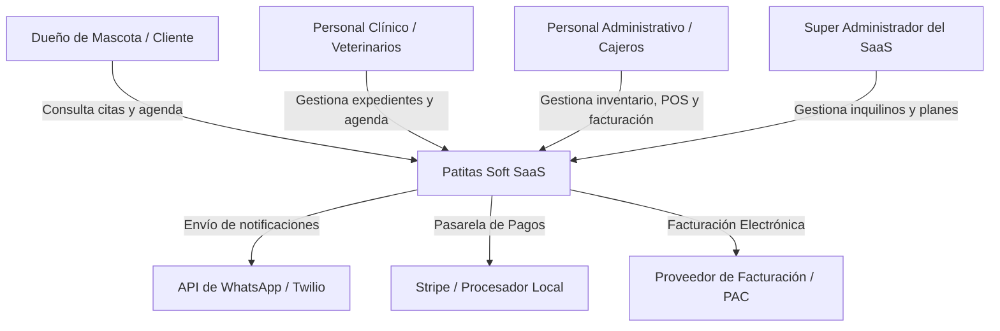
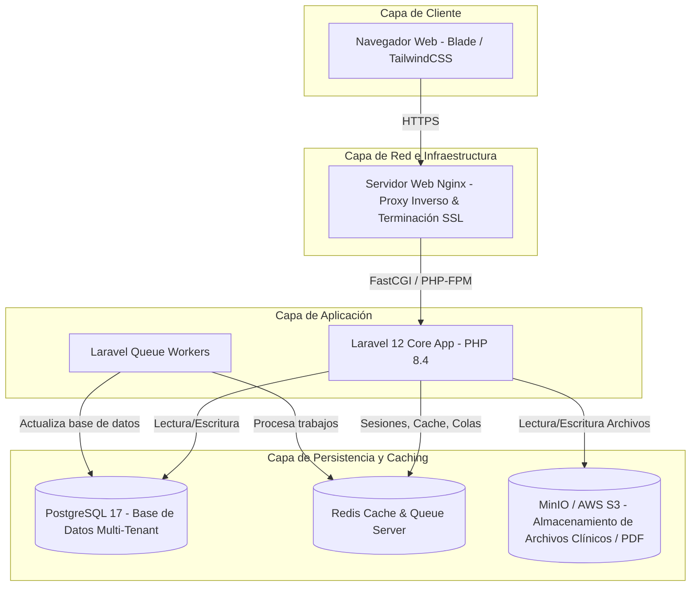
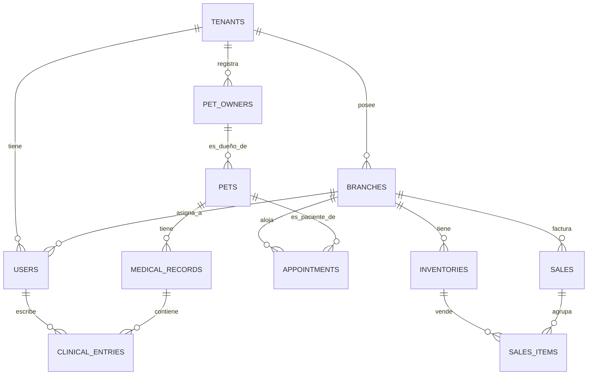
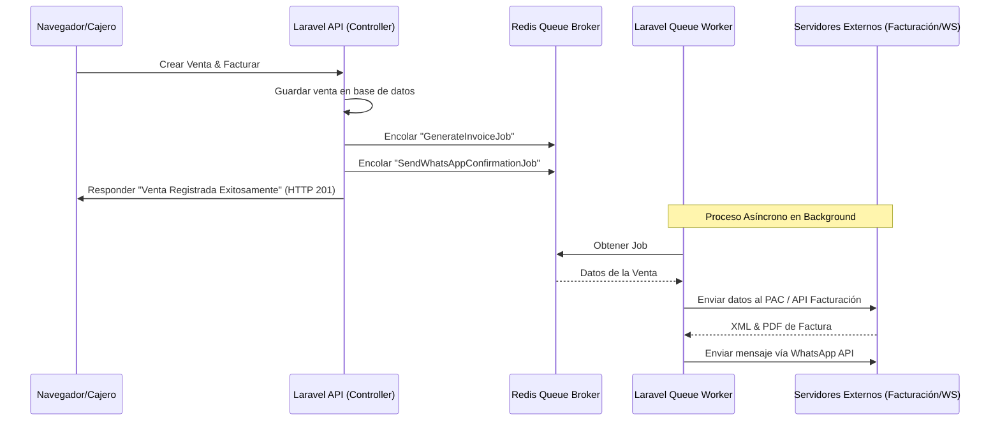
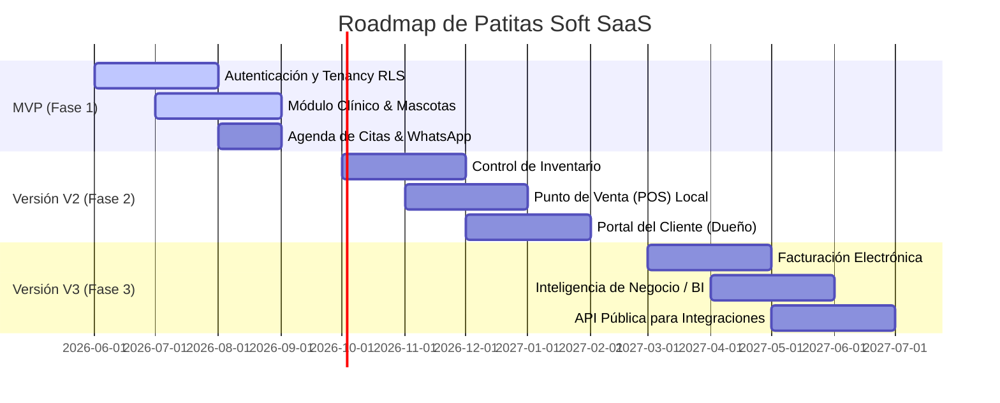

# Documento de Arquitectura Empresarial: Patitas Soft
## Plataforma SaaS Multi-Tenant para Clínicas Veterinarias

---

### Control de Documento
* **Proyecto:** Patitas Soft
* **Versión:** 1.0.0
* **Fecha:** 10 de Junio de 2026
* **Autores (Consorcio de Arquitectos):**
  * Enterprise Software Architect
  * SaaS Architect
  * Solution Architect
  * PostgreSQL Database Architect
  * Laravel 12 Architect
  * Security Architect
  * DevSecOps Engineer
  * Product Owner (HealthTech & VetTech)
  * Especialista en OWASP Top 10

---

## 1. Resumen Ejecutivo y Visión General

**Patitas Soft** se concibe como una plataforma SaaS (Software as a Service) de clase empresarial diseñada específicamente para modernizar y optimizar la gestión operativa, médica y comercial de clínicas y hospitales veterinarios en esquemas de sucursales múltiples (multi-branch) y aislamiento absoluto de inquilinos (multi-tenant).

Este documento detalla las especificaciones técnicas, las decisiones de diseño y las justificaciones de ingeniería para la construcción del sistema, asegurando la escalabilidad, alta disponibilidad, seguridad informática y el cumplimiento de las normativas de privacidad de datos clínicos de la industria.

---

## 2. Arquitectura General del Sistema

La arquitectura está diseñada bajo el patrón de **Clean Architecture** y principios de diseño modular, utilizando el framework **Laravel 12** y **PHP 8.4+** en el backend para una base sólida de servicios web, y **Blade + TailwindCSS** en el frontend para una renderización rápida (SSR) y reactividad ligera a través de componentes interactivos (Alpine.js / Livewire para micro-interacciones necesarias).

### 2.1. Diagrama de Contexto del Sistema (C4 Model - Nivel 1)



### 2.2. Diagrama de Contenedores (C4 Model - Nivel 2)



### 2.3. Justificación de la Pila de Tecnologías (Tech Stack)

* **PHP 8.4+**: Permite el uso de tipos estrictos mejorados, propiedades *readonly* asimétricas, mejoras en el recolector de basura, y preloading optimizado, lo que incrementa el rendimiento del framework de manera nativa.
* **Laravel 12**: Aporta una estructura de desarrollo ágil con robustez empresarial. El soporte nativo para colas, contenedores de inyección de dependencias, sistema de autenticación extensible y comandos avanzados agiliza el mantenimiento.
* **PostgreSQL (16/17)**: Seleccionado por su soporte avanzado de esquemas, rendimiento con índices parciales y, crucialmente, la funcionalidad nativa de **Row-Level Security (RLS)** y soporte JSONB para campos variables en expedientes clínicos.
* **Redis**: Actúa como la memoria caché del sistema, almacenamiento de sesiones persistentes e intermediario para colas de trabajo pesadas (envío de correos, facturación, reportes).
* **JWT (JSON Web Tokens)**: Garantiza la autenticación sin estado (stateless) necesaria para APIs del sistema, con flujos seguros de rotación de Refresh Tokens.
* **TailwindCSS + Blade**: Evita la complejidad añadida de un framework Single Page Application (SPA) en etapas iniciales (MVP), garantizando el menor tiempo de carga de página posible (mejor SEO y experiencia de usuario interna en clínicas) mediante renderizado en servidor y diseño responsivo fluido.

---

## 3. Estrategia Multi-Tenant e Isolation Model

La decisión del modelo de base de datos multi-tenant es el pilar central de Patitas Soft. A continuación, se presenta un análisis comparativo riguroso de las tres estrategias clásicas antes de definir la arquitectura final propuesta.

### 3.1. Análisis Comparativo de Estrategias Multi-Tenant

| Criterio | Shared Database Shared Schema | Shared Database Separate Schema | Database Per Tenant |
| :--- | :--- | :--- | :--- |
| **Aislamiento de Datos** | **Bajo**. Depende puramente de filtros en la capa de software (`tenant_id`). | **Medio-Alto**. Los datos están separados lógicamente por esquemas PostgreSQL. | **Máximo**. Aislamiento físico de bases de datos. |
| **Costo de Infraestructura** | **Mínimo**. Una sola instancia de BD para miles de inquilinos. | **Mínimo**. Una sola instancia de BD con múltiples esquemas. | **Alto**. Mayor overhead de memoria por conexiones de red y espacio en disco por DB. |
| **Complejidad de Migraciones** | **Mínimo**. Una sola base de datos y esquema a actualizar. | **Alto**. Las migraciones deben correr iterativamente en cada esquema de inquilino. | **Muy Alto**. Cientos/miles de conexiones a actualizar individualmente. |
| **Respaldo y Restauración** | **Muy Complejo**. Extraer y restaurar datos de un solo inquilino requiere scripts manuales quirúrgicos. | **Medio-Fácil**. Se puede realizar `pg_dump` de un esquema específico. | **Extremadamente Fácil**. Respaldo nativo de base de datos por tenant. |
| **Límite de Escalabilidad** | **Alto** en volumen, pero vulnerable al fenómeno de "Noisy Neighbor" si un tenant monopoliza la BD. | **Medio**. El catálogo del sistema de PostgreSQL puede saturarse con miles de esquemas. | **Ilimitado**. Los inquilinos pueden distribuirse físicamente en diferentes servidores. |

### 3.2. Estrategia Propuesta: "Shared Database, Shared Schema con RLS (Row-Level Security)"

Tras la evaluación cruzada por parte de los arquitectos de PostgreSQL, Seguridad y Software, se ha diseñado un modelo híbrido basado en **Shared Database Shared Schema potenciado por Row-Level Security (RLS) nativo de PostgreSQL**.

#### Justificación Técnica
El mayor riesgo de un esquema compartido es el **Acceso Accidental / Broken Access Control (OWASP #1)** si un desarrollador olvida agregar `where('tenant_id', $tenantId)` en una consulta Laravel.
Al utilizar **PostgreSQL RLS**, el propio motor de la base de datos bloquea cualquier consulta que no pertenezca al inquilino activo, sin importar si el código de la aplicación omitió el filtro.

#### Mecánica de Implementación del RLS:
1. **Definición de Políticas**:
   En PostgreSQL, cada tabla multi-tenant se crea con la opción `ENABLE ROW LEVEL SECURITY`. Se define una política para que solo se devuelvan registros donde la columna `tenant_id` coincida con la variable de sesión actual de la transacción:
   ```sql
   ALTER TABLE mascotas ENABLE ROW LEVEL SECURITY;
   
   CREATE POLICY tenant_mascotas_policy ON mascotas
       FOR ALL
       USING (tenant_id = NULLIF(current_setting('app.current_tenant_id', true), '')::uuid);
   ```

2. **Middleware de Laravel (Tenant Connection Context)**:
   Al recibir una petición web, el middleware detecta el inquilino (mediante el dominio o subdominio) y, antes de procesar el flujo del controlador, ejecuta una consulta rápida que inyecta el ID del inquilino en la sesión de la conexión PostgreSQL:
   ```php
   DB::statement("SET LOCAL app.current_tenant_id = ?", [$tenantId]);
   ```
   *Nota:* Al usar `SET LOCAL` dentro de una transacción, la configuración dura únicamente durante la transacción actual. Si no se usan transacciones continuas, se configura a nivel de sesión de conexión con `SET app.current_tenant_id`.

3. **Ventajas de esta opción para Patitas Soft**:
   * **Costos Operativos Bajos:** Un solo pool de conexiones PostgreSQL administrado por PgBouncer.
   * **Seguridad Absoluta:** La seguridad reside en la base de datos (última línea de defensa).
   * **Migraciones Ultrarrápidas:** Un único comando `php artisan migrate` actualiza a todos los inquilinos simultáneamente.

---

## 4. Definición de Roles y Modelo de Autorización

Para administrar el acceso en un sistema con clínicas de múltiples sucursales (multi-branch), utilizaremos un modelo híbrido **RBAC (Role-Based Access Control)** combinado con **ABAC (Attribute-Based Access Control)** para delimitar el contexto geográfico (sucursal) y de datos.

### 4.1. Matriz de Roles y Permisos

| Rol | Nivel de Acceso | Alcance de Datos | Permisos Clave |
| :--- | :--- | :--- | :--- |
| **SuperAdmin (SaaS)** | Global de la plataforma | Todos los inquilinos | Crear inquilinos, monitorear uso de recursos, facturación del SaaS, desactivar cuentas de clínicas. |
| **ClinicOwner (Inquilino)** | Nivel Inquilino Completo | Todas sus sucursales | Acceso a configuraciones globales de la clínica veterinaria, reportes consolidados financieros, gestión de sucursales y creación de usuarios administradores. |
| **BranchManager** | Nivel Sucursal | Su sucursal asignada | Administración de inventario local, asignación de turnos a veterinarios de su sucursal, visualización de reportes locales de ventas y caja. |
| **Veterinarian** | Operativo Clínico | Pacientes y Agenda global/local | Creación de expedientes clínicos, prescripción médica, visualización de agenda de consultas, registro de procedimientos clínicos. |
| **Receptionist** | Operativo Servicio | Agenda y POS local | Crear dueños y mascotas, agendar citas, cobrar consultas, registrar entrada/salida de inventario básico en caja, arqueo de caja. |
| **Accountant** | Consulta Financiera | Datos de Facturación y Ventas | Descarga de reportes fiscales, visualización del libro de ventas, facturación electrónica, egresos e ingresos. |
| **Client (Dueño)** | Portal de Cliente | Únicamente sus mascotas | Ver historial de vacunas, consultar recetas médicas en formato PDF, agendar y cancelar citas en línea. |

### 4.2. Estrategia ABAC para Sucursales
Un usuario con rol `Veterinarian` puede estar adscrito a la "Sucursal Norte". Cuando intenta modificar el inventario o la agenda de la "Sucursal Sur", la política de Laravel comprueba:
`user.branch_id === target_resource.branch_id`.

---

## 5. Arquitectura de Datos (PostgreSQL)

El esquema conceptual requiere un diseño altamente normalizado y eficiente para garantizar consultas en milisegundos incluso bajo cargas pesadas de transacciones en el Punto de Venta.

### 5.1. Diagrama de Relaciones Lógicas (Tablas Clave)



### 5.2. Diccionario Conceptual de Tablas Críticas

#### Tabla: `tenants` (Esquema Global/Control)
* `id` (UUID, PK)
* `name` (VARCHAR)
* `subdomain` (VARCHAR, Unique) - ej: `clinicaveterinaria.patitassoft.com`
* `custom_domain` (VARCHAR, Nullable, Unique) - ej: `app.veterinariasanmartin.com`
* `status` (ENUM: active, suspended, trial)
* `plan_id` (UUID) - Relación con planes de cobro SaaS.
* `created_at`, `updated_at`

#### Tabla: `branches` (Sucursales)
* `id` (UUID, PK)
* `tenant_id` (UUID, FK, RLS Enabled)
* `name` (VARCHAR)
* `address` (TEXT)
* `phone` (VARCHAR)
* `is_active` (BOOLEAN)

#### Tabla: `users` (Usuarios con Laravel Breeze/Fortify backend)
* `id` (UUID, PK)
* `tenant_id` (UUID, FK, RLS Enabled)
* `branch_id` (UUID, FK, Nullable) - Sucursal por defecto.
* `name` (VARCHAR)
* `email` (VARCHAR, Unique per tenant)
* `password` (VARCHAR)
* `role` (VARCHAR) - ej: `veterinarian`
* `status` (ENUM: active, inactive)

#### Tabla: `pet_owners` (Dueños de Mascotas)
* `id` (UUID, PK)
* `tenant_id` (UUID, FK, RLS Enabled)
* `first_name` (VARCHAR)
* `last_name` (VARCHAR)
* `email` (VARCHAR, Nullable)
* `phone` (VARCHAR)
* `dni_tax_id` (VARCHAR, Nullable) - Para facturación.

#### Tabla: `pets` (Mascotas)
* `id` (UUID, PK)
* `tenant_id` (UUID, FK, RLS Enabled)
* `owner_id` (UUID, FK)
* `name` (VARCHAR)
* `species` (VARCHAR) - ej: Canino, Felino, Exótico.
* `breed` (VARCHAR)
* `birth_date` (DATE)
* `gender` (ENUM: M, F)
* `weight_kg` (DECIMAL)

#### Tabla: `medical_records` (Expediente Clínico Cabecera)
* `id` (UUID, PK)
* `tenant_id` (UUID, FK, RLS Enabled)
* `pet_id` (UUID, FK, Unique) - Relación 1 a 1 con la mascota.
* `allergies` (TEXT)
* `chronic_diseases` (TEXT)

#### Tabla: `clinical_entries` (Entradas Históricas del Expediente)
* `id` (UUID, PK)
* `tenant_id` (UUID, FK, RLS Enabled)
* `medical_record_id` (UUID, FK)
* `branch_id` (UUID, FK)
* `veterinarian_id` (UUID, FK)
* `reason` (TEXT) - Motivo de consulta.
* `symptoms` (TEXT)
* `diagnosis` (TEXT)
* `treatment_plan` (TEXT)
* `clinical_notes` (TEXT)
* `json_metadata` (JSONB) - Para guardar campos dinámicos específicos según especie.
* `created_at`

#### Tabla: `inventories` (Control de Stock)
* `id` (UUID, PK)
* `tenant_id` (UUID, FK, RLS Enabled)
* `branch_id` (UUID, FK)
* `product_name` (VARCHAR)
* `sku` (VARCHAR)
* `stock` (INTEGER)
* `min_stock` (INTEGER) - Alerta de reabastecimiento.
* `purchase_price` (DECIMAL)
* `sale_price` (DECIMAL)

---

## 6. Arquitectura de Laravel 12 & PHP 8.4

La implementación en Laravel 12 estructurará los módulos de la aplicación bajo principios de **Modular Domain-Driven Design (DDD)** para evitar que el proyecto se convierta en un "monolito espagueti".

### 6.1. Organización del Código (Módulos DDD)
```text
app/
├── Domains/
│   ├── Tenant/          # Registro de Clínicas, dominios, facturación SaaS
│   ├── Clinic/          # Gestión de Clínicas, Sucursales y Configuración
│   ├── User/            # Autenticación, Roles y Permisos (Spatie / Custom)
│   ├── Pet/             # Mascotas, Dueños y Expediente Clínico (Medical Records)
│   ├── Appointment/     # Agenda, Calendario y Recordatorios
│   ├── Inventory/       # Proveedores, Productos y Stock de Clínicas
│   └── Finance/         # Punto de Venta (POS), Transacciones y Facturación Electrónica
```

### 6.2. Estrategia de Eventos y Trabajos Asíncronos (Queues con Redis)
El backend delegará todas las tareas que no requieran una respuesta inmediata a los trabajadores de Laravel (Queue Workers) para mantener tiempos de respuesta API por debajo de los 100ms.



---

## 7. Arquitectura de Seguridad (OWASP Top 10)

El manejo de expedientes médicos y operaciones financieras exige una arquitectura de seguridad estricta y alineada a los estándares del **OWASP Top 10 (2021)**.

### 7.1. Matriz de Mitigación OWASP Top 10

| Riesgo OWASP | Escenario en Patitas Soft | Mitigación Arquitectónica |
| :--- | :--- | :--- |
| **A01:2021-Broken Access Control** | Un usuario de un Tenant intenta leer datos de otro Tenant adivinando el ID en la URL. | 1. Implementación de **PostgreSQL Row-Level Security (RLS)** que intercepta consultas SQL.<br>2. Uso de **UUIDs versión 7** en lugar de IDs numéricos secuenciales.<br>3. Laravel Gates/Policies validadas en controladores. |
| **A02:2021-Cryptographic Failures** | Exposición de contraseñas de usuarios o datos clínicos confidenciales. | 1. Contraseñas hasheadas con **Argon2id** (estándar PHP 8.4).<br>2. Cifrado de datos sensibles en reposo mediante Laravel `Crypt::encrypt()` (ej: detalles específicos de dueños). |
| **A03:2021-Injection** | Ataques SQL Injection mediante formularios de búsqueda de mascotas. | 1. Uso obligatorio de **Eloquent ORM** y Parameterized Queries.<br>2. Sanitización y validación estricta de inputs con Form Requests. |
| **A04:2021-Insecure Design** | Lógica de negocio fallida que permite saltarse la agenda de citas o facturar importes negativos. | 1. Modelado de lógica en Domain Services puros.<br>2. Pruebas unitarias de cobertura del 90% para flujos financieros. |
| **A05:2021-Security Misconfiguration** | Modo debug activado en producción (`APP_DEBUG=true`). | 1. Pipeline de CI/CD que valida que el archivo `.env` de producción esté bloqueado.<br>2. Headers de seguridad de Nginx preconfigurados (HSTS, Content Security Policy). |
| **A06:2021-Vulnerable and Outdated Components** | Uso de dependencias desactualizadas de Composer o NPM. | 1. Integración de **GitHub Dependabot** o **Snyk** en el pipeline CI/CD.<br>2. Actualización regular del Core PHP y Laravel. |
| **A07:2021-Identification and Authentication Failures** | Ataques de fuerza bruta a cuentas de veterinarios. | 1. Laravel Rate Limiting nativo para rutas de login.<br>2. Bloqueo temporal de cuentas tras 5 intentos fallidos.<br>3. Flujo JWT con rotación obligatoria de tokens en dispositivos móviles. |
| **A08:2021-Software and Data Integrity Failures** | Inyección de archivos maliciosos subidos al expediente clínico (ej. malware en PDFs de análisis). | 1. Validación estricta del tipo MIME del archivo subido (no fiarse solo de la extensión).<br>2. Almacenamiento fuera de la raíz pública web (Bucket S3/MinIO privados con links temporales firmados). |
| **A09:2021-Security Logging and Monitoring Failure** | Un atacante entra al sistema y borra registros de inventario sin dejar rastro. | 1. Implementación de un **Audit Log System** inmutable que registra: quién, cuándo, qué modificó y valor anterior/nuevo.<br>2. Exportación de logs en tiempo real hacia una pila centralizada. |
| **A10:2021-Server-Side Request Forgery (SSRF)** | El veterinario sube una URL externa para extraer información de la red interna de Patitas Soft. | 1. Deshabilitar descargas directas del backend desde URLs suministradas por el usuario sin antes pasar por un proxy de validación de dominios permitidos. |

---

## 8. Casos de Uso Críticos

### Caso de Uso 1: Registro y Onboarding de Nuevo Tenant (Autoservicio)
* **Actor Principal:** Cliente Veterinario (Propietario de Clínica)
* **Precondiciones:** El sistema SaaS está activo en su página de aterrizaje corporativa.
* **Flujo Principal:**
  1. El cliente entra a `patitassoft.com/register` y selecciona un Plan SaaS.
  2. Rellena los datos de la clínica, información fiscal, usuario administrador y define su subdominio (ej: `san-francisco`).
  3. Realiza el pago inicial de suscripción (procesado mediante Stripe).
  4. El sistema crea el registro del tenant en la tabla `tenants`.
  5. El sistema inicializa la configuración por defecto y genera el primer usuario con rol `ClinicOwner`.
  6. El cliente es redirigido a `san-francisco.patitassoft.com/login` para iniciar su configuración.

### Caso de Uso 2: Agendamiento y Gestión de Citas Médicas
* **Actor Principal:** Recepcionista / Veterinario
* **Precondiciones:** La mascota y el dueño ya están registrados en la clínica.
* **Flujo Principal:**
  1. El recepcionista ingresa al módulo de Agenda (`/appointments`).
  2. Selecciona la sucursal activa, la fecha, hora y el veterinario disponible.
  3. El sistema valida en tiempo real (vía Redis lock/reserva) que el veterinario no tenga otra cita asignada en ese bloque de tiempo.
  4. Se registra la cita médica asociada al ID de la mascota y dueño.
  5. Se despacha un Job asíncrono para enviar un recordatorio automatizado por WhatsApp al dueño de la mascota con la confirmación de la cita.

### Caso de Uso 3: Registro de Consulta en Expediente Clínico
* **Actor Principal:** Veterinario
* **Precondiciones:** La cita está registrada y el paciente está en sala de espera.
* **Flujo Principal:**
  1. El veterinario abre el perfil del paciente mascota desde el panel de consultas activas.
  2. El sistema recupera el historial clínico de la mascota (expediente completo).
  3. El veterinario registra constantes vitales (peso, temperatura, frecuencia cardíaca).
  4. Completa los campos obligatorios del diagnóstico, plan de tratamiento y notas médicas.
  5. Agrega recetas y medicamentos (los cuales validan disponibilidad en el stock del inventario de la sucursal actual).
  6. Guarda la consulta. El sistema genera el historial digital inmutable y actualiza el estado de la cita a "Completada".

### Caso de Uso 4: Venta de Productos e Insumos en Punto de Venta (POS)
* **Actor Principal:** Cajero / Recepcionista
* **Precondiciones:** Productos cargados en inventario y sesión de caja abierta.
* **Flujo Principal:**
  1. El cajero inicia una venta, escaneando el código de barra (SKU) del producto o seleccionando un servicio médico de la lista.
  2. El sistema verifica el stock disponible en la sucursal actual.
  3. Se calcula el subtotal, impuestos aplicables e importe total.
  4. El cajero selecciona el método de pago (Efectivo, Tarjeta, Transferencia).
  5. Al confirmar el pago, el sistema:
     * Reduce el stock físico del inventario.
     * Registra la transacción en el arqueo de caja de la sucursal.
     * Genera el comprobante de venta.
     * Lanza en segundo plano la generación y timbrado de la factura electrónica en caso de ser requerido por el cliente.

---

## 9. Historias de Usuario (Formato Ágil)

### Historia de Usuario 1: Registro de Inquilino Automatizado
**Como** Propietario de Clínica Veterinaria,  
**Quiero** registrar mi negocio en Patitas Soft en línea y obtener mi subdominio personalizado de inmediato,  
**Para** empezar a administrar mis sucursales y pacientes sin demoras administrativas ni despliegues manuales.

* **Criterios de Aceptación:**
  * El subdominio elegido debe ser validado como único en tiempo real.
  * Solo se permite la activación tras un procesamiento de pago exitoso (API Stripe).
  * El proceso de registro completo no debe demorar más de 10 segundos en entregar el acceso al panel.

### Historia de Usuario 2: Seguridad y Aislamiento de Expedientes Clínicos
**Como** Veterinario de la Clínica Veterinaria A,  
**Quiero** que el sistema impida bajo cualquier circunstancia que mis expedientes clínicos sean vistos por usuarios de la Clínica Veterinaria B,  
**Para** garantizar la privacidad confidencial de mis clientes y cumplir con las leyes de protección de datos.

* **Criterios de Aceptación:**
  * Cualquier consulta SQL directa de lectura de datos de pacientes debe ser bloqueada en la base de datos si pertenece a otro `tenant_id` diferente al de la sesión actual de la base de datos (PostgreSQL RLS activo).
  * Los adjuntos del expediente (PDFs, imágenes de rayos X) deben estar alojados en directorios del bucket S3 correspondientes a cada `tenant_id` y descargables mediante URLs con firmas temporales (firmadas por el servidor por un tiempo máximo de 5 minutos).

### Historia de Usuario 3: Notificación de Recordatorios por WhatsApp
**Como** Dueño de Mascota,  
**Quiero** recibir un mensaje de WhatsApp 24 horas antes de mi cita agendada,  
**Para** confirmar o solicitar reprogramación de mi visita veterinaria sin tener que llamar por teléfono.

* **Criterios de Aceptación:**
  * La notificación debe ejecutarse en segundo plano a través de una cola de Laravel en Redis sin ralentizar al operador de agenda.
  * Si el número de WhatsApp es inválido, el sistema debe marcar el registro de la alerta como "Fallido" e informar en el panel del recepcionista para corregir el dato clínico.

---

## 10. Hoja de Ruta del Producto (Product Roadmap)



### 10.1. MVP (V1) - Foco: Operatividad Médica Básica y Tenancy (Meses 1-4)
* **Backend Core:** Implementación de Multi-Tenancy RLS a nivel de base de datos, autenticación base por JWT y roles principales (SuperAdmin, ClinicOwner, Veterinarian, Receptionist).
* **Módulo de Pacientes:** Registro de dueños y mascotas. Historial de especies, razas, edades.
* **Expediente Clínico Básico:** Diagnóstico, recetas clínicas y tratamiento.
* **Agenda:** Calendario de citas visual en tiempo real para médicos. Integración básica de notificaciones SMS o WhatsApp automatizadas (Jobs asíncronos).

### 10.2. Versión V2 - Foco: Comercialización y Multi-Sucursales (Meses 5-8)
* **Inventario:** Control de compras, proveedores, alertas de stock mínimo por sucursal.
* **Punto de Venta (POS):** Módulo de caja física, cobro de citas, servicios médicos y venta de insumos/alimentos. Reportes de caja diarios (cierres de turno).
* **Gestión Multi-Sucursal:** Control de usuarios asignados a sucursales y permisos locales.
* **Portal del Cliente:** Sitio responsivo de autoconsulta de citas y recetas médicas para dueños de mascotas.

### 10.3. Versión V3 - Foco: Integraciones, Facturación y Analítica (Meses 9-12)
* **Facturación Electrónica:** Integración de APIs de entes gubernamentales locales (PACs / SAT en México, DIAN en Colombia, etc.) para emisión directa de comprobantes fiscales.
* **Módulo de Reportes Avanzados (BI):** Tableros con analítica predictiva de ingresos, reabastecimiento inteligente de inventario basado en demanda histórica.
* **Módulo de Vacunación / Telemetría:** Alertas inteligentes predictivas según edad del animal y época estacional para campañas de vacunación.
* **API Pública:** Integración de software clínico con laboratorios externos para la importación directa de resultados de análisis clínicos en el expediente del paciente.

---

## 11. Infraestructura y Estrategia DevSecOps

El entorno de producción se gestionará bajo un esquema de contenedores orquestados que garanticen despliegues sin tiempo de inactividad (zero-downtime deployment) y parches de seguridad en vivo.

### 11.1. Configuración del Servidor Nginx (Bloque de Configuración SaaS)

Para soportar subdominios dinámicos ilimitados sin reiniciar el servidor Nginx, utilizaremos la directiva `server_name` con comodines (*wildcards*), redirigiendo las peticiones a la instancia única de Laravel:

```nginx
# Redirección HTTP a HTTPS
server {
    listen 80;
    server_name .patitassoft.com;
    return 301 https://$host$request_uri;
}

# Servidor HTTPS Multi-Tenant
server {
    listen 443 ssl http2;
    server_name .patitassoft.com;

    # Certificados SSL Wildcard (Let's Encrypt)
    ssl_certificate /etc/letsencrypt/live/patitassoft.com/fullchain.pem;
    ssl_certificate_key /etc/letsencrypt/live/patitassoft.com/privkey.pem;

    root /var/www/patitas-soft/public;
    index index.php;

    charset utf-8;

    # Encabezados de Seguridad Recomendados (OWASP)
    add_header X-Frame-Options "SAMEORIGIN";
    add_header X-Content-Type-Options "nosniff";
    add_header X-XSS-Protection "1; mode=block";
    add_header Referrer-Policy "no-referrer-when-downgrade";
    add_header Content-Security-Policy "default-src 'self' https: data: 'unsafe-inline' 'unsafe-eval'; img-src 'self' https: data: blob:;";

    location / {
        try_files $uri $uri/ /index.php?$query_string;
    }

    location ~ \.php$ {
        fastcgi_pass php-fpm:9000;
        fastcgi_param SCRIPT_FILENAME $realpath_root$fastcgi_script_name;
        include fastcgi_params;
    }

    # Deshabilitar acceso a archivos ocultos (.env, .git)
    location ~ /\. {
        deny all;
    }
}
```

### 11.2. Docker y Docker Compose para Desarrollo y Producción

#### Archivo: `docker-compose.yml` (Entorno de Desarrollo Aislado)
```yaml
version: '3.8'

services:
  # Servidor de Aplicación (PHP-FPM)
  app:
    build:
      context: .
      dockerfile: docker/Dockerfile
    image: patitassoft-backend:latest
    container_name: patitas_app
    restart: unless-stopped
    working_dir: /var/www
    volumes:
      - .:/var/www
    environment:
      - APP_ENV=local
      - APP_DEBUG=true
    depends_on:
      - postgres
      - redis

  # Servidor Web (Nginx)
  webserver:
    image: nginx:alpine
    container_name: patitas_nginx
    restart: unless-stopped
    ports:
      - "80:80"
      - "443:443"
    volumes:
      - .:/var/www
      - ./docker/nginx/conf.d/:/etc/nginx/conf.d/
    depends_on:
      - app

  # Base de Datos PostgreSQL
  postgres:
    image: postgres:16-alpine
    container_name: patitas_db
    restart: unless-stopped
    ports:
      - "5432:5432"
    environment:
      POSTGRES_DB: patitas_soft
      POSTGRES_USER: patitas_admin
      POSTGRES_PASSWORD: SecretPassword123
    volumes:
      - postgres_data:/var/lib/postgresql/data

  # Cola y Caching (Redis)
  redis:
    image: redis:alpine
    container_name: patitas_redis
    restart: unless-stopped
    ports:
      - "6379:6379"
    volumes:
      - redis_data:/data

volumes:
  postgres_data:
  redis_data:
```

### 11.3. Pipeline CI/CD Seguro (Security DevSecOps)
Cada cambio en el código fuente debe pasar por un pipeline automatizado de GitHub Actions / GitLab CI antes de ser promovido a producción:

1. **Linting & Code Quality:** Validación de estándares PHP PSR-12 usando PHP_CodeSniffer y PHPStan en nivel de análisis 7.
2. **SAST (Static Application Security Testing):** Ejecución de herramientas como **SonarQube** y **Snyk** para detectar debilidades en el código y dependencias vulnerables de Composer.
3. **Automated Tests:** Ejecución de pruebas unitarias e integración con Laravel Pest / PHPUnit (verificando que las políticas de RLS bloqueen correctamente accesos cruzados de inquilinos).
4. **Deploy:** Despliegue en Kubernetes o Docker Swarm mediante Rolling Updates para garantizar cero inactividad.

---

## 12. Escalabilidad y Resiliencia a Nivel de Empresa

Para escalar a nivel regional y soportar miles de clínicas simultáneas con miles de usuarios activos concurrentes, se establecen las siguientes directrices de escalabilidad.

### 12.1. Escalabilidad en Base de Datos (PostgreSQL Tuning & Scaling)
Como el modelo de datos es centralizado (Shared DB), la base de datos es el principal cuello de botella potencial.
* **PgBouncer (Connection Pooling):** PostgreSQL requiere un proceso del sistema operativo por conexión abierta, lo cual limita las conexiones concurrentes a pocas centenas en máquinas estándar. PgBouncer se configurará en modo de transacción (`pool_mode = transaction`) para reutilizar dinámicamente conexiones entre solicitudes HTTP rápidas, elevando la capacidad a miles de conexiones concurrentes.
* **Separación de Lectura/Escritura (Read Replicas):** Laravel 12 se configurará con un nodo de escritura principal y múltiples réplicas de lectura (Read Replicas). Consultas pesadas de reportes o la visualización del expediente clínico se dirigirán automáticamente a las réplicas de lectura de PostgreSQL, liberando la carga transaccional del nodo primario de escritura.
* **Particionamiento de Tablas:** Tablas históricas que crecen indefinidamente, como `clinical_entries` y `sales_items`, serán particionadas lógicamente por rangos anuales basados en `created_at` o por Hash basado en `tenant_id`.

### 12.2. Estrategia de Caching Distribuido (Redis Cache Layer)
Para evitar consultas redundantes a la base de datos:
* **Tenant Metadata Cache:** Las configuraciones del tenant (ej: logotipo, datos fiscales de la clínica, plan activo) se consultan en cada petición. Esta información se almacenará en Redis de forma indefinida con invalidación automática basada en eventos Eloquent (`saved`, `updated`, `deleted`).
* **Cache Semántico de Búsqueda de Inventario:** El stock disponible de los productos y sus precios base se mantendrán sincronizados en la caché de Redis por sucursal, acelerando en un 400% las búsquedas en tiempo real del Punto de Venta.

### 12.3. Resiliencia, Recuperación ante Desastres (DR) e Indicadores de Negocio
* **Objetivos Clave:**
  * **RTO (Recovery Time Objective):** Menor a 2 horas (tiempo máximo tolerado para restablecer el servicio tras un desastre generalizado).
  * **RPO (Recovery Point Objective):** Menor a 1 hora (pérdida máxima permitida de transacciones y expedientes).
* **Estrategia de Respaldos:**
  * Respaldos diarios completos de la base de datos PostgreSQL mediante snapshots automáticos con replicación cruzada de regiones de red.
  * Respaldos en caliente de transacciones (Wal archiving con herramientas como pgBackRest) enviando de forma continua los logs de transacciones PostgreSQL a buckets de almacenamiento inmutable con retención extendida.
  * Despliegue Multi-Zona en la nube seleccionada para garantizar tolerancia a caídas a nivel de centros de datos regionales.
