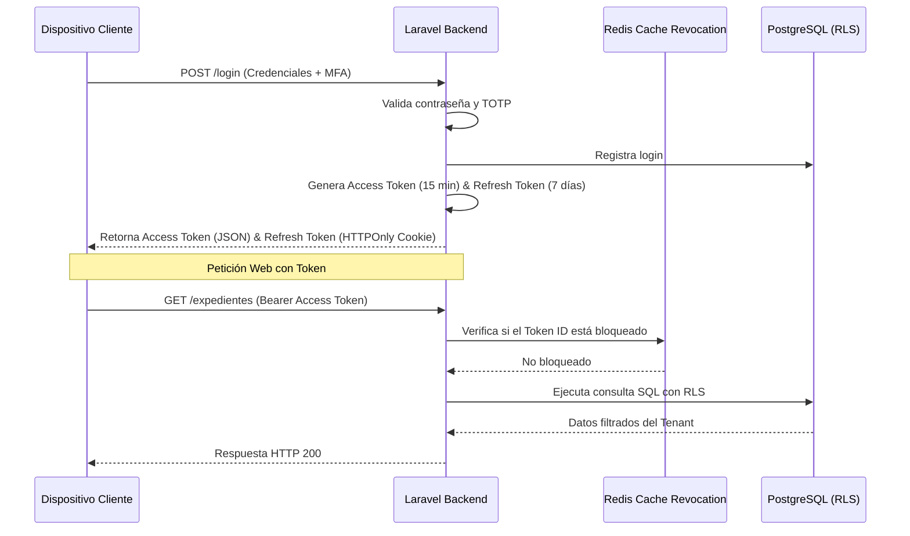

# Estrategia de Seguridad y Guía DevSecOps: Patitas Soft
## Arquitectura de Seguridad SaaS Multi-Tenant (Laravel 12 & PostgreSQL RLS)

---

### Control de Documento
* **Proyecto:** Patitas Soft
* **Versión:** 1.0.0
* **Fecha:** 10 de Junio de 2026
* **Autor:** Security Architect & Especialista en OWASP Top 10
* **Estatus:** Aprobado para Implementación

---

## 1. Principios de Seguridad Fundamentales

* **Security by Design:** La seguridad no es una capa añadida al final del desarrollo. Cada módulo, endpoint e interacción de base de datos se concibe bajo la premisa de que debe ser seguro de manera nativa.
* **Privacy by Design:** Siguiendo normativas internacionales como GDPR y regulaciones locales de datos clínicos y de clientes, el sistema restringe y anonimiza los datos sensibles por defecto.
* **Zero Trust (Confianza Cero):** No se confía en ningún elemento de la red, ya sea interno o externo. Cada petición web, llamada a la API y conexión de base de datos debe ser autenticada, autorizada e inspeccionada.
* **Least Privilege (Menor Privilegio):** Los usuarios y los procesos del sistema operativo (incluyendo PHP y PostgreSQL) operan únicamente con el conjunto mínimo de permisos necesarios para realizar su función.

---

## 2. Análisis y Mitigación del OWASP Top 10 (2021) en Patitas Soft

A continuación se realiza el análisis técnico detallado de los riesgos del OWASP Top 10 aplicados a la plataforma SaaS Patitas Soft, incluyendo ejemplos de código en Laravel 12.

---

### A01:2021 - Broken Access Control (Falta de Control de Acceso)

* **Riesgo:** Un inquilino o usuario del sistema accede a recursos de otro inquilino (Cross-Tenant Access) o un rol inferior accede a funciones administrativas modificando parámetros de consulta (ID ORCA).
* **Impacto:** Fuga de expedientes clínicos completos, manipulación de inventarios o visualización de reportes de ventas ajenos.
* **Ejemplo de Ataque:**
  Un veterinario del *Tenant A* intenta ver un expediente clínico del *Tenant B* haciendo una petición HTTP GET a:
  `http://tenant-a.patitassoft.com/api/v1/expedientes/8f51a2d4-3b6c-7e8f-9a01-2b3c4d5e6f7g` (donde el UUID pertenece al Tenant B).
* **Mitigación Arquitectónica:**
  1. **PostgreSQL RLS:** El motor de base de datos bloquea la consulta a nivel físico.
  2. **Laravel Policies:** Validación explícita de propiedad a nivel de modelo en controladores.
* **Implementación en Laravel 12:**
  ```php
  // app/Domains/Pet/Policies/MedicalRecordPolicy.php
  namespace App\Domains\Pet\Policies;

  use App\Models\User;
  use App\Domains\Pet\Models\MedicalRecord;

  class MedicalRecordPolicy
  {
      /**
       * Determina si el usuario puede ver el expediente clínico específico.
       */
      public function view(User $user, MedicalRecord $record): bool
      {
          // 1. Validar aislamiento de inquilino (doble capa de seguridad además de RLS)
          if ($user->tenant_id !== $record->tenant_id) {
              return false;
          }

          // 2. Validar rol del usuario (Veterinarios y Administradores tienen acceso)
          return in_array($user->role, ['veterinarian', 'clinic_owner', 'branch_manager']);
      }
  }
  ```

---

### A02:2021 - Cryptographic Failures (Fallos Criptográficos)

* **Riesgo:** Exposición de datos de pacientes/dueños sensibles en tránsito o almacenamiento de datos sin cifrado fuerte (por ejemplo, contraseñas hasheadas con MD5 o datos clínicos sin cifrar en disco).
* **Impacto:** Fuga de información personal identificable (PII) que expone a la clínica a penalizaciones legales por violación de privacidad de datos.
* **Ejemplo de Ataque:**
  Un atacante accede a una copia de seguridad física de la base de datos PostgreSQL y lee los números de teléfono y direcciones de correo personales de los dueños de mascotas.
* **Mitigación Arquitectónica:**
  1. Forzar **TLS 1.3** en Nginx.
  2. Hashear contraseñas usando **Argon2id** (configurado por defecto en PHP 8.4 y Laravel 12).
  3. Cifrado de datos sensibles en columnas clave (ej. DNI/tax_id, dirección) usando la funcionalidad nativa de Laravel `Encrypted` cast.
* **Implementación en Laravel 12:**
  ```php
  // app/Domains/Pet/Models/Owner.php
  namespace App\Domains\Pet\Models;

  use Illuminate\Database\Eloquent\Model;
  use App\Domains\Tenant\Traits\BelongsToTenant;
  use Illuminate\Database\Eloquent\Casts\Attribute;

  class Owner extends Model
  {
      use BelongsToTenant;

      protected $casts = [
          'dni_rfc' => 'encrypted', // Cifrado automático en base de datos al guardar
          'direccion' => 'encrypted',
      ];
  }
  ```

---

### A03:2021 - Injection (Inyecciones SQL, XSS, Command Injection)

* **Riesgo:** Datos proveídos por el usuario son interpretados directamente como sentencias de base de datos o código HTML ejecutable por el navegador.
* **Impacto:** Ejecución de consultas maliciosas en la base de datos o robo de cookies de sesión a través de scripts inyectados en formularios de nombres de mascotas.
* **Ejemplo de Ataque (SQLi):**
  Un formulario de búsqueda de mascotas realiza consultas usando concatenación directa de cadenas:
  `DB::select("SELECT * FROM mascotas WHERE nombre = '" . $request->input('nombre') . "'");`
  El atacante ingresa: `' OR 1=1; --`.
* **Mitigación Arquitectónica:**
  1. Uso obligatorio y exclusivo de **Eloquent ORM** o **Query Builder parametrizado**.
  2. Implementación de una cabecera HTTP **Content Security Policy (CSP)** estricta para mitigar ataques XSS.
* **Implementación en Laravel 12:**
  ```php
  // Formulario de Búsqueda Seguro en Controlador
  public function search(Request $request)
  {
      $validated = $request->validate([
          'nombre' => 'required|string|max:100',
      ]);

      // Eloquent utiliza sentencias parametrizadas seguras internamente contra SQLi
      $mascotas = Pet::where('nombre', 'like', '%' . $validated['nombre'] . '%')->get();

      return view('pets.index', compact('mascotas'));
  }
  ```

---

### A04:2021 - Insecure Design (Diseño Inseguro)

* **Riesgo:** Lógica de negocio mal estructurada que carece de controles defensivos conceptuales (por ejemplo, permitir facturar importes negativos o agendar citas en el pasado).
* **Impacto:** Fraude financiero dentro de la clínica veterinaria o corrupción de la integridad de la agenda médica.
* **Ejemplo de Ataque:**
  Un cajero modifica la petición del carrito de compras enviando una cantidad de producto de `-5` para reducir artificialmente la deuda total del cliente en la caja.
* **Mitigación Arquitectónica:**
  1. Uso de **Form Requests** de Laravel para forzar reglas lógicas estrictas antes de tocar controladores.
  2. Modelado de lógica financiera en clases independientes de servicios de dominio que verifican la consistencia matemática de los datos.
* **Implementación en Laravel 12:**
  ```php
  // app/Http/Requests/StoreSaleItemRequest.php
  namespace App\Http\Requests;

  use Illuminate\Foundation\Http\FormRequest;

  class StoreSaleItemRequest extends FormRequest
  {
      public function authorize(): bool
      {
          return true; // Controlado a nivel de rutas
      }

      public function rules(): array
      {
          return [
              'product_id' => 'required|uuid|exists:productos,id',
              'cantidad' => 'required|integer|min:1', // Previene cantidades negativas o flotantes maliciosas
              'precio_unitario' => 'required|numeric|min:0.01',
              'descuento' => 'required|numeric|min:0|max:100', // Previene descuentos superiores al 100% o negativos
          ];
      }
  }
  ```

---

### A05:2021 - Security Misconfiguration (Configuración de Seguridad Incorrecta)

* **Riesgo:** Uso de configuraciones por defecto inseguras, almacenamiento de archivos `.env` expuestos, o páginas de error detalladas activadas en entornos de producción.
* **Impacto:** Un atacante descubre la contraseña de la base de datos PostgreSQL, la clave de cifrado `APP_KEY` o las rutas internas del servidor mediante la pantalla de debug.
* **Ejemplo de Ataque:**
  Despliegue del contenedor con `APP_DEBUG=true` en producción, provocando que un error de base de datos revele trazas del código, contraseñas de conexión o nombres de archivos del servidor.
* **Mitigación Arquitectónica:**
  1. Inhabilitar el debug en producción (`APP_DEBUG=false`).
  2. Configuración robusta en el pipeline CI/CD para validar el estado del entorno.
  3. Deshabilitar el listado de directorios en Nginx y restringir el acceso a archivos de configuración ocultos.

---

### A06:2021 - Vulnerable and Outdated Components (Componentes Vulnerables y Desactualizados)

* **Riesgo:** Uso de versiones de PHP obsoletas o paquetes de Composer/NPM con vulnerabilidades de seguridad conocidas.
* **Impacto:** Ejecución de código remoto (RCE) o denegación de servicio (DoS) a través de fallos en bibliotecas externas.
* **Ejemplo de Ataque:**
  Uso de una biblioteca desactualizada de generación de PDFs que permite inyección de comandos remotos a través del intérprete de HTML.
* **Mitigación Arquitectónica:**
  1. Uso obligatorio de **Snyk** y **Trivy** en el pipeline de integración continua.
  2. Auditoría semanal automática mediante `composer audit` y `npm audit`.

---

### A07:2021 - Identification and Authentication Failures (Fallos de Identificación y Autenticación)

* **Riesgo:** Debilidad en la robustez de las contraseñas, ausencia de límites en intentos de acceso o gestión insegura de tokens de sesión.
* **Impacto:** Secuestro de cuentas de administradores o veterinarios mediante ataques de fuerza bruta.
* **Ejemplo de Ataque:**
  Un atacante ejecuta un script automatizado que prueba 10,000 combinaciones de contraseñas por segundo contra la ruta `/api/v1/auth/login`.
* **Mitigación:**
  1. Forzar contraseñas complejas.
  2. Implementar limitador de peticiones en rutas de login.
  3. Implementar **Autenticación Multifactor (MFA)** para roles administrativos y médicos.
* **Implementación en Laravel 12 (Rate Limiting de Login):**
  ```php
  // app/Providers/AppServiceProvider.php
  namespace App\Providers;

  use Illuminate\Support\ServiceProvider;
  use Illuminate\Cache\RateLimiting\Limit;
  use Illuminate\Support\Facades\RateLimiter;
  use Illuminate\Http\Request;

  class AppServiceProvider extends ServiceProvider
  {
      public function boot(): void
      {
          // Rate limiter para login: máximo 5 intentos por minuto por combinación de IP e Email
          RateLimiter::for('login', function (Request $request) {
              $email = (string) $request->input('email');
              return Limit::perMinute(5)->by($email . $request->ip())->response(function () {
                  return response()->json([
                      'error' => 'Demasiados intentos de inicio de sesión. Por favor, intente en 60 segundos.'
                  ], 429);
              });
          });
      }
  }
  ```

---

### A08:2021 - Software and Data Integrity Failures (Fallos de Integridad de Software y Datos)

* **Riesgo:** Despliegue de actualizaciones que no han sido validadas criptográficamente o subida de archivos arbitrarios maliciosos al expediente del paciente.
* **Impacto:** Compromiso total del servidor si un usuario sube un script php (ej. `shell.php`) disfrazado de radiografía en formato JPG.
* **Ejemplo de Ataque:**
  Un usuario sube un archivo llamado `backdoor.php` a la sección de archivos clínicos y luego intenta ejecutarlo accediendo a `http://patitassoft.com/storage/backdoor.php`.
* **Mitigación:**
  1. Validación del tipo MIME real del archivo (no confiar en la extensión).
  2. Guardado de archivos adjuntos en almacenamiento no-ejecutable (Buckets AWS S3 / MinIO privados con accesos firmados de corta duración).
* **Implementación en Laravel 12:**
  ```php
  // Guardado Seguro de Adjuntos Clínicos
  public function uploadMedicalAttachment(Request $request, $petId)
  {
      $request->validate([
          'documento' => 'required|file|mimes:pdf,jpg,png|max:5120', // Máx 5MB y valida MIME real
      ]);

      $file = $request->file('documento');
      
      // Guardar en bucket privado S3 (no accesible directamente desde la web)
      $path = $file->storeAs(
          "tenants/" . session('tenant_id') . "/pets/{$petId}",
          gen_random_uuid() . '.' . $file->getClientOriginalExtension(),
          's3' // Storage Disk privado
      );

      return response()->json(['path' => $path], 201);
  }
  ```

---

### A09:2021 - Security Logging and Monitoring Failures (Fallos de Registro y Monitoreo de Seguridad)

* **Riesgo:** Los eventos de seguridad críticos (logins fallidos, cambios de contraseñas, exportaciones de reportes financieros, modificaciones en políticas RLS) no quedan registrados en una bitácora central e inmutable.
* **Impacto:** Imposibilidad de realizar análisis forense tras un ataque informático o fuga de datos.
* **Ejemplo de Ataque:**
  Un empleado de la clínica desparasita productos del inventario para venderlos por fuera y borra los registros sin que los logs del servidor dejen rastro de la transacción de borrado.
* **Mitigación:**
  1. Centralización de logs en formato estructurado (JSON).
  2. Implementación de alertas inmediatas para anomalías (ej: 50 peticiones fallidas seguidas de un mismo usuario).
  3. Integración con el sistema de triggers PostgreSQL inmutables (`audit_logs`) definidos en la base de datos.

---

### A10:2021 - Server-Side Request Forgery (SSRF)

* **Riesgo:** La aplicación Laravel realiza peticiones HTTP a URLs suministradas por el usuario sin validación previa, permitiendo al atacante escanear la infraestructura interna.
* **Impacto:** Exposición de servicios internos en la red local (ej. Redis, el servidor Postgres o la API de Kubernetes) que no están expuestos públicamente a Internet.
* **Ejemplo de Ataque:**
  Un administrador de clínica puede subir su logotipo mediante una URL remota. Un atacante configura la URL como `http://localhost:6379/keys` para inspeccionar la memoria caché de Redis a través del backend.
* **Mitigación:**
  1. Deshabilitar descargas de URLs provistas por el usuario o utilizar un servicio proxy aislado (sandboxed) para realizar descargas de terceros.
  2. Validar que la dirección IP resuelta de la URL no pertenezca a rangos privados (`10.0.0.0/8`, `192.168.0.0/16`, `127.0.0.1`, etc.).

---

## 3. Arquitectura de Autenticación y Autorización Avanzada

### 3.1. Estrategia de Autenticación JWT Segura
Para las APIs del sistema y futuras integraciones móviles, implementamos un flujo de autenticación JWT sin estado (stateless) pero con control de revocación.



#### Medidas de Hardening JWT:
* **Asignación Criptográfica:** Firma de tokens mediante algoritmo **RS256** (llave pública/privada), lo que previene ataques de manipulación de firmas si la llave secreta se expone en un cliente.
* **Almacenamiento del Refresh Token:** Almacenado exclusivamente en una cookie con atributos `HttpOnly` (previene robo por Javascript/XSS), `Secure` (forzado en HTTPS) y `SameSite=Strict` (mitigación CSRF).
* **Token Blacklist en Redis:** Cuando un usuario cierra sesión, el ID único del token (`jti`) se almacena en Redis con un tiempo de vida igual a la vigencia del token original, bloqueando cualquier petición posterior con ese token.

### 3.2. Estrategia Multi-Factor (MFA)
1. **Configuración Inicial:** El usuario escanea un código QR generado mediante el estándar de autenticación TOTP (RFC 6238).
2. **Encriptación de Llave:** La llave secreta del TOTP se almacena cifrada en la base de datos mediante la clave global del sistema `Crypt::encryptString()`.
3. **Flujo de Acceso:** Tras ingresar las credenciales correctas en `/login`, si el MFA está activo, el servidor retorna un JWT temporal con alcance único (`scope: ['mfa_pending']`). El usuario no puede consumir endpoints de negocio hasta consumir el endpoint `/login/mfa` enviando el token temporal y el código dinámico de 6 dígitos.

---

## 4. Encabezados de Seguridad HTTP y Content Security Policy (CSP)

Se implementará un Middleware en Laravel que inyecte de manera obligatoria las cabeceras de seguridad en cada respuesta HTTP.

```php
<?php

namespace App\Http\Middleware;

use Closure;
use Illuminate\Http\Request;
use Symfony\Component\HttpFoundation\Response;

class SecurityHeaders
{
    /**
     * Aplica encabezados de endurecimiento de seguridad en la respuesta HTTP.
     */
    public function handle(Request $request, Closure $next): Response
    {
        $response = $next($request);

        // Prevenir ataques clickjacking
        $response->headers->set('X-Frame-Options', 'SAMEORIGIN');
        
        // Deshabilitar la adivinación del tipo de contenido (MIME-sniffing)
        $response->headers->set('X-Content-Type-Options', 'nosniff');
        
        // Habilitar filtros XSS del navegador
        $response->headers->set('X-XSS-Protection', '1; mode=block');
        
        // Controlar la información de referencia enviada en los enlaces
        $response->headers->set('Referrer-Policy', 'strict-origin-when-cross-origin');
        
        // Forzar HTTP estricto (HSTS) durante 2 años
        $response->headers->set('Strict-Transport-Security', 'max-age=63072000; includeSubDomains; preload');

        // Content Security Policy (CSP) robusta
        // Solo permite la ejecución de scripts y estilos originados desde el dominio de la app, fuentes seguras de Google Fonts y APIs específicas
        $response->headers->set('Content-Security-Policy', "default-src 'self'; script-src 'self' 'unsafe-eval' https://apis.google.com; style-src 'self' 'unsafe-inline' https://fonts.googleapis.com; img-src 'self' data: https:; font-src 'self' https://fonts.gstatic.com; connect-src 'self' https://api.stripe.com; frame-ancestors 'none'; object-src 'none';");

        return $response;
    }
}
```

---

## 5. Pipeline DevSecOps (GitHub Actions)

El siguiente archivo YAML define el flujo de Integración y Entrega Continua Segura (CI/CD) para ejecutar análisis estático (SAST), escaneo de contenedores Docker y análisis dinámico de vulnerabilidades (DAST).

```yaml
# .github/workflows/devsecops-pipeline.yml
name: DevSecOps Secure Pipeline

on:
  push:
    branches: [ main, develop ]
  pull_request:
    branches: [ main ]

jobs:
  sast_scans:
    name: SAST, Linter & Security Audit
    runs-on: ubuntu-latest
    steps:
      - name: Checkout Code
        uses: actions/checkout@v4

      - name: Setup PHP Environment
        uses: shivammathur/setup-php@v2
        with:
          php-version: '8.4'
          extensions: pdo_pgsql, redis

      - name: Install Composer Dependencies
        run: composer install --no-progress --no-suggest --prefer-dist

      # 1. Auditoría nativa de Composer de vulnerabilidades en librerías PHP
      - name: PHP Composer Audit
        run: composer audit

      # 2. Escaneo de dependencias mediante Snyk (Requiere SNYK_TOKEN en secretos del repositorio)
      - name: Run Snyk to check for vulnerabilities
        uses: snyk/actions/php@master
        env:
          SNYK_TOKEN: ${{ secrets.SNYK_TOKEN }}

      # 3. Análisis Estático de Código con PHPStan
      - name: Run Static Analysis (PHPStan)
        run: ./vendor/bin/phpstan analyse --level=7 app

  container_scan:
    name: Container Security Scanning
    runs-on: ubuntu-latest
    needs: sast_scans
    steps:
      - name: Checkout Code
        uses: actions/checkout@v4

      # 4. Construcción de la imagen local para análisis
      - name: Build Docker App Image
        run: docker build -t patitassoft-app:latest -f docker/Dockerfile .

      # 5. Escaneo de la imagen del contenedor Docker con Trivy
      - name: Run Trivy vulnerability scanner
        uses: aquasecurity/trivy-action@master
        with:
          image-ref: 'patitassoft-app:latest'
          format: 'table'
          exit-code: '1' # Hace fallar el pipeline si se encuentran vulnerabilidades CRÍTICAS
          ignore-unfixed: true
          vuln-type: 'os,library'
          severity: 'CRITICAL,HIGH'

  sonar_scan:
    name: SonarQube Code Quality Analysis
    runs-on: ubuntu-latest
    needs: sast_scans
    steps:
      - name: Checkout Code
        uses: actions/checkout@v4
        with:
          fetch-depth: 0 # Requerido para SonarQube
          
      - name: SonarQube Scan
        uses: sonarsource/sonarqube-scan-action@master
        env:
          SONAR_TOKEN: ${{ secrets.SONAR_TOKEN }}
          SONAR_HOST_URL: ${{ secrets.SONAR_HOST_URL }}

  dast_scans:
    name: Dynamic Security Testing (DAST)
    runs-on: ubuntu-latest
    needs: container_scan
    steps:
      - name: Checkout Code
        uses: actions/checkout@v4

      # Levantar la aplicación temporalmente en GitHub runner para la prueba dinámica
      - name: Start services using Docker Compose
        run: docker compose up -d app webserver postgres redis

      # 6. Ejecución del Escaneo Dinámico OWASP ZAP contra la URL del contenedor levantado
      - name: OWASP ZAP Baseline Scan
        uses: zaproxy/action-baseline@v0.12.0
        with:
          target: 'http://localhost'
          rules_file_name: '.zap/rules.tsv'
          fail_action: true # Falla el deploy si se detectan vulnerabilidades activas
```

---

## 6. Lista de Verificación (Checklist) de Seguridad para Producción

Antes de realizar el lanzamiento definitivo de Patitas Soft en producción, el equipo de operaciones y DevSecOps debe verificar el cumplimiento del siguiente checklist.

- [ ] **Desactivación del Modo Depuración:** Confirmar que `APP_DEBUG=false` en el entorno de producción.
- [ ] **Bloqueo del Puerto de Base de Datos:** Comprobar que el puerto `5432` de PostgreSQL y `6379` de Redis solo aceptan conexiones locales (localhost / Docker Bridge) y no están abiertos a direcciones IP públicas de Internet.
- [ ] **Configuración Segura de TLS:** Configurar el proxy Nginx para rechazar conexiones SSL v3, TLS 1.0 y TLS 1.1, forzando de manera exclusiva **TLS 1.2 y TLS 1.3**.
- [ ] **Gestión de Llaves del Sistema:** Asegurar que `APP_KEY` se genera con un valor de 32 bytes seguro y que nunca se guarda en el repositorio Git.
- [ ] **Activación de Row-Level Security:** Validar en la consola de PostgreSQL que todas las tablas de inquilinos tienen el estado `row level security` como `ENABLED`.
- [ ] **Ajuste de Credenciales por Defecto:** Modificar todas las contraseñas e IDs generados por defecto en contenedores Docker y configuraciones de administrador.
- [ ] **Cifrado de Respaldos:** Las copias de seguridad de la base de datos PostgreSQL deben estar cifradas mediante algoritmo AES-256 antes de ser enviadas a sistemas de almacenamiento externo.
- [ ] **Políticas de Retención de Logs:** Los registros del archivo `audit_logs` deben estar protegidos contra escrituras externas y mantenerse activos por un período mínimo de 6 meses según directrices de trazabilidad fiscal y auditoría clínica.
